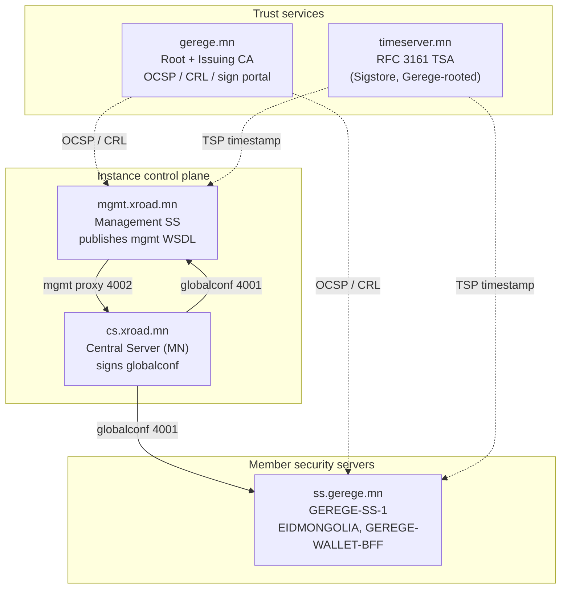
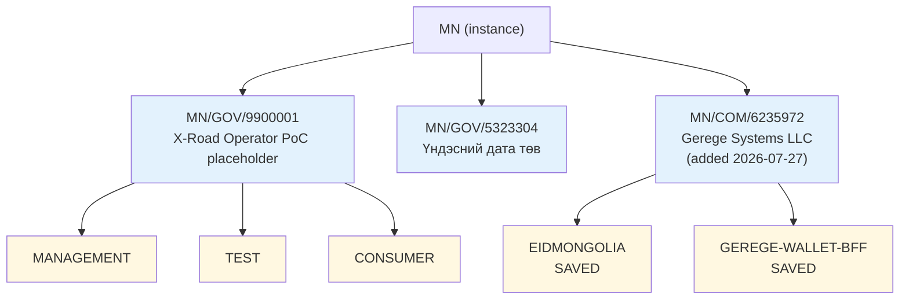
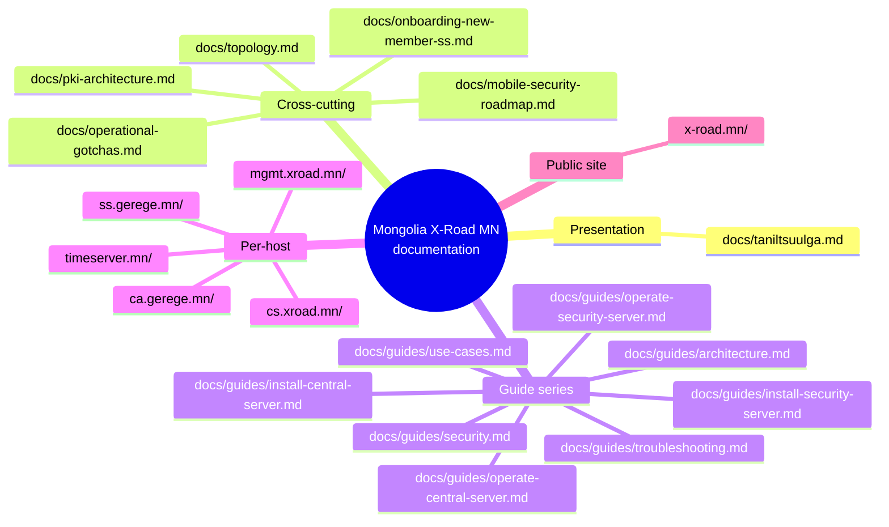

# Mongolian X-Road (instance `MN`)

Monorepo of every server, every config and every script that brings up the X-Road ecosystem operated by **Gerege Systems LLC** in Mongolia.

The instance identifier is **`MN`**. The Central Server lives at **cs.xroad.mn** and is currently the only authoritative source of `globalconf` for any Mongolian-X-Road-aware Security Server.

## Topology at a glance



> **2026-07-27:** `rp.gerege.mn` and `ss.paygrid.mn` were removed from this repo — neither exists in the MN instance any more (see `ss.gerege.mn/HISTORY.md`, entry "The whole MN instance was re-provisioned on 2026-07-22"). The trust-service names above are also stale: the instance's approved CA is now **eID Mongolia Organization Issuing CA** and its TSA is **eID Mongolia TSA** at `http://tsa.timeserver.mn:8318/`.

Membership detail (member class, code, registered subsystems) lives in [`docs/topology.md`](docs/topology.md).

## Repo layout

```
mongolian-xroad-mn/
├── README.md                  ← this file
├── docs/
│   ├── topology.md            full host/IP/port/cert table + cert chain diagrams
│   ├── pki-architecture.md    Gerege Root → Issuing CA + TSA Issuing CA + per-cert profile
│   ├── onboarding-new-member-ss.md  end-to-end checklist for a partner SS
│   └── operational-gotchas.md OCSP staleness, TSP cert hash mismatch, cert URL-encode etc.
├── cs.xroad.mn/               Central Server (X-Road v7.8.0)
├── mgmt.xroad.mn/             Management Security Server (owned by Цахим хөгжил инновац харилцаа холбооны яам / GOV/6806252 since 2026-05-08; was Gerege Systems LLC)
├── ss.gerege.mn/              GEREGE-SS-1 — Gerege Systems LLC SS (rebuilt 2026-07-27)
├── ca.gerege.mn/              CA + OCSP + CRL + sign portal + X-Road IS for GEREGE-ID
│                              (vhosts: gerege.mn, ca., ocsp., crl., sign. on 38.180.136.97)
├── timeserver.mn/             RFC 3161 timestamping authority (Sigstore TSA, Gerege-rooted)
└── x-road.mn/                 Public landing page for the MN instance — static HTML +
                               precompiled Tailwind + Mermaid; live at https://x-road.mn
                               (38.180.242.76, same edge box as test.gerege.mn). Markets
                               the platform to potential member orgs and points back at
                               docs/ for the technical truth.
```

Each per-server folder has its own `README.md` describing the role, the ports it listens on, what files in `xroad/`, `nginx/`, `systemd/`, `tsa-certs/` etc. mean, and what to be careful about.

## Public IPs

| Host                | IP             | Role                                                             |
|---------------------|----------------|------------------------------------------------------------------|
| `cs.xroad.mn`       | 38.180.203.234 | X-Road Central Server, reinstalled in place 2026-07-22 (owner `MN/GOV/5323304` Үндэсний дата төв) |
| `mgmt.xroad.mn`     | 38.180.137.229 | Management SS, new host as of 2026-07-22 (`MN:GOV:5323304:mgmt`; was 38.180.255.177 / GOV/6806252) |
| `ss.gerege.mn`      | 66.181.175.134 | `GEREGE-SS-1` — Gerege Systems LLC (`MN/COM/6235972`)             |
| `ca.gerege.mn`      | 38.180.82.252  | eID Mongolia Organization Issuing CA + OCSP; same host as `rp-api.eidmongolia.mn` / `eidmongolia.mn` |
| `gerege.mn`         | 38.180.145.75  | moved off 38.180.136.97 at some point before 2026-07-27 (hence its changed SSH host key) |
| `timeserver.mn`     | 38.180.203.29  | eID Mongolia TSA — RFC 3161 on `:8318`                           |

**Watch out:** `tsa.timeserver.mn` also has a second A record `38.180.137.229` (mgmt.xroad.mn) which refuses `:8318`, so timestamping fails on roughly every other attempt instance-wide. Delete that record.

## Member identity overview

As read from cs on 2026-07-27. Everything here was created 2026-07-22 or later; the pre-rebuild registry (`6884857` Gerege Core LLC, `7181609` Gerege Smart Metering, `6806252` Цахим хөгжлийн яам, and the `GEREGE-ID` / `GEREGE-WEB` / `EIDMONGOL` / `PAYGRID-CORE` subsystems) no longer exists.



`mgmt.xroad.mn` (`MN:GOV:5323304:mgmt`) is the only registered security server. `GEREGE-SS-1` is initialized but not yet registered — its two subsystems sit in `SAVED` pending certificates.

## Doc map



Шинэ танилцагч: [`docs/taniltsuulga.md`](docs/taniltsuulga.md)-аас эхэл. Архитектор: [`docs/guides/architecture.md`](docs/guides/architecture.md). Алдаа гарвал: [`docs/guides/troubleshooting.md`](docs/guides/troubleshooting.md).

## Things this repo intentionally does NOT contain

- Private keys (CA root, CA issuing, TSA leaf, SS auth/sign keys, GPG backup keys).
- Database passwords, X-Road UI passwords, HSM PINs, FCM service-account JSONs.
- The literal value of `XROAD_SS_TOKEN` (the shared secret between the producer SS nginx and the gerege backend) — only the env var name and where it gets set.
- API tokens for `[management-service]` / `[registration-service]` in CS `local.ini`.

The operator's local memory store (under `~/.claude/.../memory/reference_cs_secrets.md`) records *where* each secret lives so it can be retrieved with `ssh + sudo` when needed.

## Sister repos

- [`gerege-mn-public`](https://github.com/geregedevops/gerege-mn-public) — public landing pages (e-id.mn, x-road.mn, template.gerege.mn), the full-stack eID/X-Road demo (test.gerege.mn), and the `gerege-doc-toolkit/` Markdown → branded `.docx` document toolkit used to render every PDF/Word artefact this monorepo produces.
