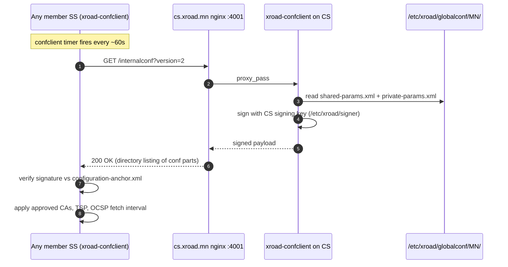

# cs.xroad.mn — X-Road Central Server (Mongolia, instance MN)

**Public IP:** 38.180.203.234
**Owner:** Үндэсний дата төв / National Data Center (instance authority since 2026-05-11; previously Gerege Systems LLC `MN/COM/6235972`)
**Operator:** Gerege Systems LLC — day-to-day ops, package upgrades, secret custody
**X-Road version:** 7.8.0 (Ubuntu 24.04, NIIS upstream packages)
**Role:** Source of truth for the Mongolia X-Road instance (`MN`). Hosts global configuration, runs management + registration services, signs `private-params.xml` + `shared-params.xml` and serves them to every member SS over `xroad-confclient`.

## What lives here

```
/etc/xroad/
├── conf.d/local.ini           — management-service / registration-service api-tokens, GPG backup keyid (REDACTED in this repo)
├── configuration-parts/       — center-monitoring.ini, ocsp-fetchinterval.ini, ocsp-nextupdate.ini
├── globalconf/MN/
│   ├── private-params.xml     — managementService URL + auth-cert-reg endpoint + center signing key
│   └── shared-params.xml      — instance members, security-servers, approved CA, approved TSA, central services
├── signer/                    — CS signing key (GPG-protected, NEVER leaves the server)
└── ssl/                       — internal nginx TLS for ports 4000/4001/4002 (self-signed)
```

## Network ports

| Port | Listener            | Reachable from                | Purpose                                                          |
|-----:|---------------------|-------------------------------|------------------------------------------------------------------|
| 4000 | xroad-center UI     | localhost (via SSH tunnel)    | Web admin (login `xrdadmin`)                                     |
| 4001 | nginx → confclient  | every member SS               | Global conf download (`/internalconf`, `/externalconf`)          |
| 4002 | nginx → mgmt svc    | mgmt.xroad.mn, every SS       | clientReg / addressChange / authCertDeletion etc.                |
|   80 | nginx               | Let's Encrypt only            | ACME challenge → 301 https                                       |
|  443 | nginx               | public                        | Serves `managementservices.wsdl` + globalconf signing key         |

## Companion files in this folder

- `nginx/xroad-management-service.conf` — port 4002 reverse proxy → 127.0.0.1:8085 (the management service backend).
- `xroad/private-params.xml` — current frozen copy. Do not hand-edit on disk; CS regenerates + signs every time the UI changes a parameter.
- `xroad/shared-params.xml` — current frozen copy. Holds approved CA cert, approved TSA cert (single leaf, see `timeserver.mn/`), per-member SS authCertHash list, central services.
- `xroad/conf.d-local.ini` — sanitized; redacts api-tokens. Real values in `reference_cs_secrets.md` (operator local memory).
- `xroad/center-monitoring.ini`, `ocsp-fetchinterval.ini`, `ocsp-nextupdate.ini` — distributed configuration parts.

## Globalconf serve flow



## Operational gotchas

- The `<approvedTSA><cert>` blob in `shared-params.xml` is matched against the SignerID inside every TSP response. If the TSA leaf is re-keyed, every member SS will throw `mlog.tsp_certificate_not_found` until CS UI → Trust Services → Timestamping Services is updated to the new leaf cert.
- After `delete + add` of a TSA in the CS UI, the cert is stored in shared-params as base64 of the *PEM file text* (with `-----BEGIN CERTIFICATE-----` lines), not base64 of the raw DER. SHA-256 of this base64 will not equal `openssl x509 -fingerprint`.
- `managementService` URL inside `private-params.xml` must be `https://cs.xroad.mn:4001/managementservice/` (the auth-cert-reg endpoint). The *post-registration* services WSDL the mgmt SS publishes points at `https://cs.xroad.mn:4002/managementservice/manage/` — different ports, different code paths, both required.
- UFW must allow inbound `4001/tcp` from every member SS and `4002/tcp` from every member SS that needs to register clients (rp.gerege.mn, ss.gerege.mn).
