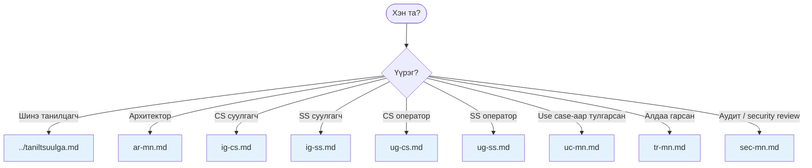
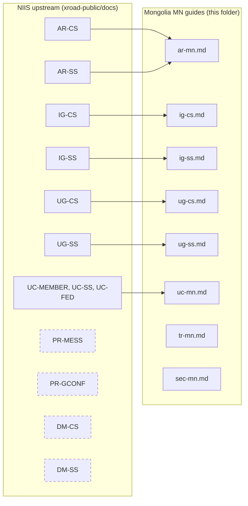

# docs/guides/ — X-Road style guide series

Mongolia X-Road instance `MN`-ийн **albani esnyi** гарын авлагын цуглуулга. NIIS-ийн `AR-*`, `IG-*`, `UG-*`, `UC-*` стандарт код-системээс санаа авч бичсэн.

## Гарын авлагын зам

## Гарын авлагын файлын жагсаалт

| Код | Файл | Сэдэв | Үндсэн уншигч |
|---|---|---|---|
| AR-MN | [ar-mn.md](ar-mn.md) | Архитектур | Архитектор, SRE |
| IG-CS | [ig-cs.md](ig-cs.md) | CS суулгах | Системийн админ (one-time) |
| IG-SS | [ig-ss.md](ig-ss.md) | SS суулгах | Гишүүн org-ийн SRE |
| UG-CS | [ug-cs.md](ug-cs.md) | CS оператор UI | ҮДТ + Gerege ops |
| UG-SS | [ug-ss.md](ug-ss.md) | SS оператор UI | Гишүүн org оператор |
| UC-MN | [uc-mn.md](uc-mn.md) | Хэрэглээний хувилбарууд | Бүгд |
| TR-MN | [tr-mn.md](tr-mn.md) | Алдаа засах | Алдаатай үед бүгд |
| SEC-MN | [sec-mn.md](sec-mn.md) | Аюулгүй байдал | Security / compliance |

## NIIS-ийн оригинал docs-той харьцуулалт

Dashed-аар тэмдэглэсэн (PR-*, DM-*) нь NIIS upstream-ийн protocol/data-model docs-ыг шууд reference хийж, Mongolia-ийн контекстэд тусдаа доку хэлбэрээр давтаагүй. Хэрэг гарвал: https://github.com/nordic-institute/X-Road/tree/develop/doc.

## Авч үлдэх гарын авлага бэлдэх ажил (хувийн TODO)

- [ ] PR-GCONF-MN — globalconf protocol Mongolia-specific tweaks
- [ ] DM-CS-MN — centerui DB schema Mongolia-side
- [ ] DM-SS-MN — serverconf DB schema
- [ ] OPMON-MN — Operational Monitoring (Phase-3)
- [ ] FED-MN — Federation onboarding (Phase-3)

---

*Гарын авлага бүр нэг шинэлэг сэдвийг гүн авч үздэг. Шинэ гарын авлага бэлдэх хэрэгцээ гарвал энэхүү index-д нэмж бичнэ.*
