# АГ-MN — Mongolia X-Road архитектур (Architecture Guide)

> **Doc code:** AR-MN — analogous to NIIS `AR-CS`/`AR-SS`/`AR-EXT` сериал.
> **Зорилго:** Mongolia X-Road instance `MN`-ийн архитектурын **бүх давхрага** — конкреттай хост, демон, өгөгдлийн загвар, итгэлийн загвар хүртэл — нэг газар цуглуулсан reference document. Танилцуулга биш, **архитектор / SRE / security review хийгчдэд зориулсан**.
> **Урьдач уншлага:** [`docs/taniltsuulga.md`](../taniltsuulga.md) ерөнхий тойм, [`docs/topology.md`](../topology.md) хост хүснэгт.

---

## Агуулга

1. [Архитектурын зорилго, хязгаар](#1-архитектурын-зорилго-хязгаар)
2. [4+1 view-той тойм](#2-41-view-той-тойм)
3. [Логик архитектур](#3-логик-архитектур)
4. [Процесс / runtime архитектур](#4-процесс--runtime-архитектур)
5. [Deployment архитектур](#5-deployment-архитектур)
6. [Өгөгдлийн архитектур](#6-өгөгдлийн-архитектур)
7. [Аюулгүй байдлын архитектур](#7-аюулгүй-байдлын-архитектур)
8. [Сүлжээний архитектур](#8-сүлжээний-архитектур)
9. [Интеграцийн загвар](#9-интеграцийн-загвар)
10. [Архитектурын шийдвэрийн бүртгэл (ADR)](#10-архитектурын-шийдвэрийн-бүртгэл-adr)
11. [Гадаад хамаарал ба upstream](#11-гадаад-хамаарал-ба-upstream)

---

## 1. Архитектурын зорилго, хязгаар

### 1.1 Архитектурын зорилго

- **Trustworthy data exchange**: гишүүн байгууллагуудын IS хооронд гэрчилсэн, гарын үсэгтэй, цаг тэмдэглэлтэй, аудит логтой мессеж дамжуулах.
- **Decentralized но governed**: гишүүд бие даан үйл ажиллагаа явуулна; зөвхөн Central Server-ийн approved тохиргооны хүрээнд харилцана.
- **Compliance**: Mongolia E-Sign Law, ISO/IEC 27001 контролтой, GDPR-төстэй өгөгдлийн privacy.
- **Legally significant**: Mongolian-eID-тэй уялдан, цахим гарын үсэг бүхий зурвас хууль зүйн ач холбогдолтой.
- **Audit-ready**: бүх SS-SS мессежийг X-Road message log дотор гарын үсэг + timestamp-тай ор хадгалдаг (`xroad-addon-messagelog`).

### 1.2 Хүрээний хязгаар (scope boundary)

```mermaid
graph LR
    subgraph in_scope["In scope (this guide)"]
        CS[Central Server architecture]
        SS[Security Server architecture]
        PKI[PKI + OCSP + CRL]
        TSA[Time-Stamp Authority]
        MSG[Message envelope + transport]
        ACL[ACL / Service-clients model]
    end

    subgraph partial["Partial scope (referenced)"]
        IS[Information Systems (per member)]
        MOB[Mobile-side hardening]
        FED[Federation with other instances]
    end

    subgraph out_of_scope["Out of scope"]
        BIZ[Business logic in member apps]
        NET[ISP-level network engineering]
        LEGAL[Legal contract templates]
    end

    in_scope --> partial
    partial --> out_of_scope
```

### 1.3 Архитектурын зарчмууд

| Зарчим | Тайлбар |
|---|---|
| **Trust through cryptography, not network** | Public Internet дамждаг бүх SS-SS зурвас mTLS + cert-pinning-тэй. Зөвхөн зөв cert chain + Service-clients ACL хоёулангаар зөвшөөрөгдөнө. |
| **Single source of truth for membership** | Гишүүн identity (member class+code+subsystem) зөвхөн CS-ийн `shared-params.xml`-аас, өөр газар duplicate байхгүй. |
| **Every signing key isolated to a single host** | Root CA private гэвэл `ca.gerege.mn`. TSA leaf private гэвэл `timeserver.mn`. SS AUTH/SIGN private гэвэл тухайн SS-ийн `keyconf.xml`. Хэзээ ч ил гарахгүй. |
| **Time-bound trust** | OCSP fresh window 3600s, TSA token expiry, cert validity 825 хоног (TSA leaf), 2 жил+ (SS AUTH/SIGN) гэх мэт. |
| **No DB write per partner on producer-side** | Service-clients ACL = single source of truth. `eid-gerege-backend` зөвхөн `00000001-...` X-Road gateway row-той (2026-04-19 refactor, `ca.gerege.mn/HISTORY.md` 2026-04-19). |

---

## 2. 4+1 view-той тойм

Krchten 4+1 архитектурын моделийг ашиглаж олон үзэгдлээр харна:

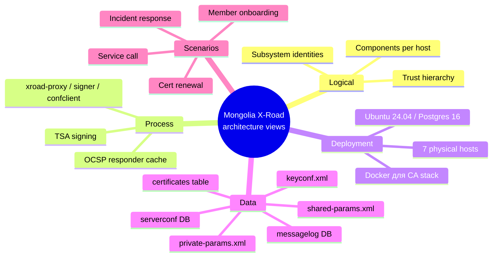

Дараагийн 6 хэсэгт тус бүрийг гүн авч үзнэ.

---

## 3. Логик архитектур

### 3.1 Гол компонентууд (UML-стайл class breakdown)

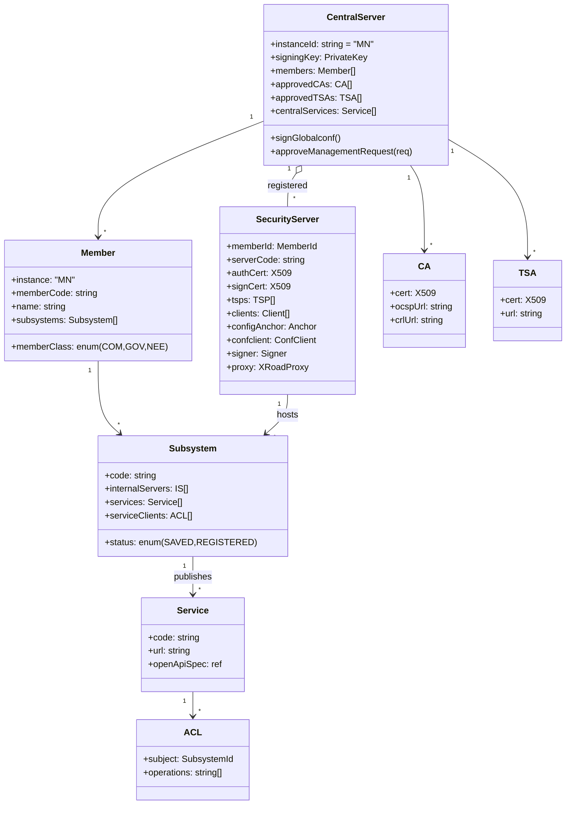

### 3.2 Mongolia дахь конкрет бичлэг (instance population)

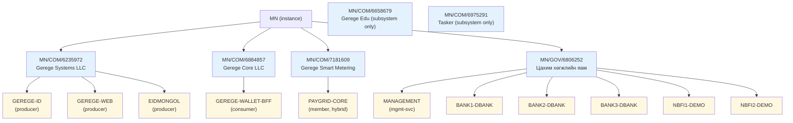

### 3.3 Service-clients ACL топологи

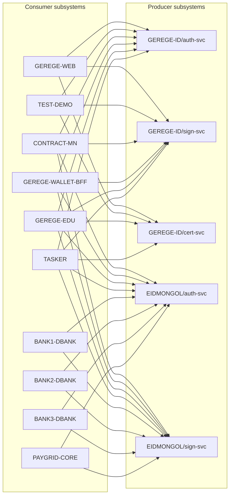

★ **Insight ─────────────────────────────────────**
- EIDMONGOL дотор `cert-svc` зориуд нийтлэгдээгүй. v2 stack нь national_id lookup-ыг auth callback-д шилжүүлсэн (privacy harvest reduce).
- ACL нь "per-operation" — нэг subsystem-ийн нэг сервисийн нэг үйлдэлд access өгөх боломжтой. Бүлгийн ACL ("security-server-owners") мөн дэмжигдэнэ, mgmt service-д ашигладаг.

**─────────────────────────────────────────────────**

---

## 4. Процесс / runtime архитектур

### 4.1 SS-ийн runtime процессүүд

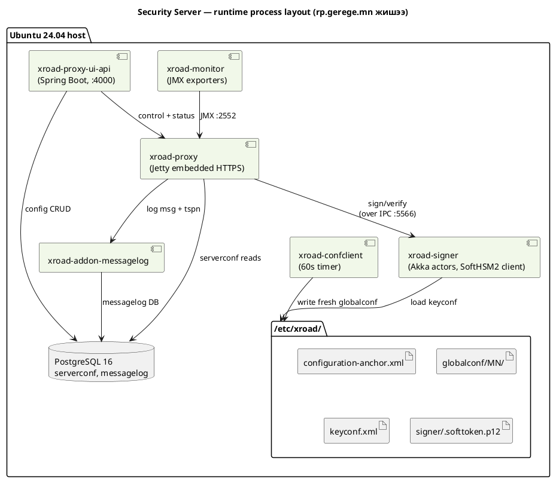

### 4.2 CS-ийн runtime процессүүд

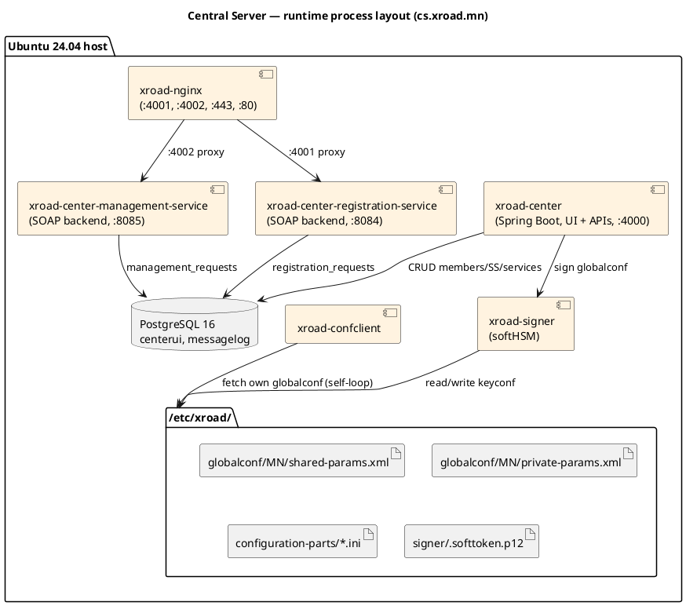

### 4.3 Time-based процессүүд

```mermaid
gantt
    dateFormat HH:mm:ss
    axisFormat %M:%S
    title Recurring SS-side timers (one minute window)

    section confclient
    Refresh globalconf      :a, 00:00:00, 1s
    Idle                    :crit, 00:00:01, 59s

    section signer
    OCSP response cache check (per cert)  :b, 00:00:00, 1s
    OCSP query if stale     :c, 00:00:30, 2s
    Idle                    :crit, 00:00:32, 28s

    section cron
    cert-check.sh (timeserver)  :d, 00:00:00, 5s
    LE renewal check (nginx)    :e, 00:00:15, 5s
```

### 4.4 Мессеж дамжуулга — runtime sequence (low-level)

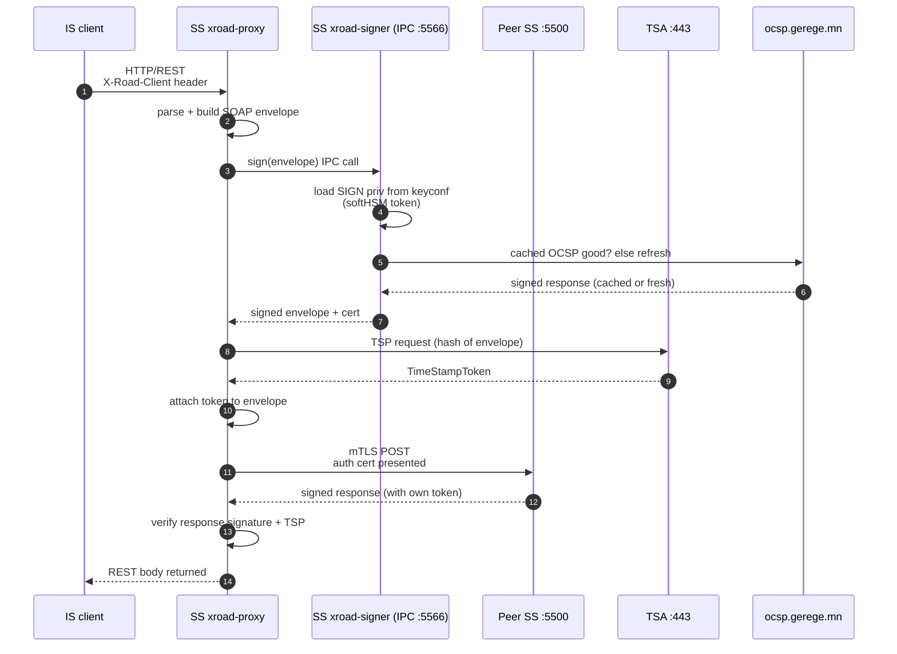

---

## 5. Deployment архитектур

### 5.1 Хостуудын overview (NIIS Архитектур-стайл)

```d2
direction: down
title: Mongolia X-Road — physical deployment

cs_box: {
  label: "cs.xroad.mn\n38.180.203.234\nUbuntu 24.04"
  shape: rectangle
  cs_xroad: "xroad-center, mgmt-svc, reg-svc, nginx, postgres"
}

mgmt_box: {
  label: "mgmt.xroad.mn\n38.180.255.177"
  shape: rectangle
  mgmt_xroad: "xroad-proxy, xroad-proxy-ui-api, confclient, signer, postgres"
}

rp_box: {
  label: "rp.gerege.mn\n38.180.251.163"
  shape: rectangle
  rp_xroad: "xroad-proxy, ui-api, confclient, signer, monitor, postgres"
}

ssg_box: {
  label: "ss.gerege.mn\n66.181.175.134 (NAT 10.0.0.27)"
  shape: rectangle
  ssg_xroad: "xroad-proxy, ui-api, opmonitor, confclient, signer, postgres"
}

pay_box: {
  label: "ss.paygrid.mn\n38.180.254.231"
  shape: rectangle
  pay_xroad: "xroad-proxy, ui-api, confclient, signer, postgres"
}

ca_box: {
  label: "ca.gerege.mn\n38.180.136.97"
  shape: rectangle
  ca_stack: "nginx, gerege-ocsp (docker), gerege-crl, gerege-sign, eid-gerege-backend (Go), postgres"
}

ts_box: {
  label: "timeserver.mn\n38.180.203.29"
  shape: rectangle
  ts_stack: "Sigstore timestamp-server, nginx"
}

monitor_box: {
  label: "monitor.x-road.mn (== x-road.mn)\n38.180.242.76"
  shape: rectangle
  mon_stack: "Prometheus, node-exporter targets, Grafana"
}

cs_box -> mgmt_box: globalconf
cs_box -> rp_box: globalconf
cs_box -> ssg_box: globalconf
cs_box -> pay_box: globalconf
mgmt_box -> cs_box: management proxy

rp_box -> ca_box: HTTPS IS
ssg_box -> rp_box: SS-SS
pay_box -> rp_box: SS-SS

ca_box -> rp_box: "OCSP / CRL"
ca_box -> ssg_box: "OCSP / CRL"
ca_box -> mgmt_box: "OCSP / CRL"
ca_box -> pay_box: "OCSP / CRL"
ts_box -> rp_box: "timestamps"
ts_box -> ssg_box: "timestamps"
ts_box -> mgmt_box: "timestamps"
ts_box -> pay_box: "timestamps"

monitor_box -> cs_box: ":9100 scrape"
monitor_box -> mgmt_box: ":9100 scrape"
monitor_box -> rp_box: ":9100 scrape"
monitor_box -> ssg_box: ":9100 scrape"
monitor_box -> ca_box: ":9100 scrape"
monitor_box -> ts_box: ":9100 scrape"
```

### 5.2 X-Road багц + хувилбар

| Хост | xroad packages |
|---|---|
| cs.xroad.mn | xroad-centralserver, xroad-database-local, xroad-nginx, xroad-confclient, xroad-signer, xroad-center-management-service, xroad-center-registration-service |
| mgmt.xroad.mn | xroad-securityserver |
| rp.gerege.mn | xroad-securityserver |
| ss.gerege.mn | xroad-securityserver, xroad-securityserver-ee, xroad-opmonitor, xroad-addon-opmonitoring |
| ss.paygrid.mn | xroad-securityserver |
| ca.gerege.mn | (no X-Road; runs CA stack via Docker + Go backend) |
| timeserver.mn | (no X-Road; runs Sigstore TSA via systemd) |

X-Road хувилбар: **7.8.0** (NIIS upstream, Ubuntu 24.04).

### 5.3 Storage хэрэгцээ

| Хост | DB-ийн өсөлт/сар (өргөн зурвас) | Backup |
|---|---|---|
| cs.xroad.mn | <100 MB (centerui CRUD-only) | daily GPG → `/var/lib/xroad/backup/` |
| Member SS (any) | ~500 MB-2 GB (messagelog dominant) | daily GPG → `/var/lib/xroad/backup/` |
| ca.gerege.mn | ~200 MB (certificates + audit + sessions) | daily encrypted tarball off-host |
| timeserver.mn | <50 MB (no DB, just logs) | weekly tarball |

---

## 6. Өгөгдлийн архитектур

### 6.1 Гол өгөгдлийн биет (ER diagram)

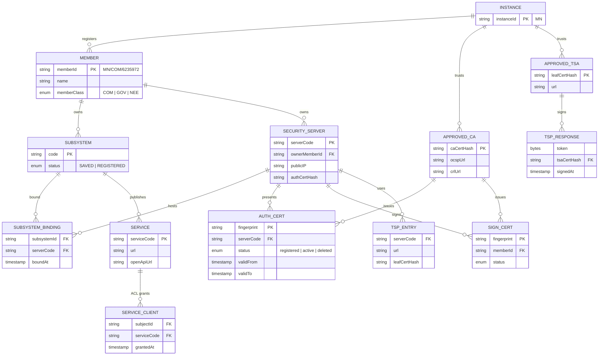

### 6.2 globalconf XML файлууд

`/etc/xroad/globalconf/MN/`:

- `shared-params.xml` — гишүүд, security servers, approved CA, approved TSA, central services
- `private-params.xml` — managementService URL, auth-cert-reg endpoint, CS signing key info

CS UI бүх UI өөрчлөлтөд автоматаар бүгдийг **гарын үсэг тавьж re-generate хийнэ**. Дискт гар аргаар засаж болохгүй — confclient signature verify-д уначихна.

### 6.3 keyconf.xml (SS-side)

```xml
<keyConf>
  <device id="0">
    <token id="softToken-0">
      <key id="auth-key-1">
        <cert active="true" status="registered">
          <data>...base64 DER...</data>
        </cert>
      </key>
      <key id="sign-key-1">
        <cert active="true" status="registered" memberId="MN/COM/6235972">
          <data>...</data>
        </cert>
      </key>
    </token>
  </device>
</keyConf>
```

★ **Insight ─────────────────────────────────────**
- `active="false"` болсон cert байгаа боловч UI-д харагдаагүй тохиолдол гардаг. `rp.gerege.mn/HISTORY.md` 2026-04-19 болон `ss.gerege.mn/HISTORY.md` 2026-04-19 хоёулаа энэ алдаатай тулсан.
- Cert "registered" гэвэл CS-д аль хэдийн approval хийгдсэн гэсэн утга. "active" нь signer-д ашиглагдахад зориулагдсан.

**─────────────────────────────────────────────────**

---

## 7. Аюулгүй байдлын архитектур

### 7.1 STRIDE threat model

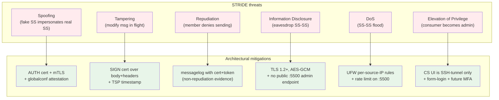

### 7.2 Сертификат болон түлхүүрийн lifecycle

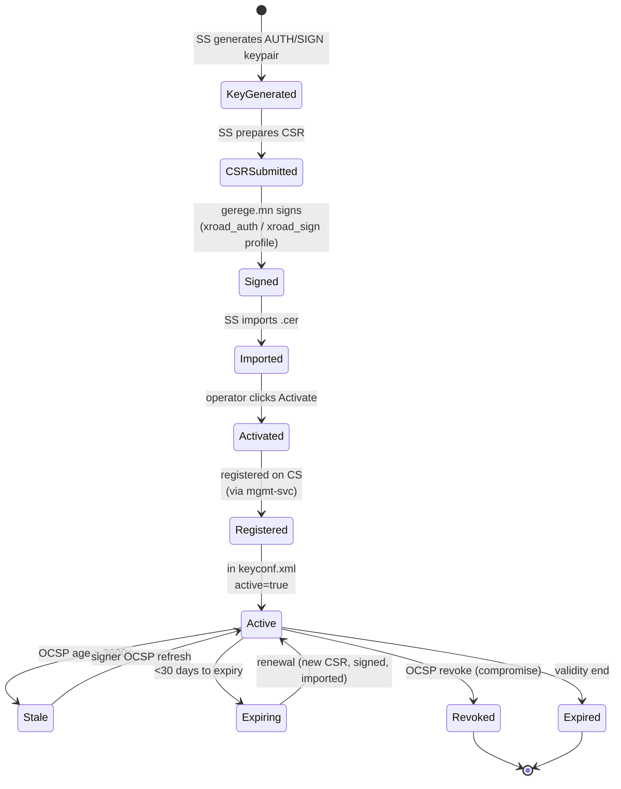

### 7.3 OCSP-ийн crash-проф архитектур

`gerege-ocsp` нь 2026-04-19-ний refactor (`gerege-mn-eid` commit `33f04ab`)-ийн дараа cache-гүй болсон. Хариу хариу dynamic sign хийнэ. Энэ нь "OCSP response is too old" алдааг бүрэн арилгасан.

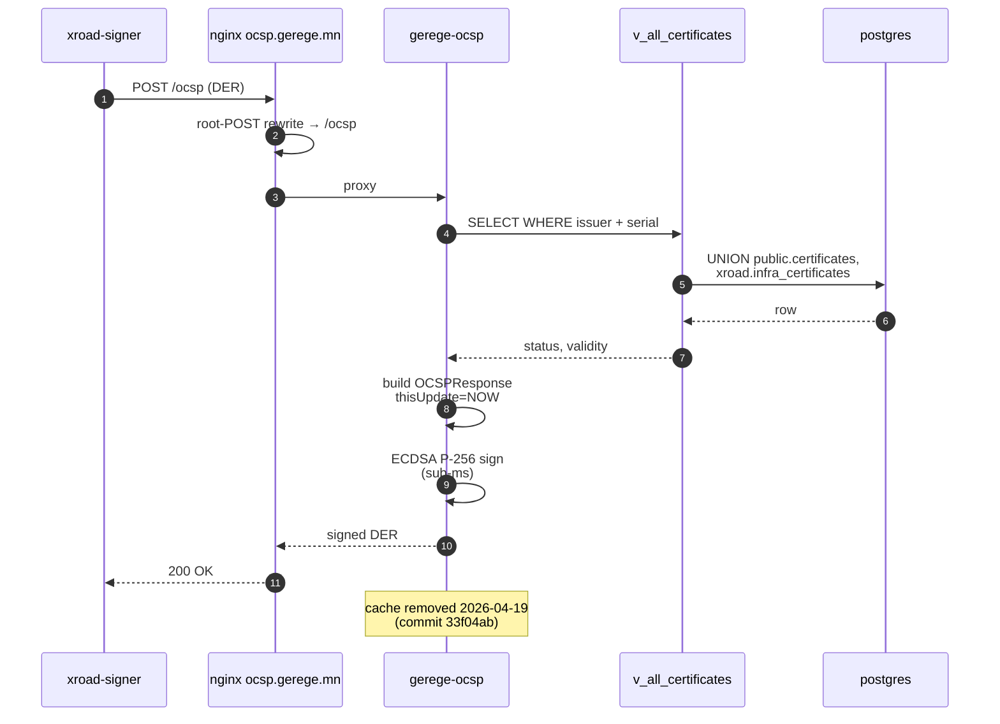

### 7.4 X-Road infra schema (production isolation)

```plantuml
@startuml schema-iso
title PostgreSQL schema isolation on ca.gerege.mn (post 2026-04-20)

skinparam database {
  BackgroundColor #FFF8E1
}

package "public schema" {
  database "users" as users
  database "certificates\n(user AUTH/SIGN certs)" as user_certs
  database "audit_logs" as audit
  database "sessions" as sessions
  database "relying_parties\n(1 row: x-road gateway)" as rp_table
}

package "xroad schema" {
  database "infra_certificates\n(SS auth/sign certs, isolated)" as infra
  database "infra_certificates_audit\n(trigger-driven)" as infra_audit
}

view "v_all_certificates\n(UNION view for OCSP)" as union_view

union_view --> user_certs
union_view --> infra

note right of infra
  Protected from dev scripts:
  TRUNCATE public.certificates
  no longer touches X-Road certs.
end note

@enduml
```

---

## 8. Сүлжээний архитектур

### 8.1 Public IPv4 хаяг ба DNS

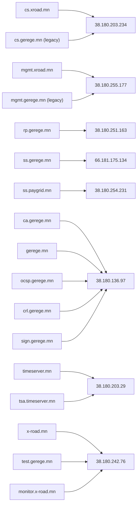

### 8.2 NAT нөхцөл (ss.gerege.mn)

```d2
direction: right
title: ss.gerege.mn — NAT topology

internet: {
  shape: cloud
  label: "Public Internet"
}

router: {
  label: "ISP router\n66.181.175.134"
  shape: rectangle
  forwards: {
    label: "port-forward rules:\n22 → 10.0.0.27:22\n5500 → 10.0.0.27:5500\n5577 → 10.0.0.27:5577\n80 → 10.0.0.27:80\n443 → 10.0.0.27:443"
    shape: rectangle
  }
}

ss: {
  label: "ss.gerege.mn host\n10.0.0.27 / ens160\n(internal LAN)"
  shape: rectangle
  ufw: "UFW rules per port"
  proxy: "xroad-proxy listens *:5500, *:5577"
}

internet -> router
router -> ss: NAT forward

note: |md
  ⚠ Port-forward на routerа байх ёстой —
  UFW зөв ч router-д rule байхгүй бол гадаа ачаалал ороход timeout.
|
```

### 8.3 UFW анхдагч policy

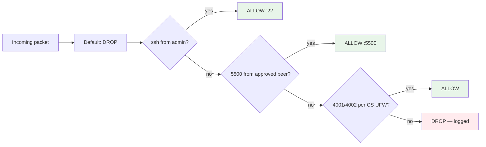

---

## 9. Интеграцийн загвар

### 9.1 IS ↔ SS integration patterns

**Producer SS (rp.gerege.mn) ↔ IS (`ca.gerege.mn /xroad/v1/*`):**

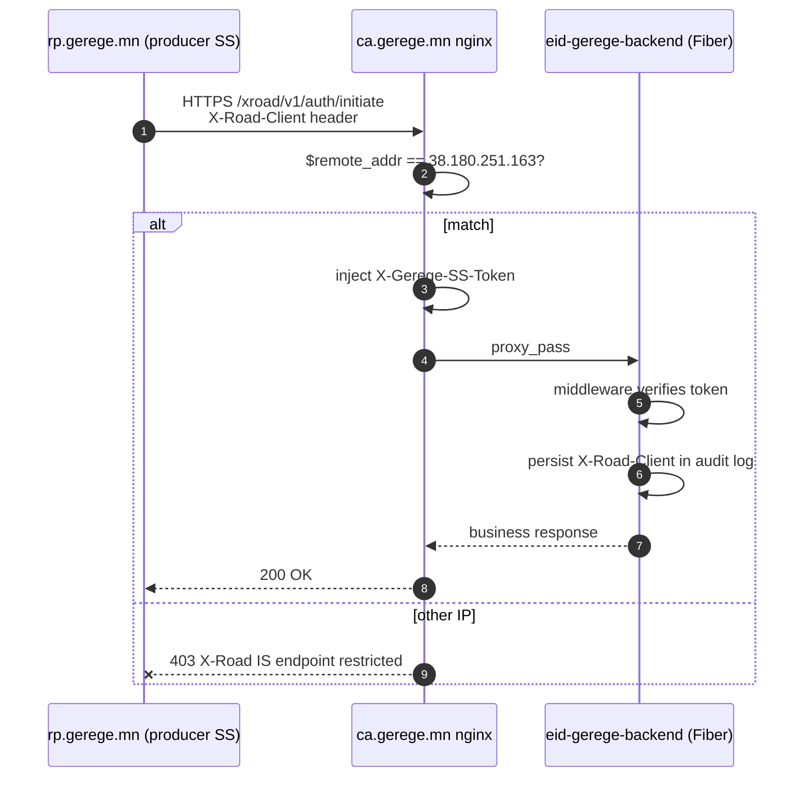

**Consumer SS (ss.paygrid.mn) ↔ IS (paygrid.mn 10.0.0.27):**

mTLS, нь mutual TLS. SS-аас IS-руу хандаж IS-ийн TLS cert-ийг pin хийдэг (uploaded under "Information System TLS certificates").

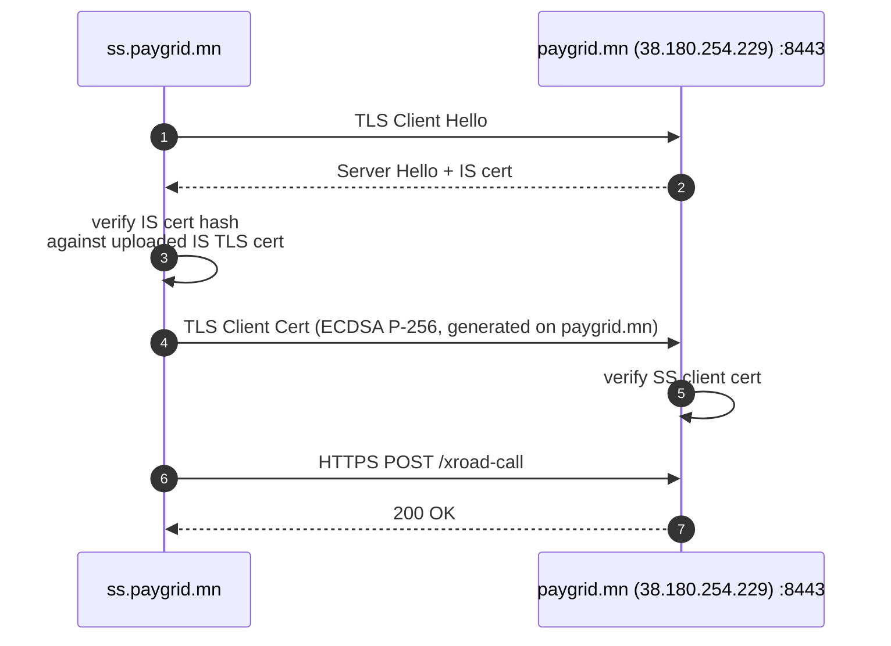

### 9.2 Хадгалагдаагүй intentional gaps

- **Op-Monitor UI dashboard** — sensor аль хэдийн идэвхтэй (`xroad-opmonitor`-ийг ss.gerege дээр суулгасан), гэхдээ UI байхгүй. Phase-3.
- **Federation** — TRUST POLICY сегмент бэлэн биш. 2027 шинэ зорилго.
- **Op-Monitor central scraping** — Prometheus `xroad-nodes` job нь node_exporter-ыг scrape хийдэг, гэхдээ X-Road-ийн өөрийн opmonitor JMX-уудыг scrap хийдэггүй. Phase-3.

---

## 10. Архитектурын шийдвэрийн бүртгэл (ADR)

Бид архитектурын шийдвэр бүрийн **why**-г бүртгэдэг — кодын комментоос илүү, гадаргуугаас илүү. Хамгийн чухлууд:

### ADR-001: Why Single Instance, Not Federation (2026-04)
- **Status**: Accepted
- **Context**: NIIS-ийн federation нь гадаад instance-уудыг trust policy-аар холбохыг зөвшөөрнө. Бид анх Estonia-тай холбохыг бодсон.
- **Decision**: Phase 1-д single instance. Federation бол 2027+ дараах stage.
- **Consequence**: Mongolia-ийн citizens-ийн identity нь зөвхөн `MN` instance-ийн дотор хүчинтэй. Cross-border eID нь өөр channel.

### ADR-002: Why ca.gerege.mn Hosts Everything-PKI (2026-04)
- **Status**: Accepted
- **Context**: PKI (Root CA + Issuing CA + OCSP + CRL + sign portal) + IS endpoint бүгдийг нэг хост дээр байрлуулах нь "single point" гэх concern үүсгэдэг.
- **Decision**: Эхний фазад бүгдийг ca.gerege.mn-д. Шалтгаан: operational complexity, single team, secret custody. Phase-3-д Root CA-г offline зөөвөрт шилжүүлнэ.
- **Consequence**: ca.gerege.mn-ий боловсон availability бүх SS-ийн "OCSP fresh" require-д шууд нөлөөлдөг. Mitigation: OCSP responder dynamic sign (cache-гүй), backup daily, hot-restart-able.

### ADR-003: Why Separate TSA Issuing CA (2026-04-19)
- **Status**: Accepted
- **Context**: Sigstore TSA нь EVERY non-root cert-д `id-kp-timeStamping` EKU байх require хийдэг. Gerege Issuing CA нь general purpose, EKU-гүй.
- **Decision**: Тусдаа `Gerege TSA Issuing CA` intermediate үүсгэсэн. Зөвхөн TSA leaf-д ашиглана.
- **Consequence**: 2 intermediate бүтэцтэй PKI. Operational cost маш бага, шаардлагын зөв.

### ADR-004: Why X-Road Gateway Single-Row Refactor (2026-04-19)
- **Status**: Accepted
- **Context**: Анх `eid-gerege-backend` нь Service-clients ACL-тай parallel `xroad_subsystems` table-той байсан. Хоёр газар sync хийх error-prone.
- **Decision**: `xroad_subsystems` table-г DROP хийсэн. `relying_parties` дотор зөвхөн 1 row (`00000001-0000-4000-8000-000000000000` "X-Road Gateway"). `X-Road-Client` header нь sessions.xroad_client + audit_logs.xroad_client-д л хадгалагдана.
- **Consequence**: Service-clients ACL = single source of truth. Partner onboarding нь "rp UI-д access нэмэх" гэж 1 алхам болсон. Trust radius нь nginx IP-pin + X-Gerege-SS-Token-аар хязгаарлагдсан.

### ADR-005: Why xroad.infra_certificates Schema (2026-04-20)
- **Status**: Accepted
- **Context**: Dev environment-ийн SQL script нь production `public.certificates` rows-уудыг bulk revoke хийсэн, X-Road infra cert-уудыг хальт цохисон. SS-SS handshake тэр дороо унасан.
- **Decision**: X-Road infra cert-уудыг тусдаа `xroad.infra_certificates` schema-д шилжүүлсэн (migration `015_xroad_infra_schema.sql`). `v_all_certificates` UNION view-аар OCSP responder ижил interface-тай хэвээр үлдсэн.
- **Consequence**: `TRUNCATE public.certificates` нь одоо infra cert-уудыг хальдахгүй. Forensic: trigger-driven `xroad.infra_certificates_audit` бүх UPDATE/INSERT/DELETE-ийг session_user + inet_client_addr + application_name-ийн хамт лог-д.

### ADR-006: Why Mermaid for All Docs (2026-05-14)
- **Status**: Accepted
- **Context**: Анх ASCII диаграмм `git diff`-д уншиж амар гэж policy байсан. x-road.mn/ нэгэнт Mermaid-аар pre-rendered SVG-ийг public-д үзүүлэхэд ашигладаг.
- **Decision**: Бүх doc-д Mermaid (Plus PlantUML/D2 өөрт нь тохирох тохиолдолд) standard болгосон. ASCII бол code listing-д л.
- **Consequence**: GitHub шууд render, public site дамжуулдаг, slide-д ашиглаж болно.

### ADR-007: Why Port 4000 Pre-Prod Showcase Was Reverted (2026-04-22)
- **Status**: Accepted
- **Context**: 2026-04-20-нд showcase зориулж бүх 4 хост (cs/mgmt/rp/ss) дээр UFW port 4000-ийг public нээсэн. 2 хоногийн дараа буцаасан.
- **Decision**: Port 4000 нь хэзээ ч public байх ёсгүй. SSH tunnel л баталгаажсан хандалт. 2026-05-14-нд яамны танилцуулгад зориулж дахин нээж, мөн өдөр буцаах товлосон.
- **Consequence**: `ss.paygrid.mn/README.md`-д "Do NOT open port 4000 to public — even briefly. The 2026-04-20 pre-prod showcase exposure ... is not repeated here" гэж дам бичигдсэн.

---

## 11. Гадаад хамаарал ба upstream

### 11.1 NIIS upstream

X-Road кодын тэргүүн нь NIIS (Nordic Institute for Interoperability Solutions). Бид:
- Ubuntu 24.04 LTS-д зориулсан Debian packages-ийг шууд ашигладаг (no custom build).
- Хувилбар 7.8.0-1 нь stable-track.
- Шинэ хувилбар (7.9+) гарахад staging-д тест хийгээд production-д рул-аут (Phase-3).

### 11.2 Sigstore upstream

TSA нь Sigstore community-ийн `timestamp-authority` бинарийг v2.0.6-д pin хийсэн. Шинэ хувилбар certchain validation rule-уудыг өөрчилдөг тул pin шинэчлэхийн өмнө sandbox-д тест хэрэгтэй.

### 11.3 Let's Encrypt

`ca.gerege.mn`, `tsa.timeserver.mn`, `x-road.mn`, `monitor.x-road.mn` бүгд LE-ээс TLS cert авдаг. ISRG Root X1/X2 нь mobile-side TLS pin-ийн target. LE-ийн уламжлалт rotation policy: жилд нэг intermediate (R10/R11) болж нэг тарихаа байгаа.

### 11.4 Docker images

- `gerege-ocsp`, `gerege-crl`, `gerege-sign`, `eid-gerege-backend` бүгд `gerege-mn-eid` репозитороор build хийгдэж private registry-аас pull хийгдэнэ.
- Container restart нь in-memory key-уудыг дахин load хийдэг — operational consideration.

### 11.5 PostgreSQL upstream

PG 16 LTS суурьтай. Бүх xroad-related DB-уудыг тус тусын кластер дотор. Замбараагүй upgrade-аас зайлсхийхийн тулд auto-update идэвхгүй (`/etc/apt/apt.conf.d/50unattended-upgrades`).

---

*Энэ архитектур гарын авлагыг 2026-05-15-нд бичсэн. Дараагийн засвар: гишүүн SS нэмэгдэх, federation policy шинэчлэх, эсвэл хост шилжүүлэх үед бичсэн ажилтан энэ файлыг шинэчилнэ үү.*
