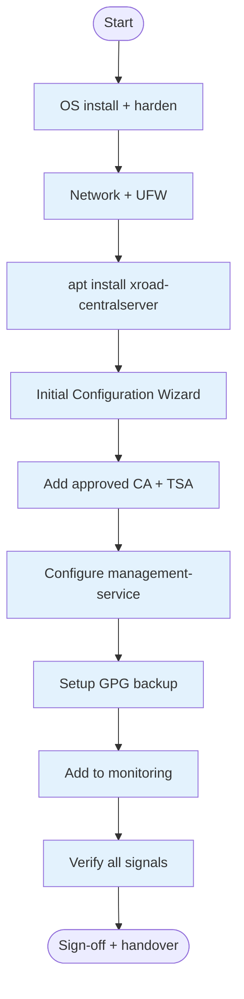
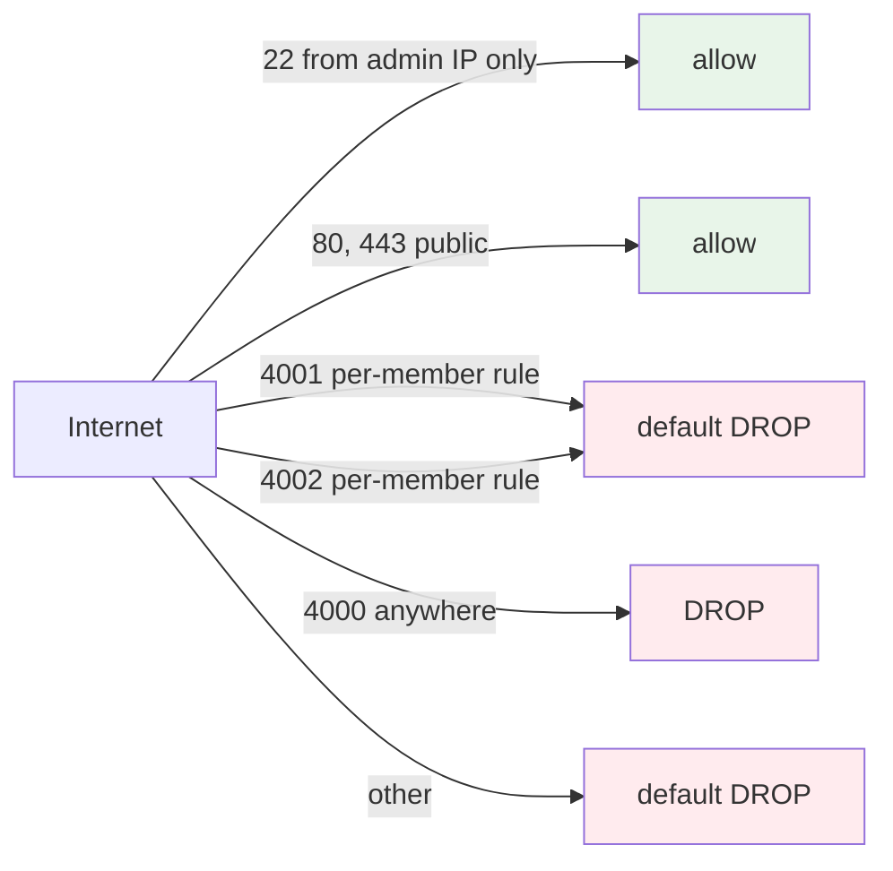
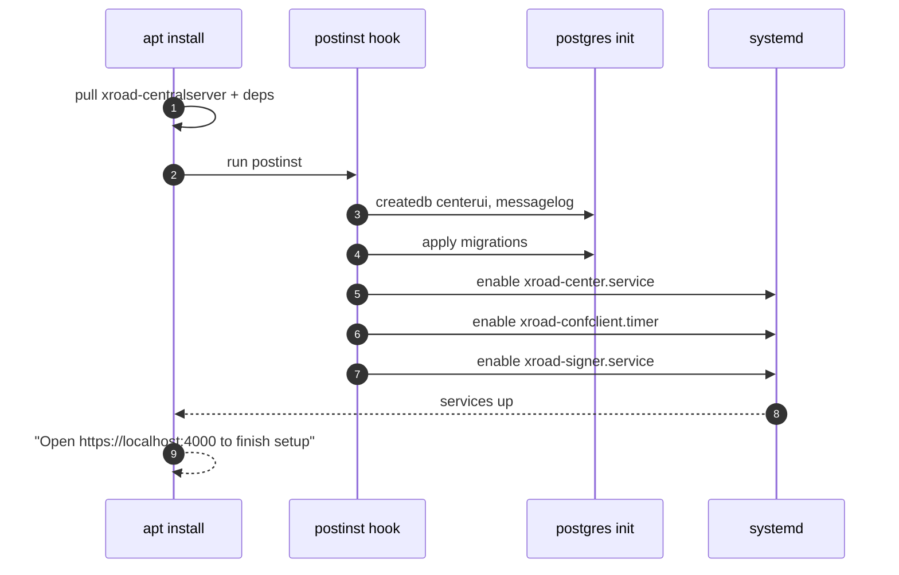
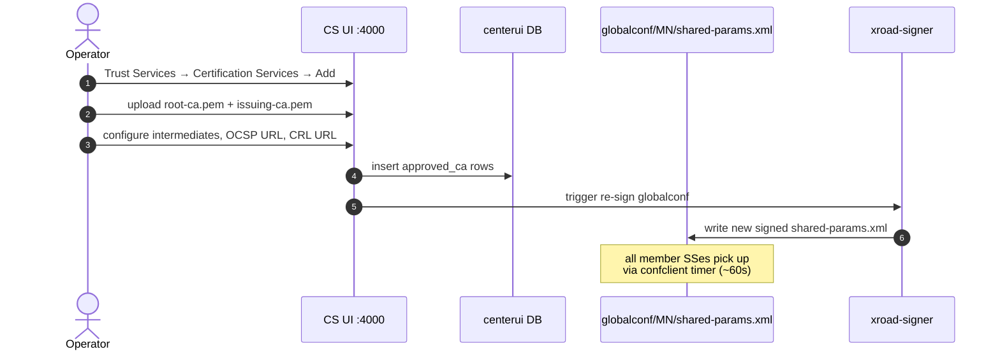
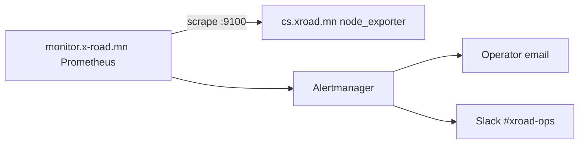
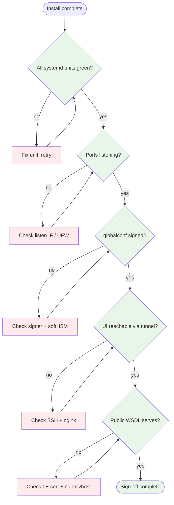

# ИГ-CS — Central Server суулгах гарын авлага (Installation Guide)

> **Doc code:** IG-CS — analogous to NIIS `IG-CS`.
> **Scope:** Шинээр Mongolia X-Road instance (эсвэл шинэ environment-д) Central Server-ийг суулгах процесс. Production-grade install. Backup, monitoring, hardening орсон.
> **Audience:** Системийн админ, SRE баг. NIIS upstream packages-тэй танил байх ёстой.

---

## Агуулга

1. [Пререкизит](#1-пререкизит)
2. [Суулгах процессын тойм](#2-суулгах-процессын-тойм)
3. [OS бэлдэх](#3-os-бэлдэх)
4. [Сүлжээ + UFW](#4-сүлжээ--ufw)
5. [X-Road packages суулгах](#5-x-road-packages-суулгах)
6. [Эхний тохиргооны wizard](#6-эхний-тохиргооны-wizard)
7. [Trust services тохируулах](#7-trust-services-тохируулах)
8. [Backup, monitoring](#8-backup-monitoring)
9. [Hardening checklist](#9-hardening-checklist)
10. [Verification + sign-off](#10-verification--sign-off)

---

## 1. Пререкизит

| Зүйл | Шаардлага | Тэмдэглэл |
|---|---|---|
| OS | Ubuntu 24.04 LTS (Server) | Production-grade. 22.04 ажиллах боловч NIIS-аас 24.04-д шилжсэн. |
| CPU | ≥4 vCPU | Globalconf sign + UI traffic. |
| RAM | ≥8 GB | Postgres + Java + nginx. |
| Disk | ≥80 GB | OS 20G + Postgres + logs + backups. |
| Static public IP | mandatory | гишүүд `cs.xroad.mn:4001`-аар хандана. |
| DNS A record | `cs.xroad.mn` → IP | TTL ≤300s эхэн үеийн өөрчлөлтөд. |
| Time sync (NTP) | `chronyd` идэвхтэй | RFC 3161 timestamping + cert validity-д чухал. |
| Хууль зүйн эрх мэдэл | CS instance authority (ҮДТ) | `mgmt.xroad.mn` нь яаманд харьяалагдсан. |

## 2. Суулгах процессын тойм



## 3. OS бэлдэх

```bash
# 1) latest patches
sudo apt update && sudo apt full-upgrade -y

# 2) timezone
sudo timedatectl set-timezone Asia/Ulaanbaatar

# 3) NTP via chrony
sudo apt install -y chrony
sudo systemctl enable --now chrony
chronyc tracking   # verify offset < 100ms

# 4) sudo + admin user
sudo useradd -m -G sudo -s /bin/bash opsadmin
sudo passwd opsadmin
sudo mkdir -p ~opsadmin/.ssh
# put admin pubkey:
echo "ssh-ed25519 AAAA...  ops" | sudo tee -a ~opsadmin/.ssh/authorized_keys
sudo chown -R opsadmin:opsadmin ~opsadmin/.ssh
sudo chmod 700 ~opsadmin/.ssh; sudo chmod 600 ~opsadmin/.ssh/authorized_keys

# 5) sshd hardening
sudo sed -i 's/^#*PermitRootLogin.*/PermitRootLogin no/' /etc/ssh/sshd_config
sudo sed -i 's/^#*PasswordAuthentication.*/PasswordAuthentication no/' /etc/ssh/sshd_config
sudo systemctl restart ssh
```

## 4. Сүлжээ + UFW

```bash
sudo apt install -y ufw
# default deny incoming, allow established + outgoing
sudo ufw default deny incoming
sudo ufw default allow outgoing

# admin SSH pinned to admin source IP(s)
sudo ufw allow from 38.180.242.76 to any port 22 proto tcp comment "ops admin SSH"

# Public HTTP/HTTPS for managementservices.wsdl + Let's Encrypt
sudo ufw allow 80/tcp  comment "ACME challenge"
sudo ufw allow 443/tcp comment "WSDL + LE-issued TLS"

# globalconf (4001) and mgmt-service (4002) — per-member rules added later
# DO NOT open 4000/tcp publicly — admin UI is SSH-tunnel only

sudo ufw enable
sudo ufw status numbered
```



## 5. X-Road packages суулгах

NIIS upstream repo нэмэх:

```bash
# add NIIS apt repo
curl -fsSL https://artifactory.niis.org/api/gpg/key/public | sudo gpg --dearmor -o /usr/share/keyrings/niis-archive-keyring.gpg
echo "deb [signed-by=/usr/share/keyrings/niis-archive-keyring.gpg] https://artifactory.niis.org/xroad-release-deb noble-current main" | sudo tee /etc/apt/sources.list.d/xroad.list
sudo apt update

# Install CS bundle
sudo apt install -y xroad-centralserver
```

Package install нь дараахыг автоматаар хийнэ:
- Postgres 16 cluster (`/etc/postgresql/16/main/`)
- `xroad-center` Java systemd unit
- `xroad-center-management-service` + `xroad-center-registration-service`
- `xroad-confclient`, `xroad-signer`
- `/etc/xroad/conf.d/local.ini` skeleton
- nginx vhost конфиг



## 6. Эхний тохиргооны wizard

```bash
# Open browser via tunnel
ssh -L 14000:localhost:4000 cs.xroad.mn
# in browser → https://localhost:14000
```

Wizard steps:

1. **Admin user** — `xrdadmin` (strong password; store in `reference_cs_secrets.md`).
2. **Instance identifier** — `MN`.
3. **Central server address** — `cs.xroad.mn` (public DNS).
4. **Software token PIN** — 8+ chars; store in secrets file.
5. **Database** — local, accept defaults.
6. **Initial configuration sign-off** — review summary, click Finish.

After wizard, CS automatically:
- Generates CS signing key in softHSM token.
- Creates `/etc/xroad/globalconf/MN/` with empty `shared-params.xml` skeleton.
- Starts confclient self-loop (CS distributes its own globalconf).

## 7. Trust services тохируулах

### 7.1 Approved CA нэмэх



Конкрет: 
- Root CA: `gerege.mn:/opt/.../pki/root-ca.pem`
- Issuing CA: `gerege.mn:/opt/.../pki/issuing-ca.pem`
- OCSP URL: `https://ocsp.gerege.mn/ocsp`
- CRL URL: `https://crl.gerege.mn/issuing-ca.crl`

### 7.2 Approved TSA нэмэх

UI → Trust Services → Timestamping Services → Add:
- Name: `TimeServer.mn`
- URL: `https://tsa.timeserver.mn/`
- Cert: `/opt/tsa-certs/leaf-cert.pem` (scp from timeserver.mn)

### 7.3 Management service тохиргоо

UI → Settings → System parameters → management-service:
- `managementServiceProviderId`: `MN/GOV/6806252/MANAGEMENT` (after mgmt SS registered)

`private-params.xml`-ийн `<managementService>` URL `https://cs.xroad.mn:4001/managementservice/` хадгалагдана (auth-cert-reg endpoint).

## 8. Backup, monitoring

### 8.1 GPG backup setup

```bash
# generate GPG key for backup encryption
sudo -u xroad gpg --homedir /etc/xroad/gpghome --batch --generate-key <<EOF
%no-protection
Key-Type: RSA
Key-Length: 4096
Name-Real: cs-xroad-backup
Expire-Date: 0
%commit
EOF

# get keyid
sudo -u xroad gpg --homedir /etc/xroad/gpghome --list-keys

# put keyid into local.ini
sudo vi /etc/xroad/conf.d/local.ini
# [center]
# backup-encryption-keyid = ABCDEF0123456789
```

Default daily backup → `/var/lib/xroad/backup/`. Keep encrypted off-host copy.

### 8.2 Monitoring add

`monitor.x-road.mn` (`38.180.242.76`) дээр Prometheus:

```bash
# on CS:
sudo apt install -y prometheus-node-exporter
sudo ufw allow from 38.180.242.76 to any port 9100 proto tcp comment "prometheus scrape"

# on monitor.x-road.mn:
# add to /opt/xroad-monitor/prometheus.yml under job: xroad-nodes
#   - targets: ['cs.xroad.mn:9100']
sudo systemctl reload prometheus
```



## 9. Hardening checklist

| Зүйл | Status |
|---|---|
| ✅ `:4000` НЭ public (зөвхөн SSH tunnel) | mandatory |
| ✅ Strong `xrdadmin` password (16+, mixed) | mandatory |
| ✅ SSH key-only (PasswordAuthentication no) | mandatory |
| ✅ `:22` UFW pinned to admin IP | mandatory |
| ✅ Auto-update enabled for security (unattended-upgrades) | recommended |
| ✅ GPG backup keyid set | mandatory |
| ✅ NTP `chrony` synced | mandatory |
| ✅ Daily encrypted backup off-host | mandatory |
| ☐ MFA для xrdadmin UI login (Phase-3) | future |
| ☐ Centralized log shipping | future |

## 10. Verification + sign-off

```bash
# 1) all services healthy
systemctl status xroad-center xroad-center-management-service xroad-center-registration-service xroad-confclient xroad-signer postgresql@16-main xroad-nginx
# all should be active (running)

# 2) ports listening as expected
sudo ss -tlnp | grep -E ':(4000|4001|4002|80|443) '
# expect *:4000, *:4001, *:4002, *:80, *:443

# 3) globalconf successfully signed
ls -la /etc/xroad/globalconf/MN/
cat /etc/xroad/globalconf/MN/shared-params.xml.metadata
# expect signature_algorithm + expiration_date present

# 4) UI accessible
ssh -L 14000:localhost:4000 cs.xroad.mn
# open https://localhost:14000 → login as xrdadmin

# 5) public endpoints respond
curl -sI https://cs.xroad.mn/managementservices.wsdl | head -1   # 200 OK
curl -sk -o /dev/null -w '%{http_code}\n' https://cs.xroad.mn:4001/   # 400 or 200 expected
```



---

*Sign-off doc-уудыг `cs.xroad.mn/HISTORY.md`-д "Install" хэсэгт оруулна. CS install бол **once-per-instance** үйл явдал — энэ playbook нь disaster recovery эсвэл шинэ environment бэлдэх үед л дахин ажилладаг.*
