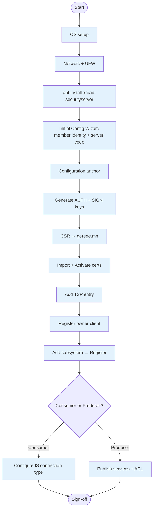
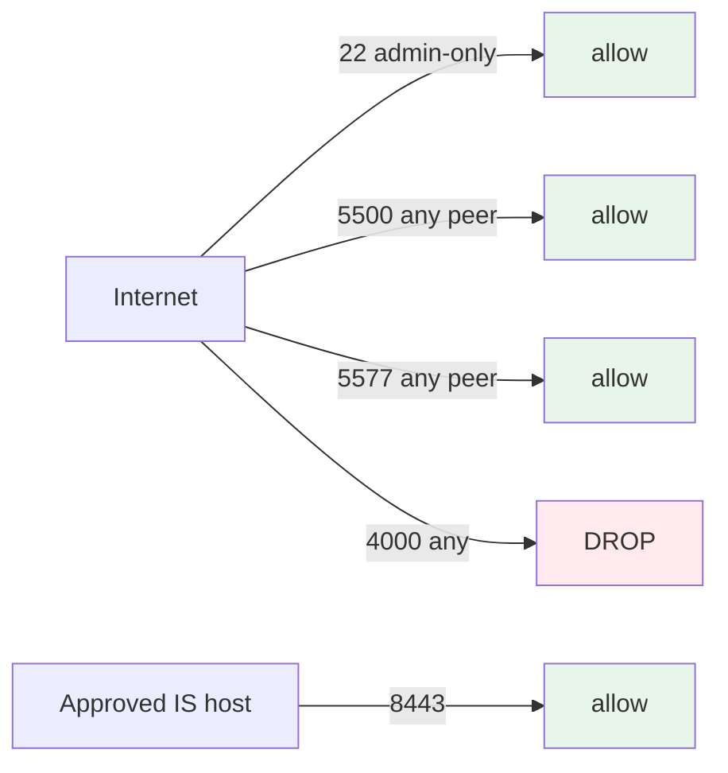
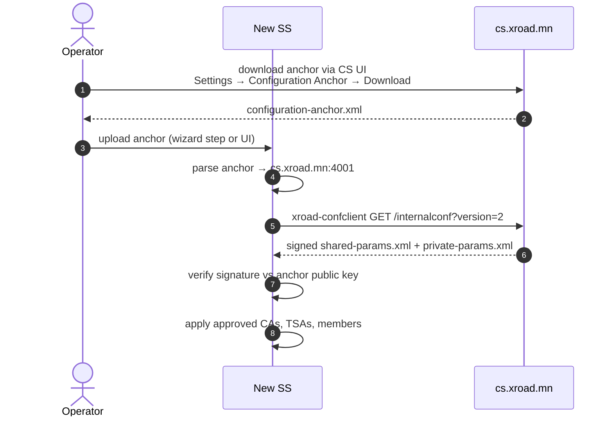
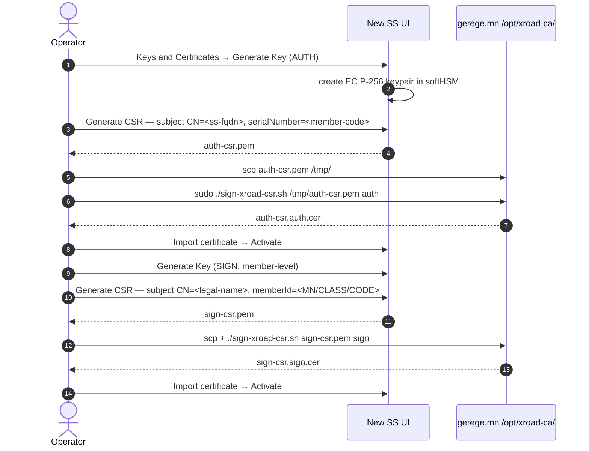
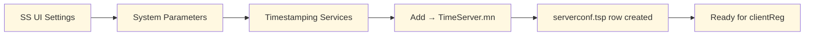
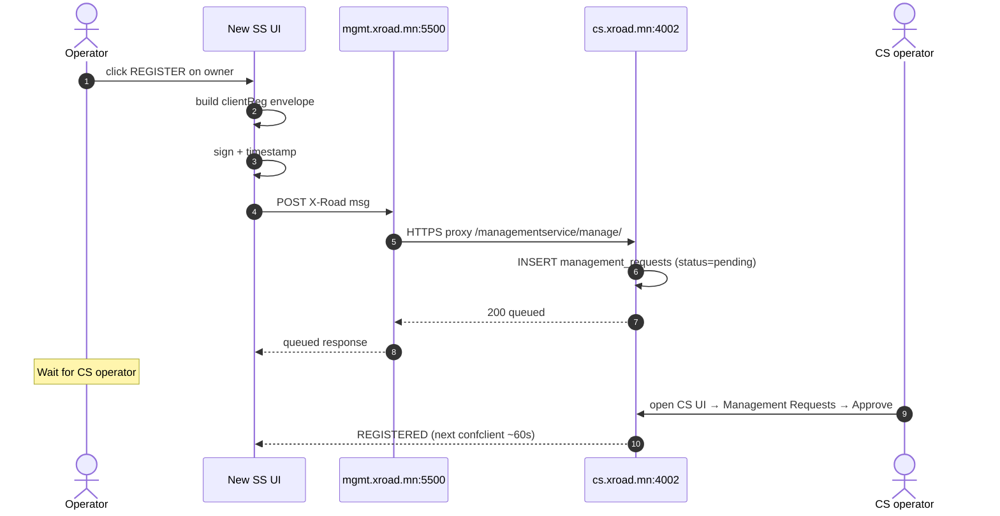
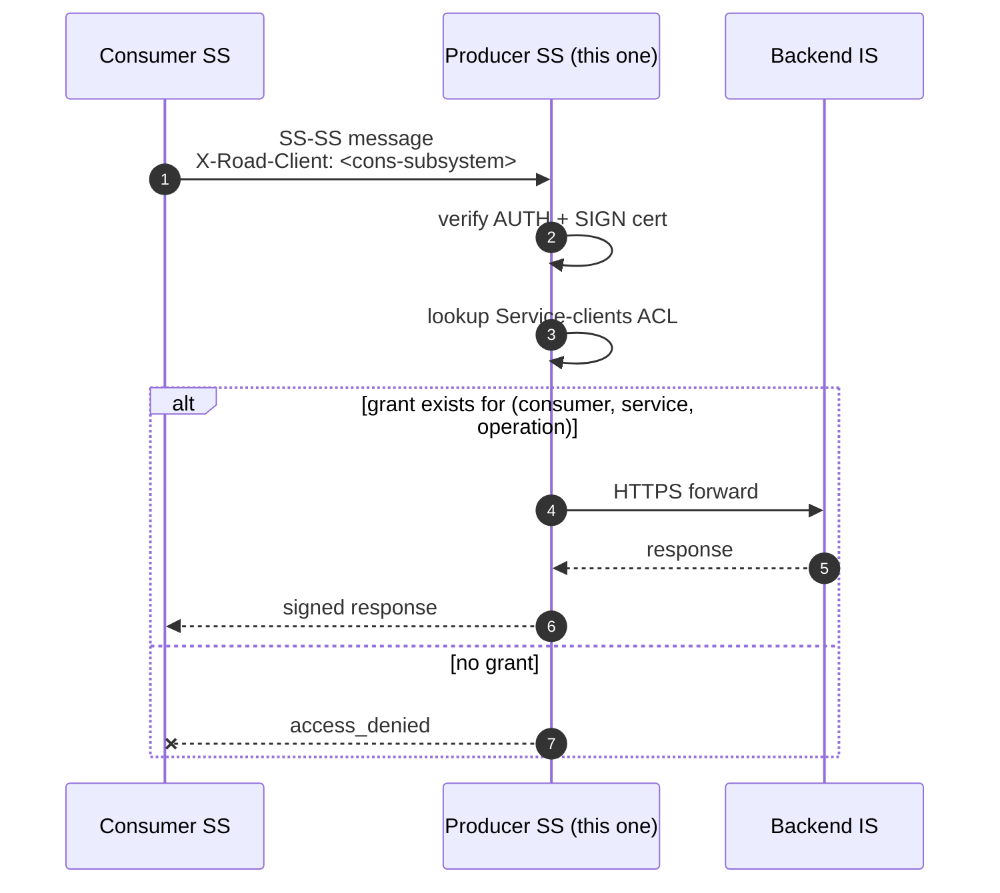
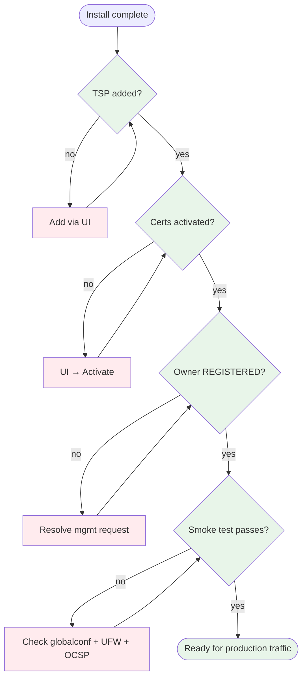

# ИГ-SS — Security Server суулгах гарын авлага

> **Doc code:** IG-SS — analogous to NIIS `IG-SS`.
> **Scope:** Шинэ гишүүн SS-ийг production-д суулгах гарын авлага. Consumer, producer, hybrid гурвуулангад нь хамаатай.
> **Audience:** Гишүүн байгууллагын SRE/sysadmin баг.

---

## Агуулга

1. [Пререкизит](#1-пререкизит)
2. [Суулгах процессын тойм](#2-суулгах-процессын-тойм)
3. [OS бэлдэх](#3-os-бэлдэх)
4. [Сүлжээ + UFW](#4-сүлжээ--ufw)
5. [X-Road packages суулгах](#5-x-road-packages-суулгах)
6. [Эхний тохиргооны wizard](#6-эхний-тохиргооны-wizard)
7. [Configuration anchor + globalconf](#7-configuration-anchor--globalconf)
8. [Key + CSR + Cert flow](#8-key--csr--cert-flow)
9. [TSP entry нэмэх](#9-tsp-entry-нэмэх)
10. [Owner clientReg + subsystem registration](#10-owner-clientreg--subsystem-registration)
11. [Information System endpoint](#11-information-system-endpoint)
12. [Hardening + sign-off](#12-hardening--sign-off)

---

## 1. Пререкизит

| Зүйл | Шаардлага |
|---|---|
| OS | Ubuntu 24.04 LTS |
| CPU/RAM/Disk | 2 vCPU / 4 GB RAM / 40 GB |
| Static public IP | mandatory — гишүүд `:5500`-аар хандана |
| DNS | `<your-ss>.<member-domain>` → IP |
| Хатуу шаардлага | Цахим хөгжлийн яам + Gerege Systems-аас гишүүний легал нэр + анги (COM/GOV/NEE) + код |

## 2. Суулгах процессын тойм



## 3. OS бэлдэх

`docs/guides/install-central-server.md` §3-той ижил. NTP, timezone (`Asia/Ulaanbaatar`), admin user + SSH key, sshd hardening.

## 4. Сүлжээ + UFW

```bash
sudo ufw default deny incoming
sudo ufw default allow outgoing

# admin SSH
sudo ufw allow from <admin-IP> to any port 22 proto tcp comment "ops SSH"

# X-Road peer ports — public
sudo ufw allow 5500/tcp comment "SS-SS message"
sudo ufw allow 5577/tcp comment "SS peer OCSP"

# IS gateway (consumer role) — pinned to IS host
sudo ufw allow from <IS-host-IP> to any port 8443 proto tcp comment "IS gateway TLS"
# or :80, :443 (custom port choice) — see ss.gerege.mn pattern

# Do NOT open 4000 to public
# Do NOT open 4001/4002 here — those are CS-side ports

sudo ufw enable
```



## 5. X-Road packages суулгах

```bash
# add NIIS apt repo (same as IG-CS §5)
curl -fsSL https://artifactory.niis.org/api/gpg/key/public | sudo gpg --dearmor -o /usr/share/keyrings/niis-archive-keyring.gpg
echo "deb [signed-by=/usr/share/keyrings/niis-archive-keyring.gpg] https://artifactory.niis.org/xroad-release-deb noble-current main" | sudo tee /etc/apt/sources.list.d/xroad.list
sudo apt update

# Install SS
sudo apt install -y xroad-securityserver

# Optional: ee (Estonian) profile or opmonitor if consumer
# sudo apt install -y xroad-securityserver-ee xroad-opmonitor xroad-addon-opmonitoring
```

★ **Insight ─────────────────────────────────────**
Хэрэв NIIS-ийн mirror удаашрал ажиглагдвал (`rp.gerege.mn/HISTORY.md` 2026-04-19), өөр host (e.g. `mgmt.xroad.mn`)-аас `.deb` cache-ийг scp-ээр шилжүүлэх боломжтой:
```bash
ssh mgmt.xroad.mn 'sudo tar -C /var/cache/apt/archives -czf - $(ls /var/cache/apt/archives/xroad-*.deb | xargs -n1 basename)' \
  | ssh <new-ss> 'sudo tar -C /var/cache/apt/archives -xzf -'
sudo apt-get install -y xroad-securityserver  # resolves from local cache
```
**─────────────────────────────────────────────────**

## 6. Эхний тохиргооны wizard

```bash
ssh -L 14000:localhost:4000 <new-ss>
# https://localhost:14000
```

Wizard steps:

1. **Admin user** — strong password.
2. **Member identity** —
   - X-Road instance: `MN`
   - Member class: `COM` | `GOV` | `NEE` (consultation with Цахим яам)
   - Member code: улсын бүртгэлийн дугаар (e.g. `7181609`)
3. **Server code** — `<MEMBER-PREFIX>-SS-1` (e.g. `PAYGRID-SS-1`).
4. **Software-token PIN** — 8+ chars; store in `reference_*_secrets.md`.
5. **Database** — local; accept defaults.

## 7. Configuration anchor + globalconf

Wizard automatically prompts to upload the **configuration anchor**.



Сонгож болох backup approach: `mgmt.xroad.mn/xroad/configuration-anchor.xml`-аас copy. Бүх SS-д ижил anchor хэрэглэгдэнэ.

## 8. Key + CSR + Cert flow



⚠ **Watch out** (HISTORY-аас):
- AUTH болон SIGN cert хоёуланг нь **Activate** хийх. UI зөвхөн "registered" гэж заана, "active" биш — зөрчилдөл байсан.
- CSR filename auto-detect нь профайлыг (auth/sign) сонгох — `eid-gerege-web/src/app/dashboard/organizations/page.tsx`-д патч хийгдсэн. Хэрэв буруу профайлаар гарын үсэг зурагдсан бол CSR filename-ыг `auth_` эсвэл `sign_` prefix-тэй болго.

## 9. TSP entry нэмэх

**🚨 Энэ алхамыг clientReg-аас ӨМНӨ хий!** Үгүй бол `mlog.no_timestamping_provider_found` алдаа гарна.

UI → Settings → System Parameters → Timestamping Services → Add:
- Name: `TimeServer.mn`
- URL: `https://tsa.timeserver.mn/`
- Cert: shared-params.xml дотроос автоматаар татна.



## 10. Owner clientReg + subsystem registration

### 10.1 Owner client REGISTER

UI → Clients → owner row (auto-created from wizard) → REGISTER button:



### 10.2 Add subsystem

UI → Clients → Add subsystem:
- Subsystem code: `<DOMAIN-SPECIFIC-CODE>` (e.g. `PAYGRID-CORE`, `GEREGE-WALLET-BFF`)
- After save, click REGISTER on the new row → same flow as above.

## 11. Information System endpoint

### 11.1 Consumer role

UI → Clients → <subsystem> → Internal Servers → Connection type:

- `HTTP` — IS-аас SS-руу plain HTTP (docker-internal network, no client cert) — `ss.gerege.mn` pattern
- `HTTPS NOAUTH` — IS sends server cert only, no client cert
- `HTTPS` — mTLS, IS presents client cert — `ss.paygrid.mn` pattern

Шаардлагатай: SS дээр **IS server cert upload** (Internal Servers → IS TLS certificate) бол IS HTTPS дээр л үйлчилгээ хийнэ.

### 11.2 Producer role

UI → Clients → <subsystem> → Services → Add OpenAPI 3 Description:
- URL: e.g. `https://api.eidmongol.mn/.well-known/openapi/eid-rp/auth.yaml`
- Click "Apply to all in WSDL" то set ALL service URLs.

UI → <subsystem> → Service clients → Add subjects → грант access per operation.



## 12. Hardening + sign-off

Sign-off checklist:

| Зүйл | Status |
|---|---|
| ✅ TSP entry added BEFORE first clientReg | mandatory |
| ✅ AUTH + SIGN certs imported AND activated | mandatory |
| ✅ Owner clientReg REGISTERED at CS | mandatory |
| ✅ At least one subsystem REGISTERED | mandatory |
| ✅ UFW deny incoming default; explicit allow per port | mandatory |
| ✅ `:4000` NOT public (SSH tunnel only) | mandatory |
| ✅ `:22` UFW pinned to admin IP | mandatory |
| ✅ NTP synced | mandatory |
| ✅ Daily backup configured | mandatory |
| ✅ Added to `monitor.x-road.mn` Prometheus targets | mandatory |
| ☐ MFA for admin UI | future |
| ☐ Op-Monitor central dashboard | future (Phase-3) |



Smoke test (consumer role):

```bash
curl -sk -m 10 https://<this-ss>:5500/ || true   # mTLS — will reject unauth, тэр л OK
# Trigger a real SS-SS call from the IS host through this SS
# Expect 200 with signed X-Road response body
```

Producer role smoke test: ACL-аар грант авсан consumer subsystem-аас тестийн REST call.

---

*Шинэ SS бүрийн install лог нь тухайн host-ын `HISTORY.md`-д "Install" хэсэгт. Алдаа гарвал [`docs/guides/troubleshooting.md`](troubleshooting.md)-аас хайна уу.*
