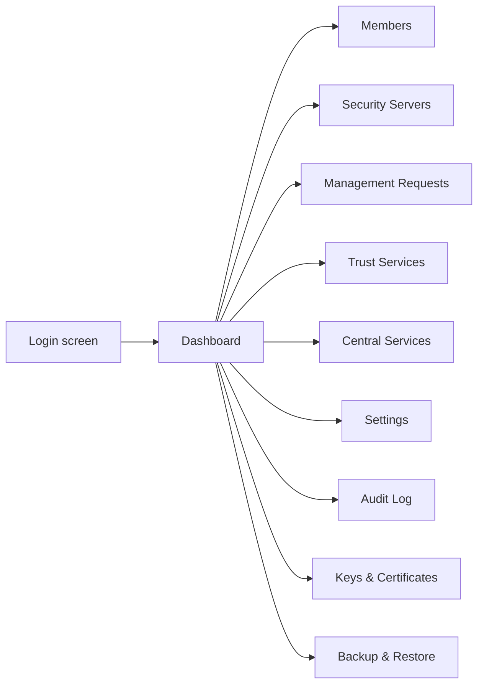
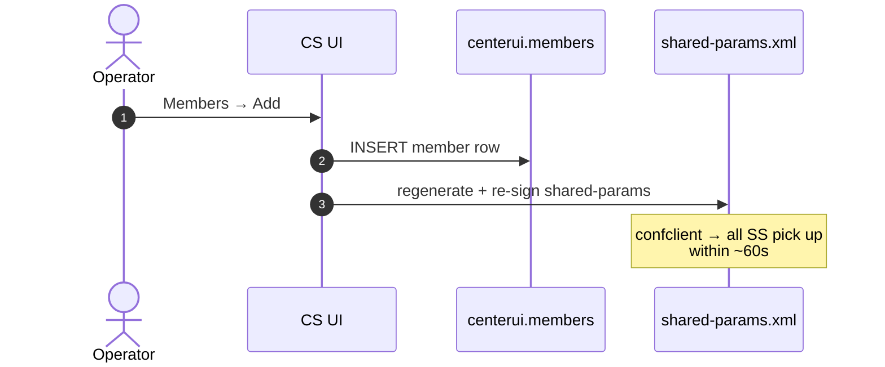
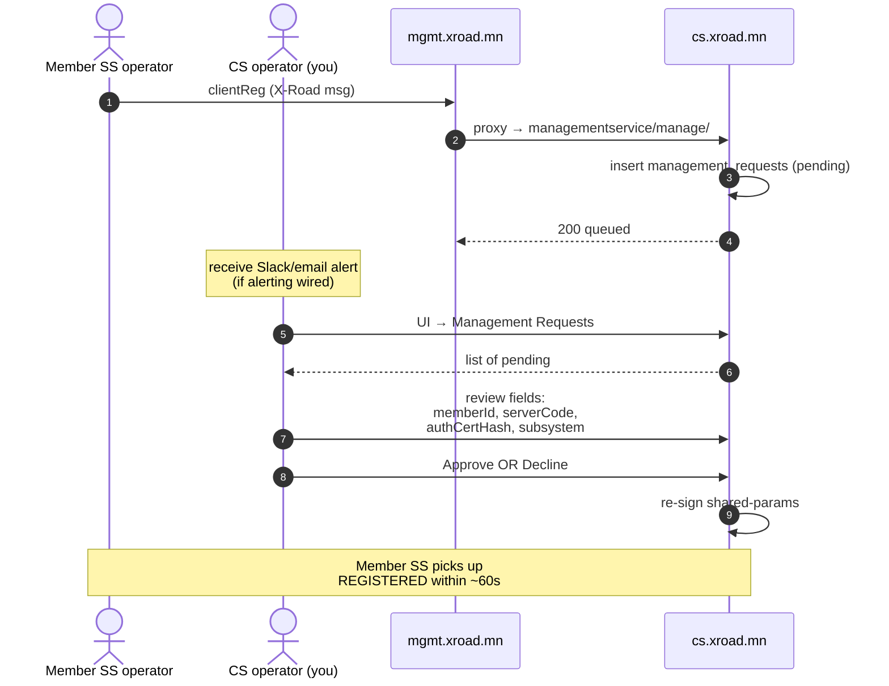
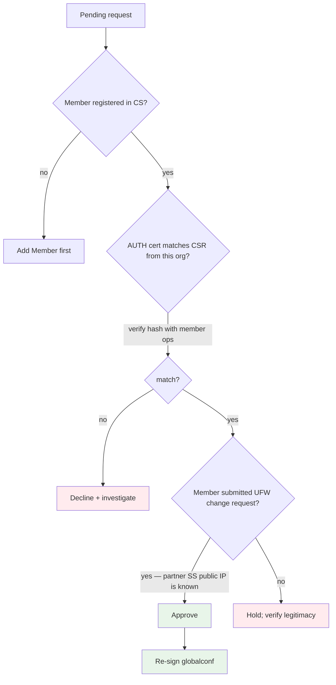
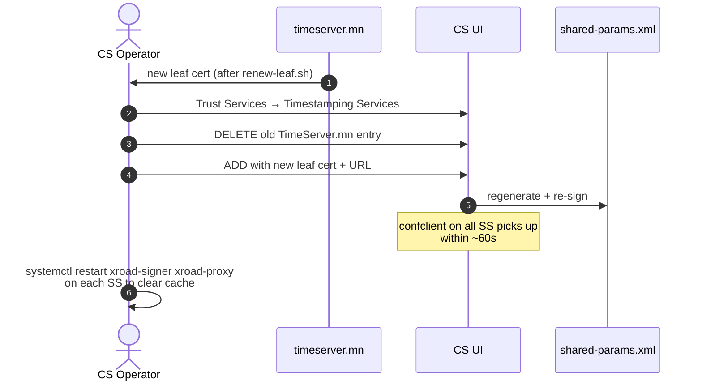
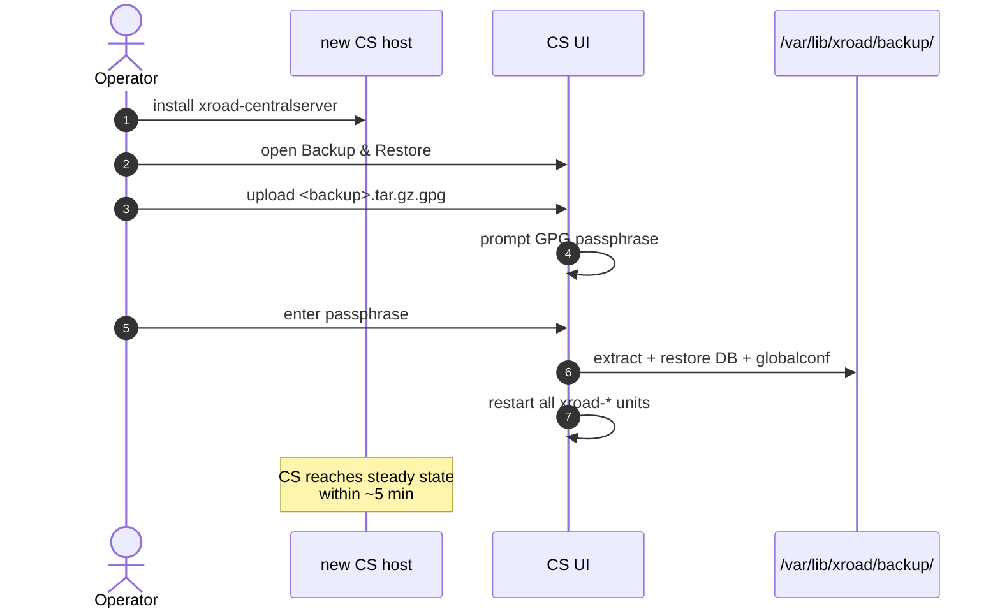

# ҮГ-CS — Central Server оператор гарын авлага (User Guide)

> **Doc code:** UG-CS — analogous to NIIS `UG-CS`.
> **Scope:** Production CS-ийн UI/CLI үйл ажиллагааны өдөр тутмын ажилбар. Гишүүн approvals, trust services, settings, troubleshooting.
> **Audience:** ҮДТ ба Gerege Systems-ийн өдөр тутмын оператор.

---

## Агуулга

1. [Хандах гарц](#1-хандах-гарц)
2. [Dashboard, navigation](#2-dashboard-navigation)
3. [Members / Security Servers удирдах](#3-members--security-servers-удирдах)
4. [Management Requests approve хийх](#4-management-requests-approve-хийх)
5. [Trust Services](#5-trust-services)
6. [Central services](#6-central-services)
7. [Settings / system parameters](#7-settings--system-parameters)
8. [Backup + restore](#8-backup--restore)
9. [Audit log](#9-audit-log)
10. [Алдааны кейсүүд](#10-алдааны-кейсүүд)

---

## 1. Хандах гарц

```bash
# Always via SSH tunnel — never direct
ssh -L 14000:localhost:4000 cs.xroad.mn
# Then https://localhost:14000  in browser
# Login: xrdadmin / <password from reference_cs_secrets.md>
```

★ **Insight ─────────────────────────────────────**
- `:4000` is **бүх UI authority**. Form-login + cookie session — MFA шаардлагатай Phase-3 ажил.
- Browser-ийн "self-signed cert" warning ердийн зүйл — Advanced → Proceed.
- `xrdadmin` нь built-in admin. Бусад operator-ыг OS-side `xroad-system-administrator` group-д нэмэх замаар оруулна.

**─────────────────────────────────────────────────**

## 2. Dashboard, navigation



Top-bar нь instance ID-г харуулна (`MN`). Sidebar-аас бүх area-нд орно.

## 3. Members / Security Servers удирдах

### 3.1 Member нэмэх

UI → **Members** → **+ Add Member**:
- Member class: `COM | GOV | NEE`
- Member code: улсын бүртгэлийн дугаар
- Name: легал нэр



⚠ **Watch out:** Member-ийг **DELETE-ыг** үнэхээр шаардлагатай үед л хий. Гишүүн идэвхтэй SS, subsystem, service-clients-тай байгаа бол DELETE нь өргөн хүрээнд эвдэрнэ.

### 3.2 Security Server мониторинг

UI → **Security Servers** хүснэгт нь instance-ийн бүх SS-ийн төлөвийг харуулна:

| Field | Утга |
|---|---|
| Server code | e.g. `RP-SS-1` |
| Owner | `MN/COM/6235972 Gerege Systems LLC` |
| AUTH cert hash | SHA-256 truncated |
| Public IP | from registration |
| Last seen | from globalconf fetch |

⚠ Cert hash mismatch гарсан тохиолдол: ХЗХ-ыг яаралтай шалга. Хэрэв SS-ийн жинхэнэ AUTH cert ИЛҮҮ шинэ бол — `clientReg` шинэ AUTH cert-тэй амжилттай хийгдсэн гэсэн үг. Хуучин hash байгаа бол — possibly hijacked or stale globalconf.

## 4. Management Requests approve хийх



### 4.1 Approval нь юу шалгах вэ?



## 5. Trust Services

### 5.1 Certification services (CAs)

UI → **Trust Services** → **Certification Services**:
- Хүн нэмэх: Add → upload `root-ca.pem` + `issuing-ca.pem`. Set OCSP URL + CRL URL.
- Edit: cert chain-ийг шинэчлэх (annual root rotation).

⚠ Cert chain change нь бүх SS-ийн OCSP fetch interval-аар л дамждаг — global propagation ~60s. Member SS-уудад `xroad-signer` restart хийх хэрэгтэй случай гарах магадлалтай.

### 5.2 Timestamping services (TSAs)

UI → **Trust Services** → **Timestamping Services**:
- Шинэ TSA нэмэх: Add → upload leaf cert + URL.
- Leaf cert rotated бол: DELETE + re-ADD (the cert is stored as base64 of PEM text in `shared-params.xml`, not raw DER — see `cs.xroad.mn/HISTORY.md` 2026-04-19).



## 6. Central services

CS дээр **central service** = бүх гишүүний хүсэлтийг redirect-аар нэг газар руу чиглүүлэх. Жишээ нь, `centralAddress` services-ийг шинэ SS-руу шилжүүлэх үед хэрэглэгддэг.

UI → **Central Services** → Add: ID + identifier + target. Mongolia X-Road instance дотор одоохондоо ашиглагдаагүй.

## 7. Settings / system parameters

UI → **Settings** → **System parameters**:

| Параметр | Утга | Тайлбар |
|---|---|---|
| `ocsp-fetchinterval` | 1200s | Бүх SS өөрсдийн cert-уудыг OCSP refresh хийх интервал |
| `ocsp-nextupdate` | 60s | OCSP responder-ийн "next update" чиглэл |
| `instance.ocsp-fetchinterval-override` | (per-CA-override) | Хэрэв тусдаа CA-д өөр интервал хэрэгтэй |

Edit-ийг **зөвхөн зайлшгүй шаардлагатай үед**. Default нь Mongolia-ийн traffic-д тохиромжтой.

## 8. Backup + restore

CS daily backup:
- Хийгдэх цаг: 02:00 Asia/Ulaanbaatar (`/etc/xroad/conf.d/local.ini` дотор тохируулна)
- Хэлбэр: GPG-encrypted `tar.gz`
- Газар: `/var/lib/xroad/backup/`
- Хадгалах хугацаа: default 30 хоног (rotation)

Restore (disaster recovery):

```bash
# 1) Stand up fresh CS host with same OS + xroad-centralserver
sudo apt install -y xroad-centralserver

# 2) Restore via UI
ssh -L 14000:localhost:4000 cs.xroad.mn
# UI → Backup & Restore → Upload → select <backup>.gpg → Restore
# Re-enters GPG passphrase
```



⚠ **Watch out:** GPG keyid solid pin шаардлагатай. Хэрэв backup encryption key-г replace хийсэн бол хуучин backup decrypt боломжгүй болно. Always keep old GPG keys for decryption-only purposes.

## 9. Audit log

UI → **Audit Log** хүснэгт нь UI-р хийгдсэн бүх үйлдлийг (member add/delete, approval, settings change) хадгална.

Filter: by user, by date range, by action type.

Бүх audit row нь:
- `who` (xrdadmin or other configured operator)
- `when` (UTC timestamp)
- `what` (action code)
- `target` (member/SS/service identifier)

⚠ **PII concern:** Audit log нь member-related identifier-ыг агуулна. Long-term retention policy ҮДТ-ийн GDPR-төстэй framework-той тохирно.

## 10. Алдааны кейсүүд

| Алдаа | Шалтгаан | Зас |
|---|---|---|
| Login fails after server reboot | postgresql@16-main not started | `sudo systemctl start postgresql@16-main` then restart xroad-center |
| Approve clicks нь "stuck pending" | signer down эсвэл softHSM token unlocked биш | UI → System Status → check signer; OR ssh + `xroad-softhsm-list` |
| Globalconf хуучин | xroad-confclient timer not fired | `sudo systemctl restart xroad-confclient.timer` |
| `shared-params.xml` дотор хуучин TSA cert | UI зөв шинэчилсэн ч cache stale | Хүлээх ~60s, эсвэл `sudo systemctl restart xroad-signer xroad-proxy` |
| Member нэмэх боломжгүй | Member code duplicate | Search Members for that code; if "phantom" row exists, DELETE then re-add |

Илүү гүнзгий troubleshooting: [`docs/guides/troubleshooting.md`](troubleshooting.md), [`cs.xroad.mn/HISTORY.md`](../../cs.xroad.mn/HISTORY.md).

---

*Энэхүү гарын авлага нь UI flow-уудыг бичсэн boldface biting reference. SQL backend хандах (e.g. `sudo -u xroad psql centerui`) нь зөвхөн disaster recovery-д. UI бүх ажилбарт хүрэлцэнэ.*
