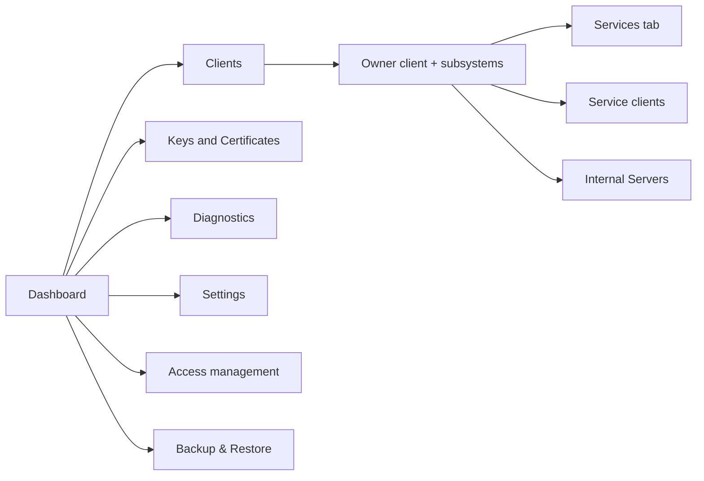
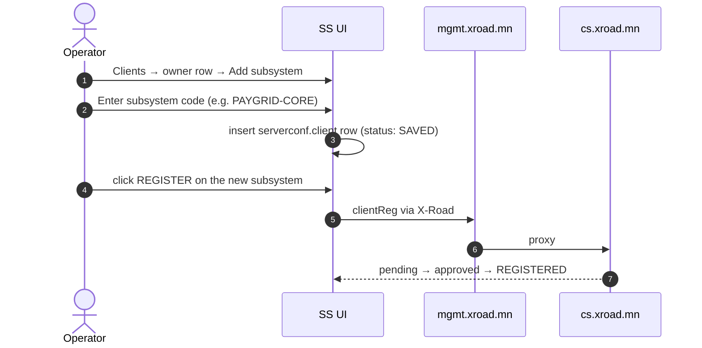
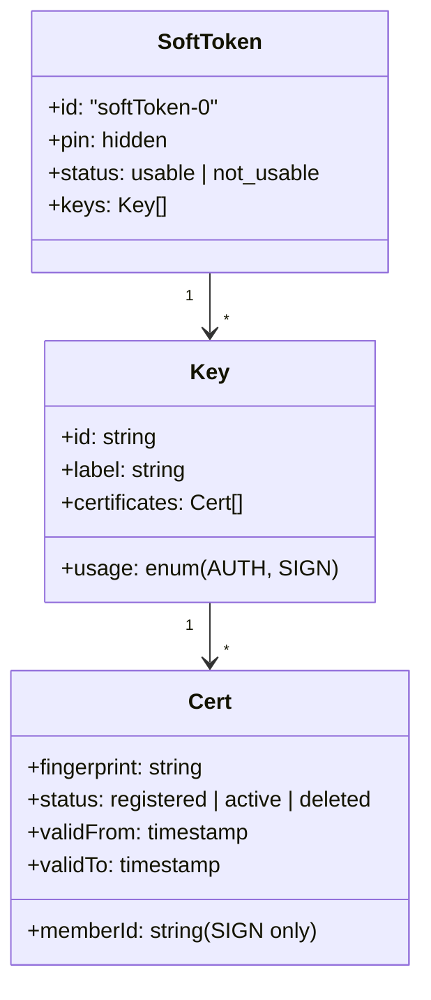
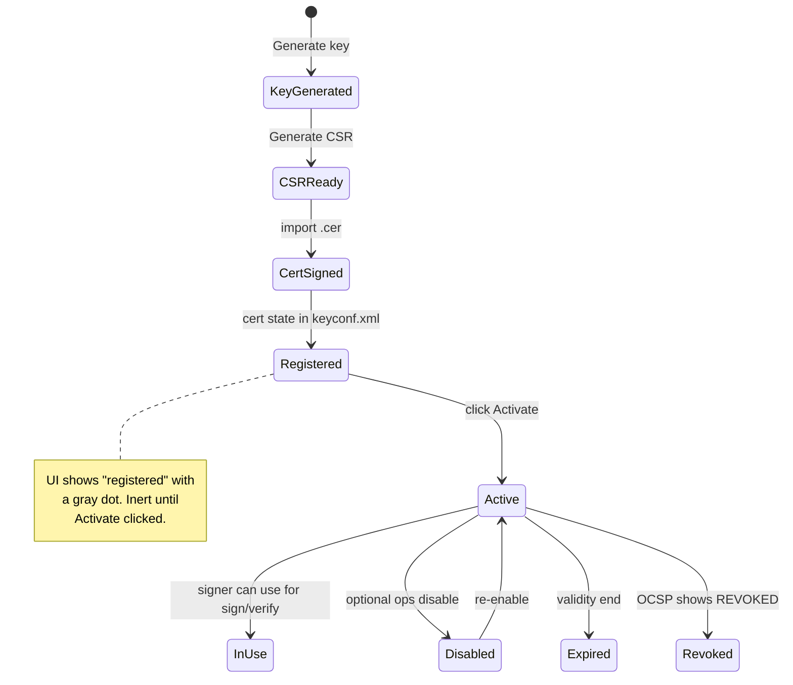
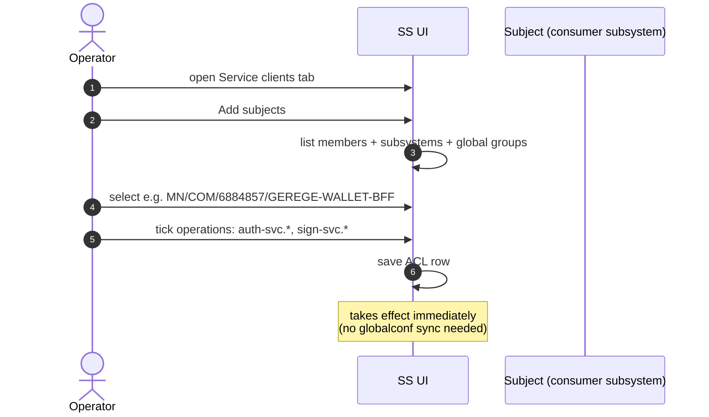
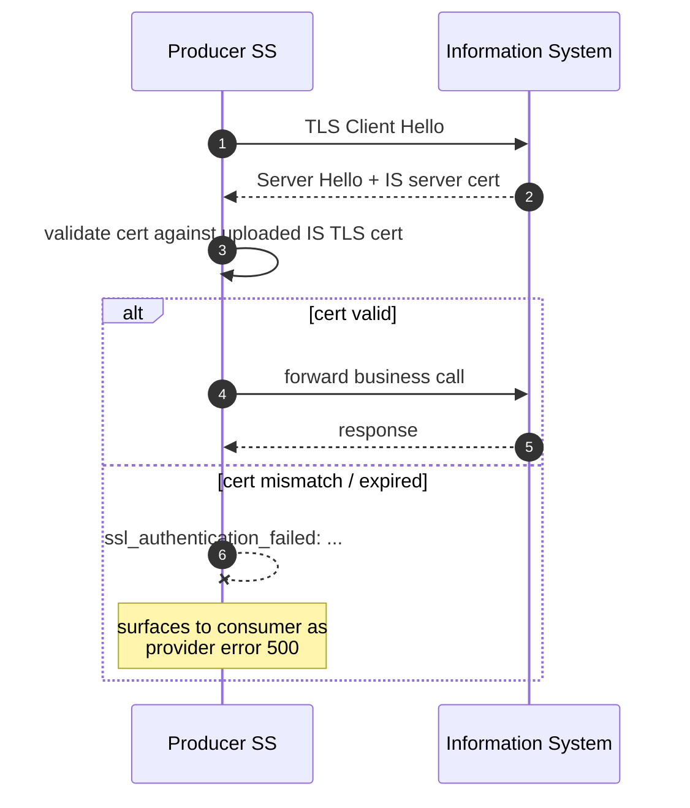
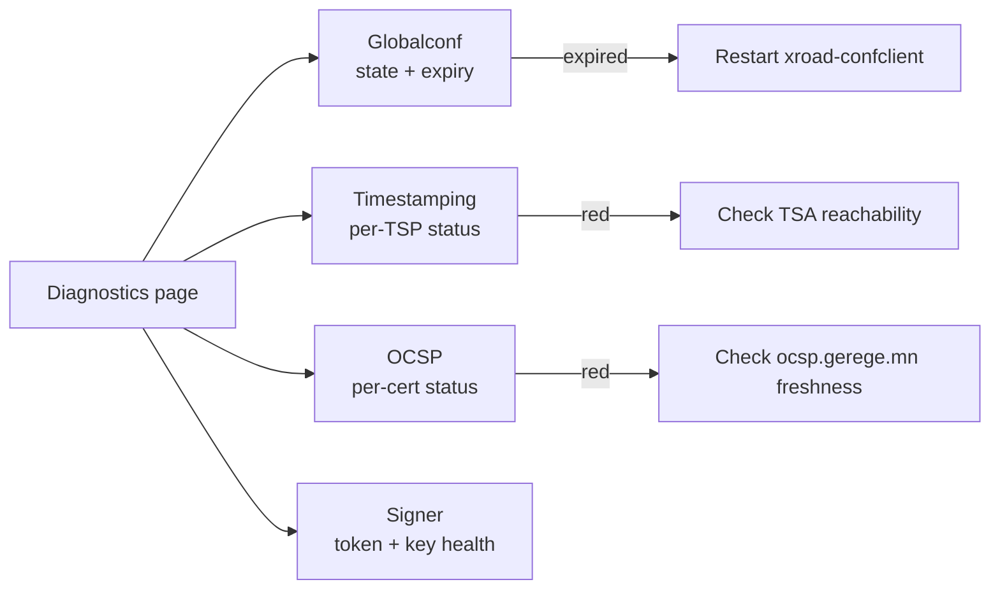

# ҮГ-SS — Security Server оператор гарын авлага

> **Doc code:** UG-SS — analogous to NIIS `UG-SS`.
> **Scope:** Гишүүн SS-ийн UI үйл ажиллагаа. Producer (rp.gerege.mn), Consumer (ss.gerege.mn), Hybrid (ss.paygrid.mn) гурвуулангад нь хамаарна.
> **Audience:** Гишүүн байгууллагын ажилтан.

---

## Агуулга

1. [Хандах гарц](#1-хандах-гарц)
2. [Dashboard tour](#2-dashboard-tour)
3. [Clients ба subsystems](#3-clients-ба-subsystems)
4. [Keys and Certificates](#4-keys-and-certificates)
5. [Services published (producer role)](#5-services-published-producer-role)
6. [Service clients ACL](#6-service-clients-acl)
7. [Internal Servers](#7-internal-servers)
8. [Settings ба System Parameters](#8-settings-ба-system-parameters)
9. [Diagnostics, monitoring](#9-diagnostics-monitoring)
10. [Backup, restore](#10-backup-restore)

---

## 1. Хандах гарц

```bash
# SSH tunnel always
ssh -L 14001:localhost:4000 mgmt.xroad.mn
# https://localhost:14001
# Login: admin user from wizard
```

Хост тус бүрд тусдаа local порт хэрэглэх стандарт:
- mgmt.xroad.mn → 14001
- ss.gerege.mn → 14002
- rp.gerege.mn → 14003
- ss.paygrid.mn → 14006

★ **Insight ─────────────────────────────────────**
`:4000`-ийг public нээж болохгүй. 2026-04-20-нд "pre-prod showcase" зориулж нээсэн, 2 хоногийн дараа буцаасан (HISTORY).
**─────────────────────────────────────────────────**

## 2. Dashboard tour



Top-bar: SS identity (e.g. `MN/COM/6235972 RP-SS-1`).

## 3. Clients ба subsystems

Owner client = wizard-аас үүссэн "X-Road client" (нэр нь legal entity). Subsystems-ийг нэмэхдээ:



⚠ Subsystem code нь **NIIS supported character set** (alpha-numeric, hyphen, underscore). Шинэ subsystem үүсгэхдээ team нэр хэлэлцэн томёол.

### 3.1 Subsystem types

| Төрөл | Жишээ | Тайлбар |
|---|---|---|
| Producer | `GEREGE-ID`, `EIDMONGOL` | Services тав-аар үйлчилгээ нийтэлдэг |
| Consumer | `GEREGE-WALLET-BFF`, `BANK1-DBANK` | Бусдын үйлчилгээ дуудна; өөрийн IS тал |
| Hybrid | `PAYGRID-CORE` (планд) | Producer + consumer |
| Management | `MANAGEMENT` | mgmt SS-ийн тусгай subsystem |

## 4. Keys and Certificates

UI → **Keys and Certificates** нь softHSM2 token-ийн key + cert содержимыг харуулна.



### 4.1 Шинэ түлхүүр + CSR

UI → **Keys and Certificates** → token → **Generate key**:
- Usage: AUTH (server identification) or SIGN (message body)
- Algorithm: EC P-256 (default, recommended for new SS) or RSA 2048

Дараа нь key row → **Generate CSR**:
- Subject CN: `<ss-fqdn>` (AUTH) or `<legal-name>` (SIGN)
- serialNumber: member code
- memberId: only on SIGN profile

CSR downloadable as `.csr` file. Send to `gerege.mn` operator for signing.

### 4.2 Cert import + activate

After receiving signed `.cer`:

UI → key row → **Import certificate**:
- Upload `.cer`
- After import, cert appears with status `registered`
- **Click Activate** to flip to `active`

⚠ **Гол алдаа:** Cert import-ийн дараа activate хийхгүй бол signer ашиглахгүй. UI алдаа цухайлах өчүүхэн зүйл оноос ажил гэхгүй. `rp.gerege.mn/HISTORY.md` 2026-04-19, `ss.gerege.mn/HISTORY.md` 2026-04-19.



## 5. Services published (producer role)

UI → **Clients** → <subsystem> → **Services** tab.

### 5.1 OpenAPI 3 description

Click **Add** → OpenAPI 3 description:
- URL: `https://api.eidmongol.mn/.well-known/openapi/eid-rp/auth.yaml`
- Or WSDL (legacy)

After save, services from the spec appear as rows. Edit each row to set:
- URL: where the SS should forward to (e.g. `https://api.eidmongol.mn/` for EIDMONGOL/auth-svc)
- Timeout: default 60s

Use **Apply to all in WSDL/OpenAPI** to batch-set URLs.

### 5.2 Service types

| Type | UI symbol |
|---|---|
| REST OpenAPI 3 | green REST icon |
| SOAP WSDL | blue SOAP icon |
| REST raw | gray icon |

## 6. Service clients ACL

UI → **Clients** → <subsystem> → **Service clients** tab.



★ **Insight ─────────────────────────────────────**
- ACL нь per-operation. Subsystem-д нэг сервис өгөхдөө BAS бүх дэд endpoint-уудыг tick хийх хэрэгтэй.
- "Yellow padlock vs green padlock" — UI-д ган үлдсэн ан өгөгдсөн service нь хайчилгаатай. Visual review хийх (`mgmt.xroad.mn/HISTORY.md` 2026-04-19).

**─────────────────────────────────────────────────**

⚠ **Onboarding partner-д:** Service-clients нь rp.gerege.mn-д **single source of truth**. Backend DB write шаардахгүй (2026-04-19 refactor, `ca.gerege.mn/HISTORY.md`).

## 7. Internal Servers

UI → **Clients** → <subsystem> → **Internal Servers** tab.

### 7.1 Connection type (consumer role)

- `HTTP` — IS-аас SS-руу plain HTTP (docker network, no client cert) — `ss.gerege.mn` TEST-DEMO pattern (өөр subsystem `GEREGE-WALLET-BFF` мөн адил)
- `HTTPS NOAUTH` — TLS, server cert only
- `HTTPS` — mTLS — `ss.paygrid.mn` PAYGRID-CORE pattern

### 7.2 Information system TLS certificate (producer role)

Producer SS-аас IS-руу HTTPS дуудах үед IS-ийн server cert-ийг verify хийнэ. Upload via **Internal Servers** → **Information system TLS certificate** → Add → upload IS-ийн `fullchain.pem`.

⚠ Let's Encrypt cert нь 90 хоног тутамд rotate хийгдэнэ. Хэрэв IS LE ашигладаг бол cron + alerting шаардлагатай (`rp.gerege.mn/HISTORY.md` 2026-04-19).



## 8. Settings ба System Parameters

UI → **Settings**:

### 8.1 System Parameters

- **Timestamping Services** — TSP entry-уудыг харуулна. Шинэ SS-д MUST `TimeServer.mn` нэмэх (`https://tsa.timeserver.mn/`).
- **Configuration Anchor** — current anchor + URL. Reload from CS if changed.
- **Approved Certification Services** — read-only, CS-аас globalconf-аар татна.

### 8.2 Backup encryption

UI → Settings → System Parameters → backup encryption keyid. Pin to a stable GPG key. Daily backup → `/var/lib/xroad/backup/`.

## 9. Diagnostics, monitoring

UI → **Diagnostics**:

| Indicator | Healthy state |
|---|---|
| Globalconf | "OK, expires YYYY-MM-DD" |
| Timestamping services | green checkmark per TSP |
| OCSP responders | "OK" with last refresh timestamp |

Хэрэв timestamping нь red бол:
- TSA host reachable эсэх (`curl -k https://tsa.timeserver.mn/`)
- shared-params-д approved TSA cert нь live leaf-тэй таарч буй эсэх



## 10. Backup, restore

SS daily backup нь `/var/lib/xroad/backup/`-д GPG encrypted tarball.

Restore:

```bash
# fresh SS install (same OS, xroad version)
sudo apt install -y xroad-securityserver

# UI → Backup & Restore → upload + restore
```

Restored SS нь:
- keyconf.xml + softHSM token + serverconf DB
- ANCHOR + globalconf is **re-fetched** from CS (not from backup)
- IS TLS certs preserved
- Service-clients ACL preserved

Restore-ийн дараа сайт MUST verify all certs are `active`. Sometimes activation status doesn't round-trip cleanly through backup.

---

*Operator daily workflow: dashboard glance → Diagnostics → fix anything red. Audit log нь UI-р хийсэн өөрчлөлтийг ор хадгална. SS багц шинэчлэх (apt upgrade) нь хагас-жилд нэг ажил — staging-д тест хийгээд production-д рул-аут.*
