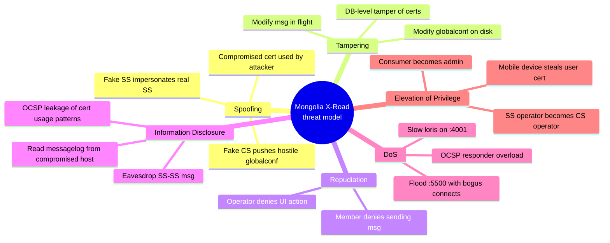
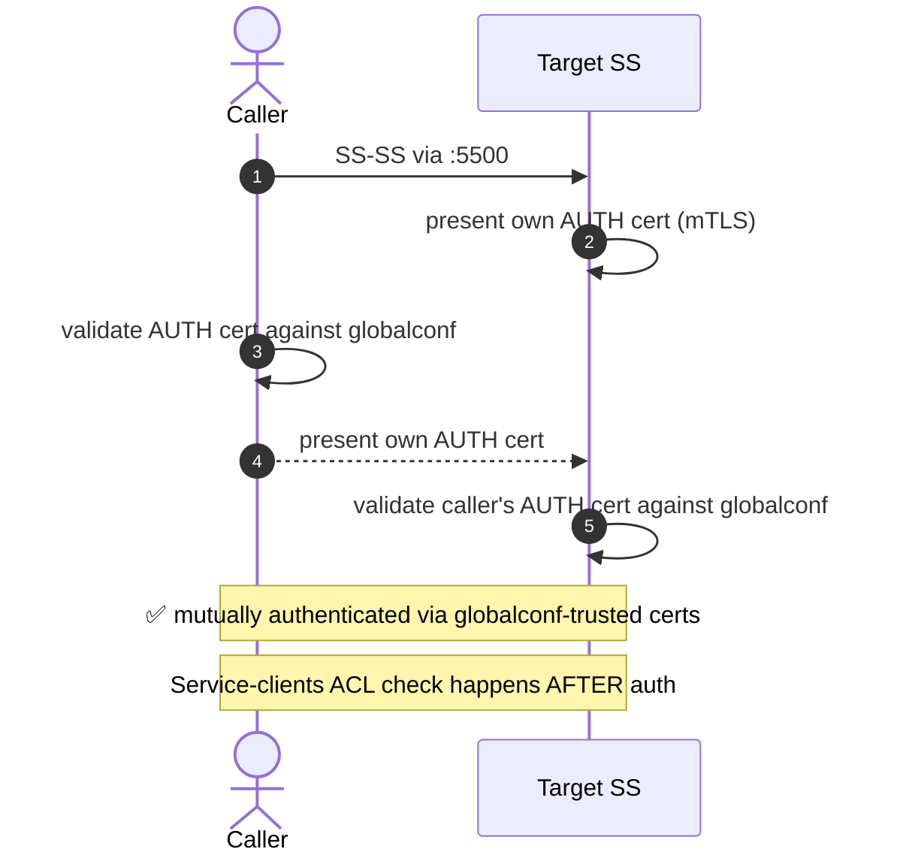
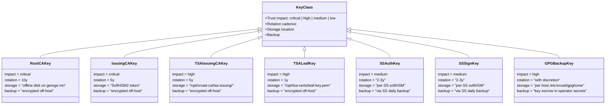
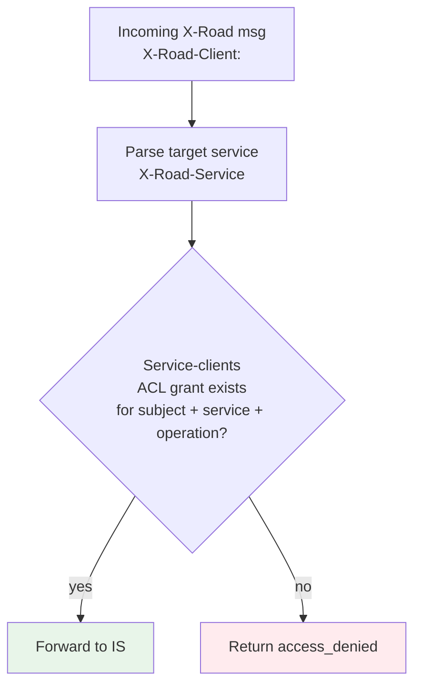
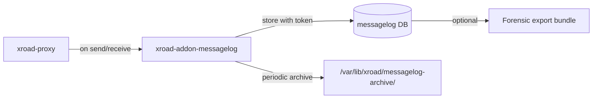
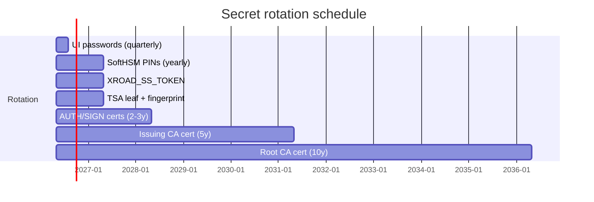
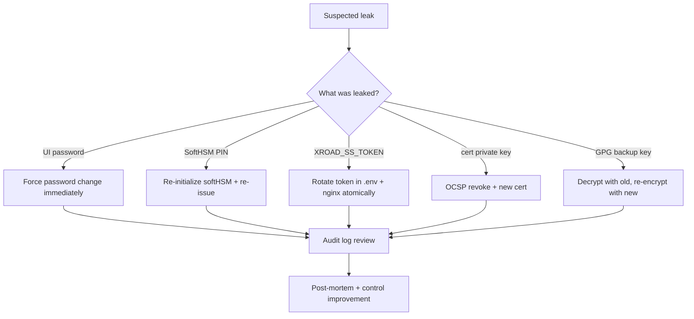
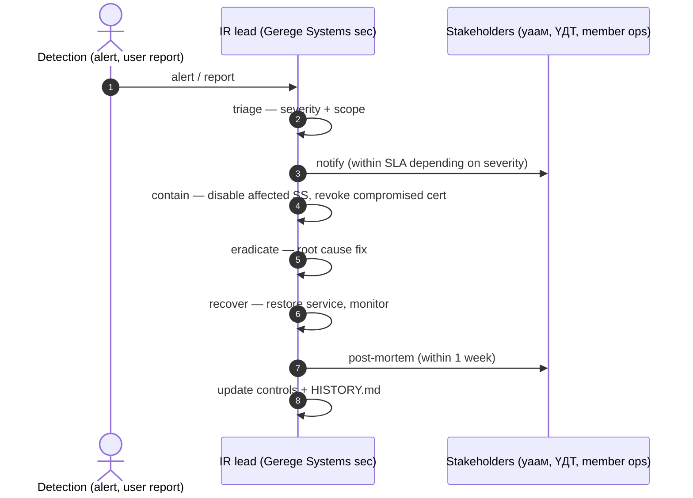

# ХБ-MN — Security гарын авлага

> **Doc code:** SEC-MN.
> **Scope:** Mongolia X-Road instance-ийн threat model, control inventory, audit guidance. ISO 27001 control map тэр чигтээ биш, гэхдээ ажилбарт чиглэсэн.
> **Audience:** Security architects, auditors, compliance officers.

---

## Агуулга

1. [Threat model (STRIDE)](#1-threat-model-stride)
2. [Trust boundaries](#2-trust-boundaries)
3. [Identity ба authentication](#3-identity-ба-authentication)
4. [Cryptographic controls](#4-cryptographic-controls)
5. [Key management](#5-key-management)
6. [Access control](#6-access-control)
7. [Audit logging ба non-repudiation](#7-audit-logging-ба-non-repudiation)
8. [Network controls](#8-network-controls)
9. [Secrets management](#9-secrets-management)
10. [Incident response playbook](#10-incident-response-playbook)
11. [Compliance map (ISO 27001 / GDPR-style)](#11-compliance-map-iso-27001--gdpr-style)

---

## 1. Threat model (STRIDE)



### 1.1 Per-threat mitigations

| Threat | Mitigation | Status |
|---|---|---|
| Fake SS | mTLS на `:5500` + globalconf cert pin | ✅ |
| Fake CS | configuration-anchor.xml-д CS public key pinned | ✅ |
| Compromised cert | OCSP revocation + cert pinning | ✅ |
| Modify msg in flight | SIGN cert over body+headers | ✅ |
| Modify globalconf on disk | CS signing → SS verify via anchor | ✅ |
| Member denies | messagelog с signed envelope + timestamp | ✅ |
| Eavesdrop SS-SS | TLS 1.2+, AES-GCM | ✅ |
| Eavesdrop msglog at rest | Disk encryption (host-level) | ⚠ partial |
| OCSP usage leakage | Single OCSP responder, no per-SS subdomain | ✅ |
| Flood `:5500` | UFW rate limit (Phase-3) | ☐ planned |
| OCSP overload | Dynamic sign with sub-ms latency | ✅ |
| Consumer escalation | Service-clients ACL per-operation | ✅ |
| Operator escalation | Per-host admin user; xrdadmin scope-limited | ✅ |
| Mobile cert theft | Secure Enclave + HMAC rotation + bio sign | ⚠ Phase-3 |

## 2. Trust boundaries

```d2
direction: down
title: Mongolia X-Road — trust boundaries

internet: {
  shape: cloud
  label: "Public Internet"
}

untrusted: {
  label: "ZONE 0 — UNTRUSTED (Internet)"
  shape: rectangle
  attacker: "Random Internet host"
}

dmz_public: {
  label: "ZONE 1 — DMZ public services"
  shape: rectangle
  ss_5500: ":5500 SS-SS (mTLS, cert-pinned)"
  ss_5577: ":5577 OCSP peer"
  cs_443: "cs.xroad.mn :443 WSDL"
  cs_4001: "cs.xroad.mn :4001 globalconf (UFW pinned)"
  cs_4002: "cs.xroad.mn :4002 mgmt-svc (UFW pinned)"
  tsa: "tsa.timeserver.mn :443"
  ocsp: "ocsp.gerege.mn :443"
  crl: "crl.gerege.mn :443"
}

dmz_internal: {
  label: "ZONE 2 — IS gating (per-IP allowlists)"
  shape: rectangle
  ca_xroad: "ca.gerege.mn /xroad/v1\n(rp IP-pinned + X-Gerege-SS-Token)"
  ss_is_gateway: "ss.gerege.mn :80 IS gateway\n(test.gerege.mn host pinned)"
  pay_is: "ss.paygrid.mn :8443\n(paygrid.mn host pinned mTLS)"
}

admin_plane: {
  label: "ZONE 3 — ADMIN PLANE (never public!)"
  shape: rectangle
  style.fill: "#FFEBEE"
  ui_4000: ":4000 xroad UI (SSH-tunnel only)"
  ssh_22: ":22 SSH (admin IP-pinned)"
  postgres: ":5432 postgres (loopback only)"
}

internet -> untrusted
untrusted -> dmz_public: "many random callers"
dmz_public -> dmz_internal: "approved SS path only"
dmz_internal -> admin_plane: "must be impossible — verified"
```

⚠ Хатуу invariant: **Zone 3 рүү public Internet-аас шууд хүрэх ёсгүй**. `:4000` (UI), `:22` (SSH), `:5432` (Postgres) — бүгд UFW + SSH-tunnel-аар хязгаарлагдсан.

## 3. Identity ба authentication

### 3.1 Identity types

| Identity | Format | Issued by |
|---|---|---|
| Member identity | `MN/<class>/<code>` (e.g. `MN/COM/6235972`) | CS approval |
| Subsystem identity | `MN/<class>/<code>/<subsystem>` | CS approval |
| AUTH cert | X.509 EC P-256 | Gerege Issuing CA |
| SIGN cert | X.509 EC P-256 | Gerege Issuing CA |
| TSA leaf | X.509 EC P-256 | Gerege TSA Issuing CA |
| Citizen AUTH/SIGN | X.509 (in mobile Gerege ID app) | Gerege Issuing CA |
| Operator identity | OS user + UI cred | OS-level + UI form-login |

### 3.2 Authentication flow per zone



## 4. Cryptographic controls

| Algorithm | Used for | Note |
|---|---|---|
| TLS 1.2+ | All HTTPS endpoints | TLS 1.3 supported by nginx |
| AES-GCM | TLS cipher suites | xroad-proxy disabled CBC modes |
| ECDSA P-256 | AUTH/SIGN/TSA leaves | Modern default; RSA legacy supported |
| EC P-384 | Gerege Root CA | More conservative root |
| RSA 2048+ | LE-issued TLS certs | LE default for non-EC subscriptions |
| SHA-256 | All hash uses | No MD5/SHA-1 in active path |
| RFC 3161 | TSP responses | Sigstore TSA |
| RFC 6960 | OCSP | gerege-ocsp |
| HMAC-SHA-256 | Mobile device auth | 60-day rotation planned |

## 5. Key management



### 5.1 Key recovery

| Key lost | Impact | Recovery |
|---|---|---|
| Root CA private | Cannot issue new intermediates; existing chain still valid | Restore from off-host encrypted backup |
| Issuing CA private | Cannot issue new SS auth/sign certs; existing certs still work | Restore from backup |
| TSA leaf private | Cannot sign new timestamp tokens | Generate new key, sign new leaf cert, update CS shared-params |
| SS AUTH/SIGN | SS-SS handshakes for this SS fail | Generate new key on SS, sign new cert, register |
| GPG backup | Existing backups unrecoverable; future backups encrypted with new key | Restore from off-host key escrow |

## 6. Access control

### 6.1 Service-clients ACL



ACL нь "default deny" — ямар нэгэн нэмэлт grant дутуу үед reject. Per-operation tick шаардлагатай.

### 6.2 Admin access

| Resource | Who | How |
|---|---|---|
| `xrdadmin` (CS UI) | ҮДТ + Gerege Systems | password in `reference_cs_secrets.md` |
| `admin` (SS UI) | Per-org operator | OS group `xroad-system-administrator` |
| SSH root on hosts | Sysadmin only | Key-only, pinned to admin IP |
| Postgres direct | Disaster recovery only | sudo + local socket |

⚠ MFA для CS UI нь Phase-3 ажил. Today form-login only.

## 7. Audit logging ба non-repudiation

### 7.1 X-Road messagelog

Бүх SS-SS зурвас нь `messagelog` DB-д **signed + timestamped envelope-аар** хадгалагдана. Forensic тогтоо урт хугацааны (default 7 жил) хадгалалт.



Хадгалагдсан запись:
- `message` (the SOAP envelope with body)
- `signature` (SIGN cert sig)
- `tspToken` (RFC 3161 token)
- `time` (storage timestamp)

Энэ бүгд хамтдаа **legally significant non-repudiation evidence**.

### 7.2 CS audit log

CS UI үйлдэл бүр centerui DB-д `audit_log` row үүсгэдэг (UI Audit Log tab).

### 7.3 ca.gerege.mn audit chain

`audit_logs` table нь hash-chained (each row's `prev_hash` references previous row). Бүх sign/auth/reg flow нь log row үүсгэнэ. Hash chain нь tampering-ийг анхааруулдаг.

## 8. Network controls

### 8.1 UFW pattern per host

```mermaid
graph TB
    %% Per-host UFW default policy

    DEFAULT[Default DROP incoming] --> CASES{Specific rules}

    CASES -->|22 from admin IP| OK_SSH[allow]
    CASES -->|5500 anywhere| OK_PEER[allow]
    CASES -->|5577 anywhere| OK_OCSP_PEER[allow]
    CASES -->|4001 from CS per-member<br/>(CS-side only)| OK_GCFG[allow]
    CASES -->|4002 from CS per-member<br/>(CS-side only)| OK_MGMT[allow]
    CASES -->|80/443 public<br/>(CS only)| OK_WEB[allow]
    CASES -->|IS gateway port from IS IP| OK_IS[allow]
    CASES -->|else| DENY[DROP]

    classDef allow fill:#E8F5E9
    classDef deny fill:#FFEBEE
    class OK_SSH,OK_PEER,OK_OCSP_PEER,OK_GCFG,OK_MGMT,OK_WEB,OK_IS allow
    class DEFAULT,DENY deny
```

### 8.2 mTLS на :5500

Бүх SS-SS зурвас mTLS-тай. AUTH cert хоёр талд presented, validated against globalconf-trusted CA chain.

### 8.3 LE-issued TLS на public-facing endpoints

`ca.gerege.mn`, `tsa.timeserver.mn`, `x-road.mn`, `monitor.x-road.mn` — бүгд LE auto-renew. ISRG Root X1 + X2 — long-term trust anchors.

## 9. Secrets management

### 9.1 Secret types

| Secret | Where stored | Rotation |
|---|---|---|
| GPG backup keys | `/etc/xroad/gpghome` + key escrow | with discretion |
| `xrdadmin` UI password | `reference_cs_secrets.md` operator memory | quarterly |
| SoftHSM2 PINs | `reference_*_secrets.md` per-host | yearly |
| `XROAD_SS_TOKEN` | `/opt/gerege-mn-eid/eid-gerege-backend/.env` AND nginx `proxy_set_header` | yearly |
| `TSA_CERT_FINGERPRINT` | `.env` env var | every leaf rotation |
| API tokens for mgmt/reg svc | `local.ini` (REDACTED in repo) | on rotation event |

### 9.2 Secret rotation cadence



### 9.3 Secret leak response



## 10. Incident response playbook

### 10.1 Incident response framework



### 10.2 Specific playbooks

**A) Compromised SS AUTH cert**:
1. OCSP-revoke the cert (UPDATE in ca DB).
2. Issue new cert, register on CS.
3. Pretend incident: review messagelog around the compromise window.
4. Notify stakeholders.

**B) CS signing key compromise** (worst case):
1. Generate new CS signing key.
2. Re-sign shared-params + private-params.
3. Re-distribute configuration-anchor.xml to every SS.
4. Operator personally hand-walk each SS to upload new anchor.
5. Notify Цахим яам + ҮДТ.
6. External forensic audit.

**C) Mass OCSP staleness causing service outage**:
- Today: should not happen (dynamic sign). If it does, suspect gerege-ocsp container or DB connectivity.
- Fix: `docker restart gerege-ocsp` + `systemctl restart xroad-signer` everywhere.

## 11. Compliance map (ISO 27001 / GDPR-style)

Бүрэн ISO 27001 compliance audit нь чухал хүрээтэй ажилбар. Энд тулгуурлахад зориулсан control area map:

| ISO 27001 control area | Mongolia X-Road implementation |
|---|---|
| A.5 Information security policies | docs/guides/sec-mn.md (this), docs/operational-gotchas.md |
| A.6 Organization | RACI in docs/taniltsuulga.md §5 |
| A.7 HR security | Per-host admin user provisioning + key revocation |
| A.8 Asset management | docs/topology.md hosts + ports; per-host README key inventory |
| A.9 Access control | Service-clients ACL + admin user lists |
| A.10 Cryptography | This guide §4 |
| A.11 Physical | Cogent + ШУТИС data center | (ҮДТ shouldering responsibility) |
| A.12 Operations | This guide §7-10; HISTORY.md per-host |
| A.13 Communications | mTLS + UFW + TLS 1.2+ |
| A.14 Acquisition/dev | gerege-mn-eid + gerege-mn-public repos |
| A.15 Supplier | NIIS upstream + Sigstore + LE — relationships documented in docs/guides/ar-mn.md §11 |
| A.16 Incident management | This guide §10 |
| A.17 Business continuity | docs/guides/ig-cs.md §8 (backup); UC-008 (host migration) |
| A.18 Compliance | This map; Mongolian e-ID law + GDPR-style data minimization (e.g. civil_id swap on /xroad/v1) |

GDPR-style data minimization:
- `national_id` (regnum) replaced with `civil_id` in `/xroad/v1` responses (`ca.gerege.mn/HISTORY.md` 2026-04-19).
- Mobile device key rotation reduces long-lived token exposure (`docs/mobile-security-roadmap.md` §2).

---

*Энэ нь Mongolia X-Road instance-ийн "security posture" хариуцлагатай документ. Аливаа threat vector эсвэл control дутагдалтай бол энд + `docs/guides/tr-mn.md` + тухайн хост-ын HISTORY.md-д нэмж бичнэ.*
