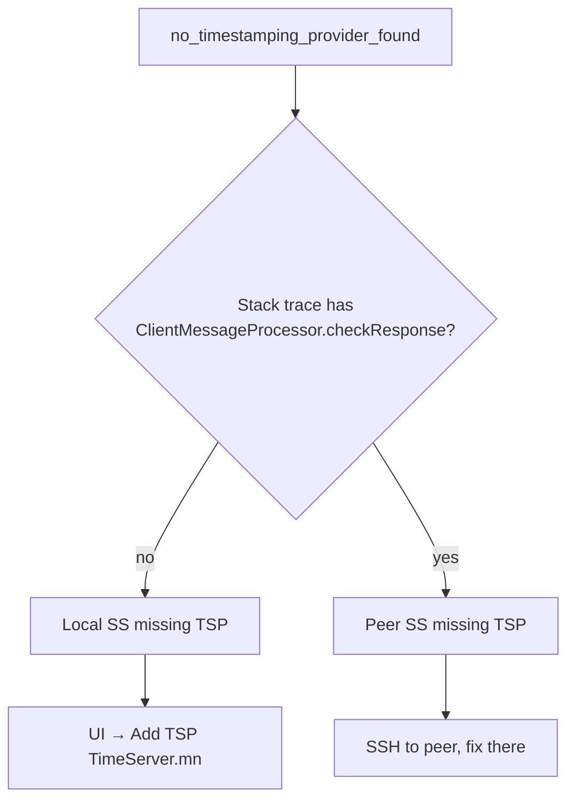
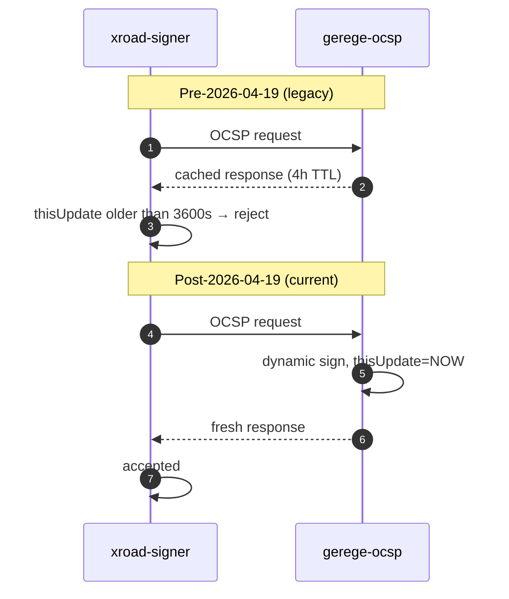
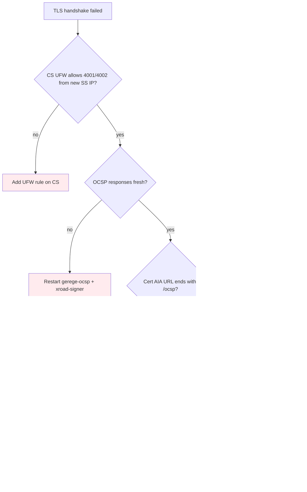
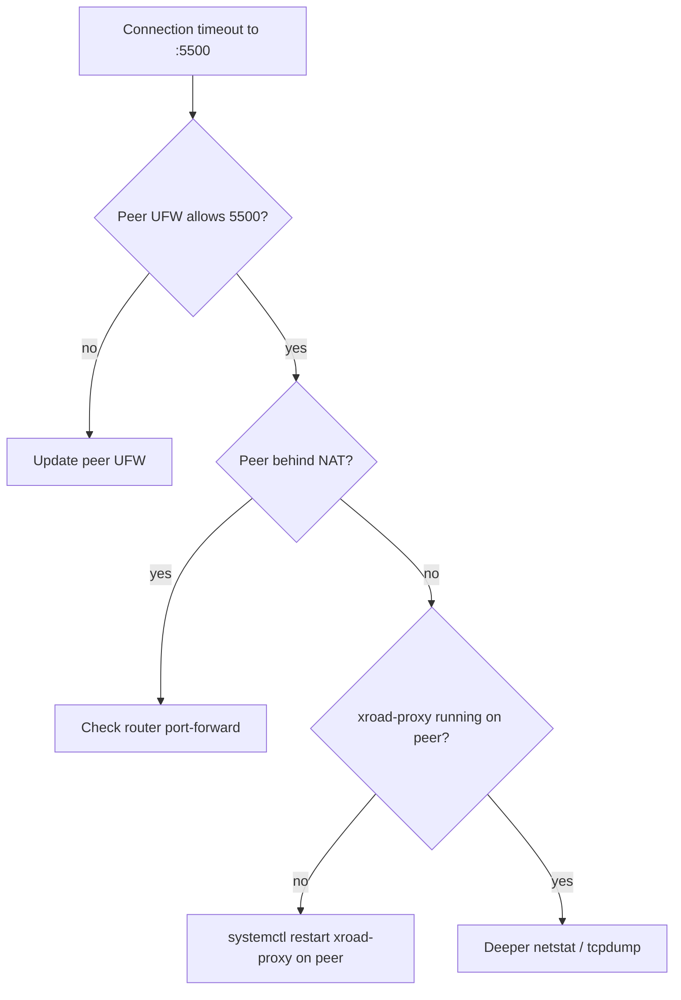
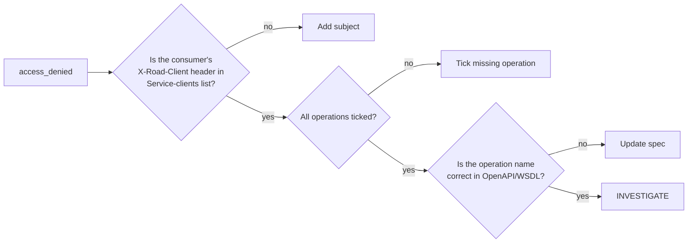

# ТР-MN — Troubleshooting гарын авлага

> **Doc code:** TR-MN.
> **Scope:** Mongolia X-Road instance-д тулгардаг бодит алдааны нөхцлүүд, шалтгаан, зас. HISTORY.md файлуудаас нэгтгэсэн. **Хамгийн чухал шинж тэмдэг → шалтгаан → зас → urlogу таблет**.
> **Audience:** Алдааны цаг үед мэдээллийн хэрэгцээтэй operator. Symptom-аар хайх style-аар бичсэн.

---

## Агуулга

1. [Symptom matrix](#1-symptom-matrix)
2. [TSA / TSP алдаанууд](#2-tsa--tsp-алдаанууд)
3. [OCSP алдаанууд](#3-ocsp-алдаанууд)
4. [Сертификат + signer алдаанууд](#4-сертификат--signer-алдаанууд)
5. [TLS handshake алдаанууд](#5-tls-handshake-алдаанууд)
6. [Network + UFW алдаанууд](#6-network--ufw-алдаанууд)
7. [Globalconf + confclient алдаанууд](#7-globalconf--confclient-алдаанууд)
8. [Service-clients / ACL алдаанууд](#8-service-clients--acl-алдаанууд)
9. [UI / API алдаанууд](#9-ui--api-алдаанууд)
10. [Backup / restore алдаанууд](#10-backup--restore-алдаанууд)

---

## 1. Symptom matrix

```mermaid
flowchart TB
    %% Lookup: by error message

    sym1["mlog.no_timestamping_provider_found"] --> tsp_fix[§2.1 TSP missing on SS]
    sym2["mlog.tsp_certificate_not_found"] --> tsp_fix2[§2.2 stale TSA cert in shared-params]
    sym3["incorrect_validation_info: OCSP response is too old"] --> ocsp_fix[§3.1 stale OCSP (legacy)]
    sym4["Member 'SUBSYSTEM:...' has no suitable certificates"] --> sig_fix[§4.1 OCSP staleness + signer cache]
    sym5["Security server has no valid authentication certificate"] --> auth_fix[§4.2 AUTH cert not activated]
    sym6["ssl_authentication_failed: ... has no IS certificates"] --> is_fix[§5.1 IS TLS cert missing]
    sym7["error_code.core.tls.handshake_failed"] --> tls_fix[§5.2 multi-layer registration fail]
    sym8["403 X-Road IS endpoint restricted"] --> nginx_fix[§6.1 IS nginx IP gate]
    sym9["Unknown service: SERVICE:..."] --> svc_fix[§8.1 service not published or mgmt WSDL missing]
    sym10["service_failed.access_denied"] --> acl_fix[§8.2 ACL not granted]
```

## 2. TSA / TSP алдаанууд

### 2.1 `mlog.no_timestamping_provider_found`

**Шалтгаан хувилбар А:** SS-д TSP entry байхгүй.
**Зас:** SS UI → Settings → System Parameters → Timestamping Services → Add → `TimeServer.mn` URL `https://tsa.timeserver.mn/`.

**Шалтгаан хувилбар Б:** Алдаа SS-аас өөр SS-аас ирсэн (e.g. mgmt SS). Stack trace дотор `ClientMessageProcessor.checkResponse` гарвал peer SS-д TSP алдаа гэсэн утга.
**Зас:** Walk the same checklist on the upstream SS.



### 2.2 `mlog.tsp_certificate_not_found`

**Шалтгаан:** CS shared-params-ийн approved TSA cert нь live TSA leaf-тэй таарахгүй (TSA leaf rotated, CS not updated).
**Зас:** CS UI → Trust Services → Timestamping Services → delete + re-add with new leaf cert. Wait ~60s. `systemctl restart xroad-signer xroad-proxy` on every member SS.

Энэ нь `timeserver.mn/HISTORY.md` 2026-04-19-ний өдрийн журам хэлбэр.

## 3. OCSP алдаанууд

### 3.1 `incorrect_validation_info: OCSP response is too old` (legacy bug)

**Контекст:** 2026-04-19-ийн өмнө `gerege-ocsp` нь in-memory cache-той байсан (4h TTL). X-Road default freshness 3600s — cache > 1h хадгалагдвал бүх consumer reject.

**Эдгээр өдөрт:** Commit `33f04ab on gerege-mn-eid`-ийн дараа cache бүрэн арилгасан. Хариу хариу dynamic sign.

**Хэрэв одоо энэ алдаа дахин гарвал:** энэ нь xroad-signer-ийн өөрийн OCSP refresh цикл-д асуудал гэсэн утга — gerege-ocsp-д биш.

**Уламжлалт зас (deprecated):**
```bash
ssh gerege.mn 'docker restart gerege-ocsp'
ssh <affected-ss> 'sudo systemctl restart xroad-signer'
```



### 3.2 OCSP responder returns wrong serial (leading-zero bug — fixed)

**Контекст:** `gerege-ocsp` нь positive cert serial-ийн leading zero байтыг алддаг. Сертификатын serial `0x00`-аар эхэлбэл lookup алдаа.

**Status:** Fixed pre-2026-04. Serial-ийг яг тэр чигт нь buцаана.

## 4. Сертификат + signer алдаанууд

### 4.1 `Member 'SUBSYSTEM:...' has no suitable certificates`

**Шалтгаан:** Signer нь OCSP cache stale → cert "unsuitable" set-ээс хасагдсан.
**Зас:** `ss.gerege.mn/HISTORY.md` 2026-04-19-ний дагуу:
```bash
ssh gerege.mn 'docker restart gerege-ocsp'   # legacy; post-fix not needed
ssh <ss> 'sudo systemctl restart xroad-signer'
```

### 4.2 `Security server has no valid authentication certificate`

**Шалтгаан:** AUTH cert registered боловч ACTIVATED биш — `<cert active="false">` in keyconf.xml.
**Зас:** SS UI → Keys and Certificates → expand AUTH key → click cert row → Activate.

**Watch out:** Import-ийн дараа auto-activate болохгүй. Wizard ч мөн адил. Бүхий ажилбарт хяна.

### 4.3 `Invalid X.509 certificate` on cert import

**Шалтгаан:** Globalconf хуучирсан — шинэ Issuing CA cert CS-д нэмэгдсэн боловч SS confclient refresh хийгээгүй.
**Зас:**
```bash
sudo systemctl restart xroad-confclient
sudo systemctl restart xroad-signer
```

Хэрэв энэ нь шинэ Issuing CA эсвэл cross-signed cert чиглэлийн өөрчлөлтийн дараа гарсан бол `rp.gerege.mn/HISTORY.md` 2026-04-19 тохиолдол.

## 5. TLS handshake алдаанууд

### 5.1 `ssl_authentication_failed: Client 'SUBSYSTEM:...' has no IS certificates`

**Шалтгаан:** Producer SS-аас IS-руу HTTPS дуудаж байна, гэхдээ IS-ийн server cert SS-д upload хийгээгүй.
**Зас:**
- Internal Servers → Information System TLS certificate → Add → upload IS server cert (e.g. LE fullchain.pem).
- Эсвэл OpenAPI service URL-ийг `http://...` болгож сольж (security trade-off).
- Эсвэл connection type-ыг HTTPS_NOAUTH болгох (consumer role only).

### 5.2 TLS handshake failed when registering new member SS (multi-layer)

**Шалтгаан:** `cs.xroad.mn/HISTORY.md` 2026-04-19-ний 4-давхар чанартай асуудал:

1. **UFW** 4002/tcp from new SS IP not allowed → `sudo ufw allow from <IP> to any port 4002 proto tcp`
2. **OCSP** responses stale → `docker restart gerege-ocsp && systemctl restart xroad-signer`
3. **OCSP AIA URL** doesn't have `/ocsp` path → nginx rewrites POST `/` → `/ocsp` (one-time fix on gerege.mn)
4. **TSA cert in shared-params** stale → CS UI re-add TimeServer.mn entry



## 6. Network + UFW алдаанууд

### 6.1 `403 X-Road IS endpoint restricted` from ca.gerege.mn

**Шалтгаан:** `/xroad/v1/*` IS endpoint нь зөвхөн rp.gerege.mn-ийн public IP (`38.180.251.163`)-аас зөвшөөрнө. Бусад IP-аас орвол 403.

**Зас:** Бодит check: `nginx/ca.gerege.mn.conf` дотор `if ($remote_addr = "38.180.251.163")`. Хэрэв rp.gerege.mn-ийн IP сольсон бол энэ check-ийг шинэчлэх MUST.

### 6.2 SS-SS connection timeout

**Шалтгаан хувилбарууд:**
- Peer SS-ийн UFW `:5500` блоклосон.
- NAT router-ийн port-forward rule байхгүй (ss.gerege.mn pattern, 10.0.0.27 ард).
- Peer's `xroad-proxy` not running.



### 6.3 SS-аас IS-руу HTTPS алдаа

Нэг конкрет тохиолдол: `rp.gerege.mn` нь IS endpoint `ca.gerege.mn` LE rotate-ийн дараа handshake fail. Зас: SS UI → Internal Servers → IS TLS certificate → upload new LE fullchain.

## 7. Globalconf + confclient алдаанууд

### 7.1 Globalconf expired

**Шинж тэмдэг:** SS UI Diagnostics → Globalconf state "expired".
**Шалтгаан хувилбарууд:**
- `xroad-confclient` сервис унтарсан.
- Сүлжээний асуудал: CS:4001-руу хүрэхгүй.
- Anchor public key зөв биш.

**Зас:**
```bash
sudo systemctl status xroad-confclient
sudo systemctl restart xroad-confclient
sudo cat /var/log/xroad/confclient.log | tail -100
```

### 7.2 Globalconf signature verify fails

**Шалтгаан:** CS signing key rotated, бид хуучин anchor-той хэвээр.
**Зас:** Download new anchor from CS UI → upload to SS via UI → Settings → Configuration Anchor → Replace.

## 8. Service-clients / ACL алдаанууд

### 8.1 `Unknown service: SERVICE:MN/COM/.../MANAGEMENT/clientReg`

**Шалтгаан:** mgmt SS дээр MANAGEMENT subsystem-д services нийтлэгдээгүй (just-installed wizard төлөв).
**Зас:** mgmt SS UI → Clients → MANAGEMENT → Services → Add WSDL → `http://cs.xroad.mn/managementservices.wsdl`. After enable, all 10 services available. Set URL → `https://cs.xroad.mn:4002/managementservice/manage/` for each.

`mgmt.xroad.mn/HISTORY.md` 2026-04-19 тохиолдол.

### 8.2 `service_failed.access_denied`

**Шалтгаан:** Service-clients-д consumer subsystem нь access өгөгдөөгүй, эсвэл per-operation tick хийгээгүй.
**Зас:** Producer SS UI → Services tab → Service clients → Add subjects (or expand existing row → tick missing operations).

**Watch out:** Yellow padlock vs green padlock visual scan (`mgmt.xroad.mn/HISTORY.md` 2026-04-19 `addressChange` тохиолдол).



## 9. UI / API алдаанууд

### 9.1 UI login fails after server reboot

**Шалтгаан:** `postgresql@16-main` not auto-started (rare).
**Зас:**
```bash
sudo systemctl start postgresql@16-main
sudo systemctl restart xroad-center  # CS
# OR
sudo systemctl restart xroad-proxy-ui-api  # SS
```

### 9.2 UI shows "Connection refused" intermittently

**Шалтгаан:** xroad-proxy unit OOM-killed (rare, low-memory hosts).
**Зас:** Increase host RAM or reduce JVM heap in `/etc/xroad/conf.d/proxy-params.ini`.

### 9.3 Cert import returns `error_code.core.internal_error`

**Шалтгаан:** Go x509 backend reconstructing subject from RDN drops `businessCategory` OID.
**Зас:** Patched `eid-gerege-backend/internal/service/xroad_csr.go` to preserve `RawSubject`. Already deployed; if it ever recurs, check the patch is in.

## 10. Backup / restore алдаанууд

### 10.1 Restore fails to decrypt

**Шалтгаан:** GPG key mismatch — current host's GPG home doesn't have the key that encrypted the backup.
**Зас:** Import the old GPG key:
```bash
sudo -u xroad gpg --homedir /etc/xroad/gpghome --import old-backup-key.asc
# verify
sudo -u xroad gpg --homedir /etc/xroad/gpghome --list-keys
```

⚠ Always keep old GPG keys for decryption only. Never delete a backup encryption key without verifying all backups using it are no longer needed.

### 10.2 Restored SS can't reach CS

**Шалтгаан:** Public IP changed; CS-side UFW rules still pin old IP.
**Зас:** CS operator updates UFW:
```bash
ssh cs.xroad.mn 'sudo ufw delete allow from <old-ip> to any port 4001 proto tcp'
ssh cs.xroad.mn 'sudo ufw allow from <new-ip> to any port 4001 proto tcp'
# Same for 4002
```

---

## Алдаа диагноз хийх ерөнхий хандлага

```mermaid
flowchart TB
    SYM[Error symptom] --> WHERE{Where did it surface?}
    WHERE -->|UI alert| UI_DEEP[UI Diagnostics + audit log]
    WHERE -->|consumer log| CONS_DEEP[Trace X-Road-Client header path]
    WHERE -->|producer log| PROD_DEEP[Check producer's signer.log, proxy.log]
    WHERE -->|CS log| CS_DEEP[/var/log/xroad/center.log]

    CONS_DEEP --> SOURCE{Which SS in chain failed?}
    SOURCE --> CHECK[Walk symptom matrix on that SS]

    CHECK --> FIX[Apply fix from this guide]
    FIX --> VERIFY[Retry the original op]
    VERIFY --> SUCCESS[✓]
    VERIFY --> LOOP[If still fails, re-check]
    LOOP --> WHERE

    classDef start fill:#E3F2FD
    classDef success fill:#E8F5E9
    class SYM,WHERE start
    class SUCCESS success
```

---

*Шинэ симптом гарвал тухайн хост-ын `HISTORY.md`-д нэмж бичнэ, дараа нь энэхүү гарын авлагын matrix-д symptom→fix-ийн уулзвар нэмнэ.*
