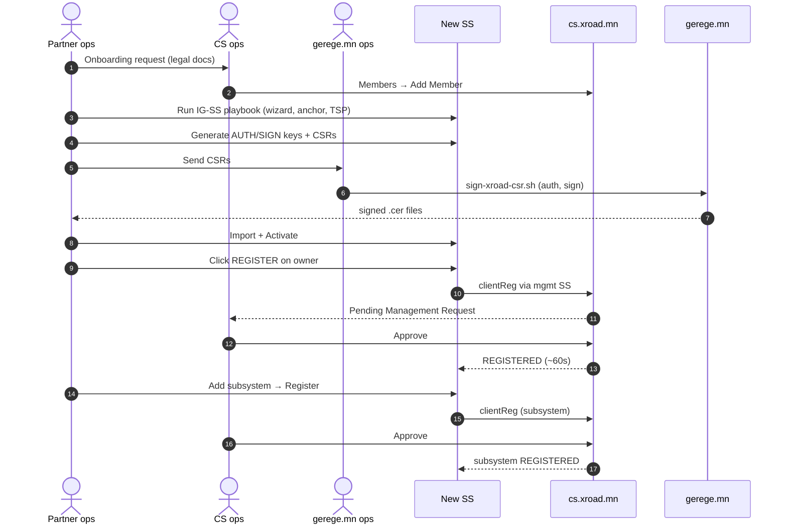
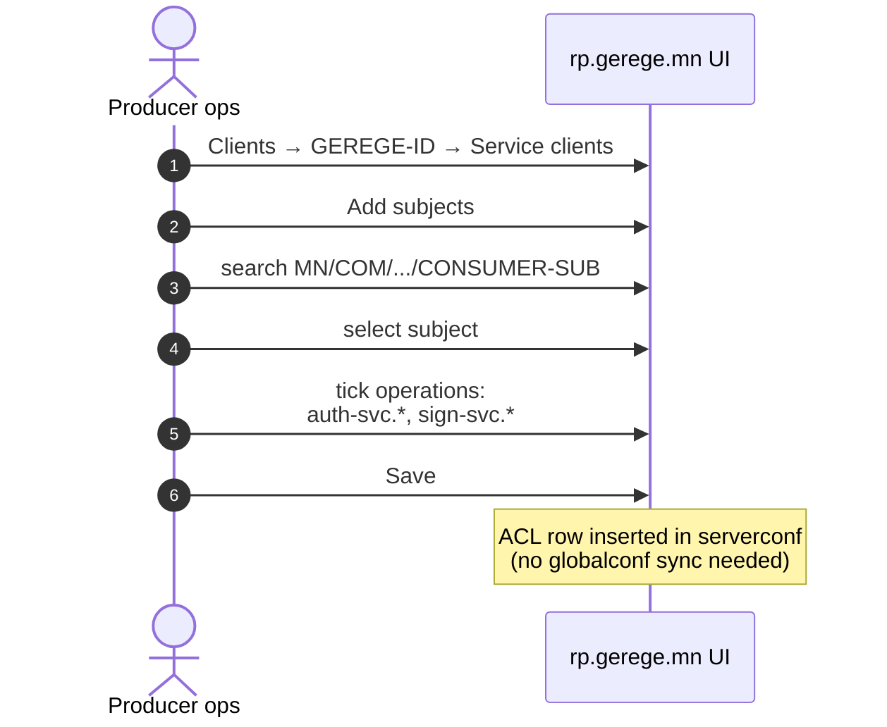
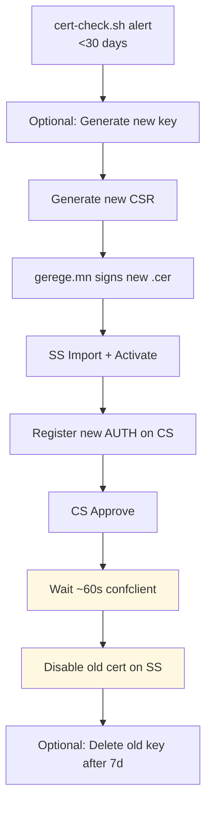
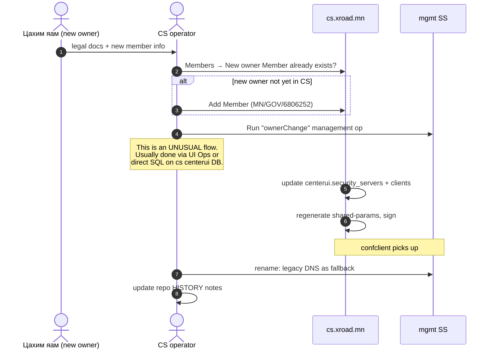
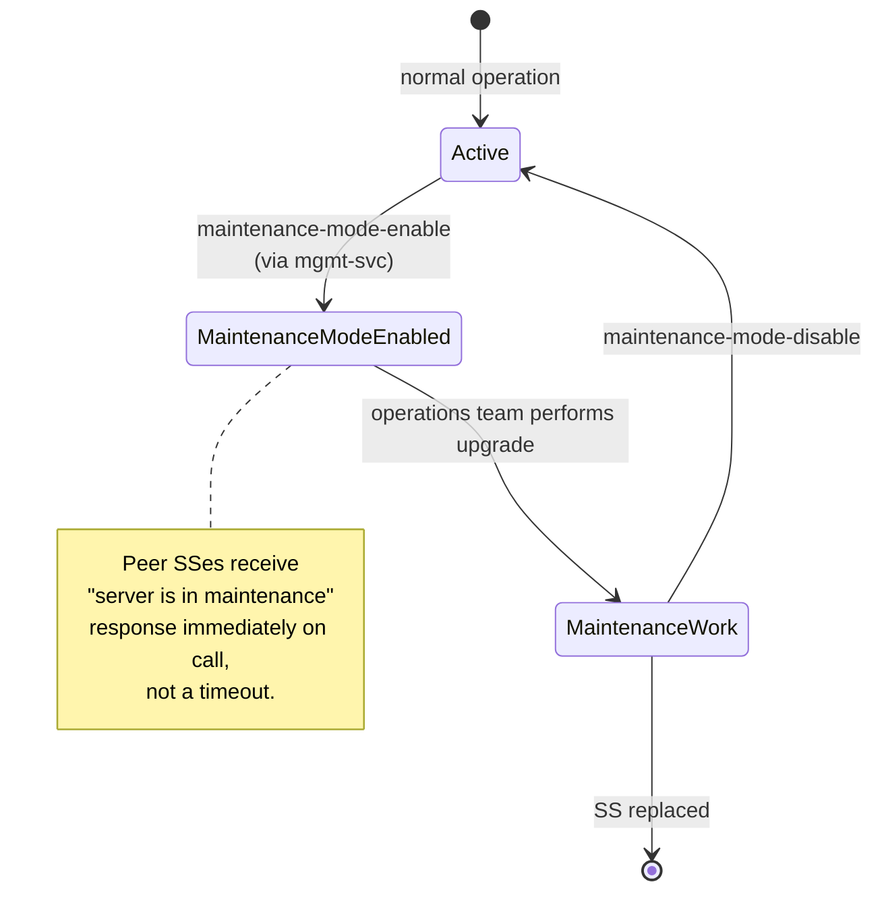
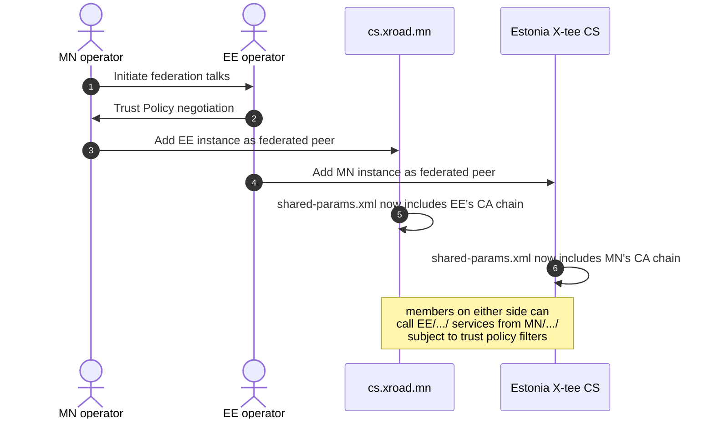

# УЦ-MN — Use Cases (Хэрэглээний хувилбарууд)

> **Doc code:** UC-MN — analogous to NIIS `UC-MEMBER`/`UC-SS`/`UC-FED`.
> **Scope:** Mongolia X-Road instance-ийн өдөр тутмын, цаг үед хийгдэх, төлөвлөгөөтэй ажилбаруудын **detailed use case**-ууд. Жинхэнэ ажилбарт зөвхөн UI алхамыг бус, шалтгаан + watch-out-уудыг хамтад нь.
> **Audience:** Бүх level-ийн operator + auditor.

---

## Агуулга

1. [UC-001: Шинэ гишүүн SS бүртгэх](#uc-001-шинэ-гишүүн-ss-бүртгэх)
2. [UC-002: Subsystem ACL grant](#uc-002-subsystem-acl-grant)
3. [UC-003: AUTH/SIGN cert renewal](#uc-003-authsign-cert-renewal)
4. [UC-004: TSA leaf renewal](#uc-004-tsa-leaf-renewal)
5. [UC-005: Member ownership change](#uc-005-member-ownership-change)
6. [UC-006: Maintenance window (planned outage)](#uc-006-maintenance-window-planned-outage)
7. [UC-007: Cert revocation + recovery](#uc-007-cert-revocation--recovery)
8. [UC-008: SS host migration](#uc-008-ss-host-migration)
9. [UC-009: Federation onboarding (future, Phase-3)](#uc-009-federation-onboarding-future-phase-3)
10. [UC-010: Op-Monitor central dashboard (future)](#uc-010-op-monitor-central-dashboard-future)

---

## UC-001: Шинэ гишүүн SS бүртгэх

**Actor:** Гишүүн SS оператор, CS оператор.
**Trigger:** Гишүүн байгууллага onboarding хүсэлт ирүүлсэн.
**Preconditions:** [`docs/guides/ig-ss.md`](ig-ss.md)-ийн дагуу SS host бэлэн.
**Postcondition:** Owner client REGISTERED, эхний subsystem REGISTERED, AUTH cert active.



**Watch-out-ууд:**
- TSP entry MUST be added BEFORE clientReg (else `mlog.no_timestamping_provider_found`).
- CS UFW MUST allow new SS IP on `:4001, :4002` before clientReg.
- AUTH AND SIGN certs MUST be activated.

## UC-002: Subsystem ACL grant

**Actor:** Producer SS operator.
**Trigger:** New consumer subsystem ready to consume a service.
**Postcondition:** Consumer's X-Road calls reach the IS.



Watch-out: visual review padlock icons after save. `mgmt.xroad.mn/HISTORY.md` 2026-04-19 noted a missed `addressChange` row.

## UC-003: AUTH/SIGN cert renewal

**Actor:** SS operator, CA operator, CS operator.
**Trigger:** Cron alert "cert expiring in 30 days".
**Postcondition:** SS uses new cert; old cert disabled.



⚠ **Same key, new cert** хувилбар — `renew-leaf.sh` нь key-г reuse хийдэг, зөвхөн cert-г шинэчлэх (TSA pattern). SS-ийн AUTH/SIGN cert-д энэ approach ашиглах боломжтой ч тогтмол policy биш. Шинэ key-г 2-3 жил тутамд rotate хийх нь зөв practice.

## UC-004: TSA leaf renewal

**Actor:** timeserver.mn operator, CS operator.
**Trigger:** TSA leaf cert expiry alert эсвэл security incident.
**Postcondition:** New leaf cert in use; CS shared-params updated; all SS pick up.

```mermaid
sequenceDiagram
    autonumber
    actor Op as Operator
    participant TS as timeserver.mn
    participant CA as gerege.mn
    participant CS as cs.xroad.mn
    participant BE as eid-gerege-backend

    Op->>TS: ./renew-leaf.sh (or manual openssl x509 -req)
    TS->>CA: scp tsa.csr; openssl sign with tsa-issuing
    CA-->>TS: new leaf-cert.pem
    Op->>TS: rebuild certchain.pem
    Op->>TS: systemctl restart timestamp-authority
    Op->>CS: UI → Trust Services → Timestamping Services
    Op->>CS: DELETE old TimeServer.mn entry
    Op->>CS: ADD with new leaf cert
    Note over CS: confclient propagates to all SS in ~60s
    Op->>Op: systemctl restart xroad-signer xroad-proxy<br/>on every member SS
    Op->>BE: update TSA_CERT_FINGERPRINT in eid-gerege-backend/.env
    Op->>BE: docker compose up -d backend
```

⚠ Triple update required:
1. CS shared-params (UI)
2. Every SS signer restart
3. `eid-gerege-backend` `TSA_CERT_FINGERPRINT` env

Forgetting #3 → all signing operations fail with "TSA cert fingerprint mismatch".

## UC-005: Member ownership change

**Actor:** Legal authority (Цахим яам / ҮДТ), CS operator, member ops.
**Trigger:** Legal/governance change (e.g. яамны ownership шилжих).
**Postcondition:** Member identity updated in shared-params; downstream services informed.

Жишээ нь, 2026-05-08-нд `mgmt.gerege.mn` → `mgmt.xroad.mn` rename + ownership transfer.



⚠ DNS legacy alias-ыг хадгал: `mgmt.gerege.mn` → still resolves to same IP. Хуучин configuration anchor-ийг хадгалж буцаах сонголттой байлгах (`/etc/xroad/configuration-anchor.xml.bak.20260508` pattern).

## UC-006: Maintenance window (planned outage)

**Actor:** SS operator.
**Trigger:** Plan upgrade, hardware maintenance, etc.
**Postcondition:** SS placed in maintenance mode; other SSes know not to expect responses.



UI alternative: SS UI → Clients → owner → Maintenance mode toggle (depends on xroad version).

## UC-007: Cert revocation + recovery

**Actor:** Security ops, gerege.mn operator.
**Trigger:** Suspected key compromise OR accidental revoke.
**Postcondition:** Revoked cert is OCSP-revoked AND SSes stop using it; replacement issued.

```mermaid
sequenceDiagram
    autonumber
    actor SecOp as Security ops
    participant DB as ca.gerege.mn DB
    participant OCSP as gerege-ocsp
    participant SS as Affected SS

    SecOp->>DB: UPDATE certificates SET status='REVOKED' WHERE serial=...
    DB->>OCSP: triggered (no cache; dynamic sign)
    SS->>OCSP: next OCSP query (~minutes)
    OCSP-->>SS: REVOKED status
    SS->>SS: drop cert from "suitable" set
    Note over SS: all SS-SS handshakes using this cert fail

    SecOp->>DB: if revoke was accidental:<br/>UPDATE SET status='ACTIVE', revoked_at=NULL
    DB->>OCSP: triggered
    SS->>SS: signer restart to clear cache
```

**Historical incident (2026-04-20):** dev script bulk-revoked 11 X-Road infra certs. SS-SS handshakes failed instantly. Recovered via `UPDATE` + signer restarts. Structural fix: `xroad.infra_certificates` schema isolation (`ca.gerege.mn/HISTORY.md` 2026-04-20).

## UC-008: SS host migration

**Actor:** SS operator.
**Trigger:** Hardware retirement, cloud move, DR drill.
**Postcondition:** New SS host running same identity; old host decommissioned.

```mermaid
flowchart TB
    PREP[Prepare new host<br/>(IG-SS install)] --> BACKUP[Take backup<br/>on old SS]
    BACKUP --> COPY[scp backup.tar.gz.gpg<br/>to new host]
    COPY --> RESTORE[UI → Backup & Restore<br/>upload + decrypt]
    RESTORE --> DNS[Update DNS A record<br/>to new IP]
    DNS --> UFW[Update CS UFW rules<br/>per-member 4001/4002]
    UFW --> WAIT[Wait propagation]
    WAIT --> VER[Verify SS-SS + IS calls]
    VER --> DECOM[Decommission old host]

    classDef phase fill:#E3F2FD
    class PREP,BACKUP,COPY,RESTORE,DNS,UFW,WAIT,VER,DECOM phase
```

⚠ Member identity нь backup-аар persists. New host-ийн public IP changed бол CS UFW rules-ыг шинэчлэх MUST. Otherwise globalconf fetch fails.

## UC-009: Federation onboarding (future, Phase-3)

**Status:** PLANNED, 2027+ candidate.
**Actor:** CS operator (Mongolia), peer instance operator (e.g. Estonia).
**Outcome:** Mongolia members can call peer instance services and vice versa.



Open issues for Phase-3:
- Cross-instance OCSP/CRL: каждый instance ownerlive its own
- Time skew across regions
- Legal MOU between governments

## UC-010: Op-Monitor central dashboard (future)

**Status:** PLANNED.
**Goal:** Centralize op-monitor data from every SS into a single dashboard. Today only `ss.gerege.mn` has `xroad-opmonitor` installed.

```mermaid
flowchart LR
    SS_OP[ss.gerege.mn xroad-opmonitor] --> CENTRAL[Central Op-Monitor]
    SS_FUTURE_RP[rp.gerege.mn xroad-opmonitor<br/>(planned install)] --> CENTRAL
    SS_FUTURE_PAY[ss.paygrid.mn xroad-opmonitor<br/>(planned install)] --> CENTRAL
    SS_FUTURE_MGMT[mgmt.xroad.mn xroad-opmonitor<br/>(planned)] --> CENTRAL
    CENTRAL --> UI[Dashboard]
    CENTRAL --> ALERT[Alerting rules]
```

Тогтсон architecture: `xroad-opmonitor` нь per-SS Postgres-д metrics хадгална, JMX-аар scrape хийгдэнэ. Central UI нь хүснэгтийн query backend.

---

*Use case бүр нь өөрийн алгоритм бүхий "actor → trigger → preconditions → flow → postcondition → watch-outs" хэлбэрийг дагана. Шинэ use case нэмэх бол энэ template-ийг ашигла.*
