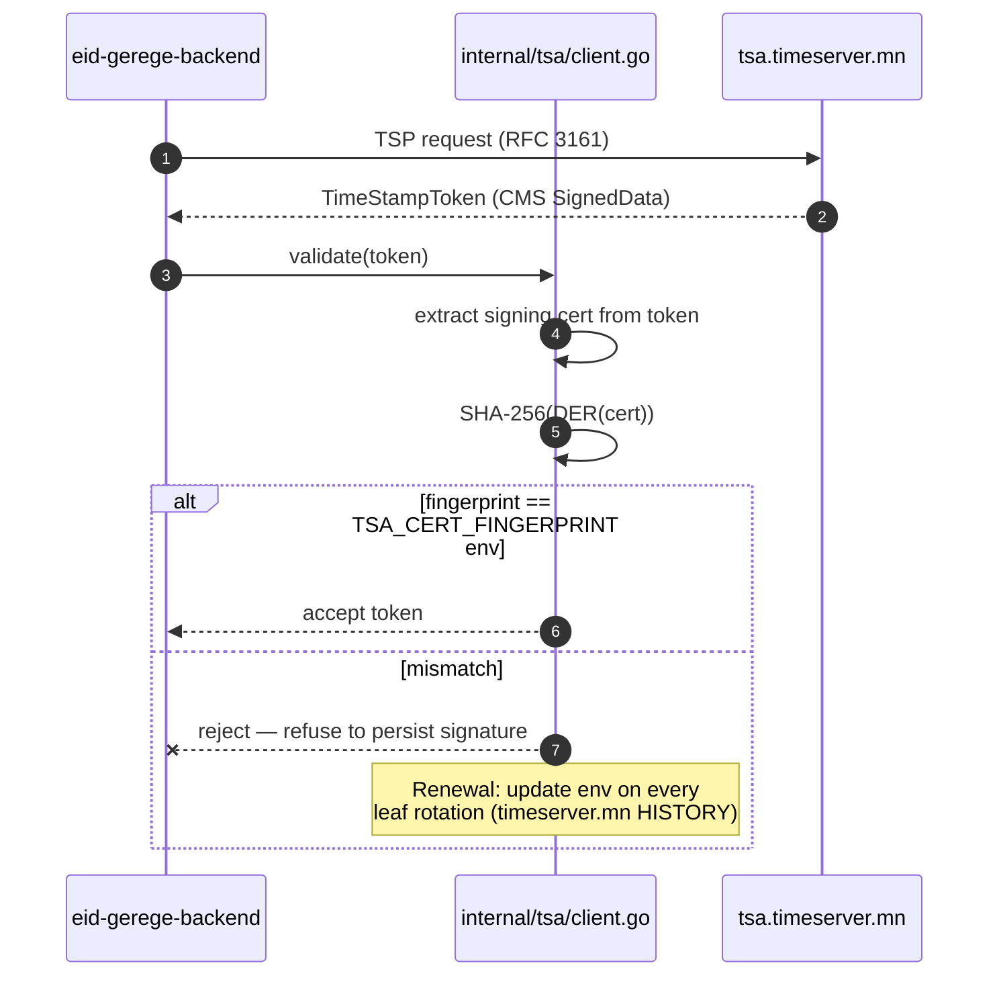
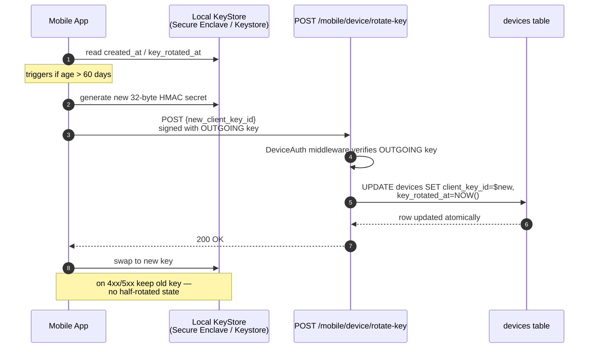
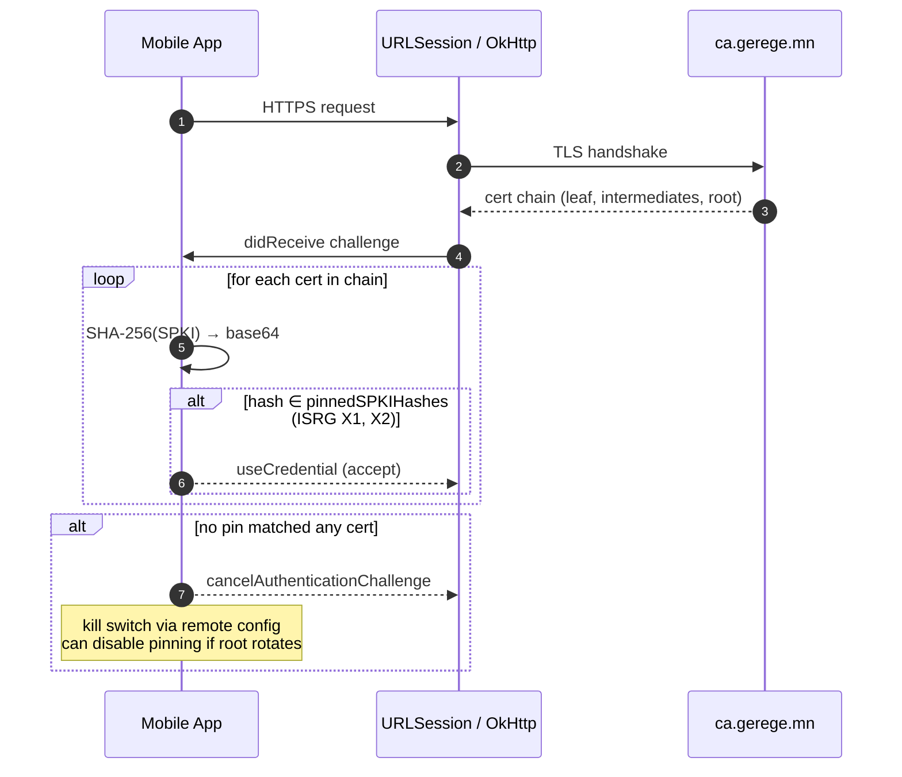
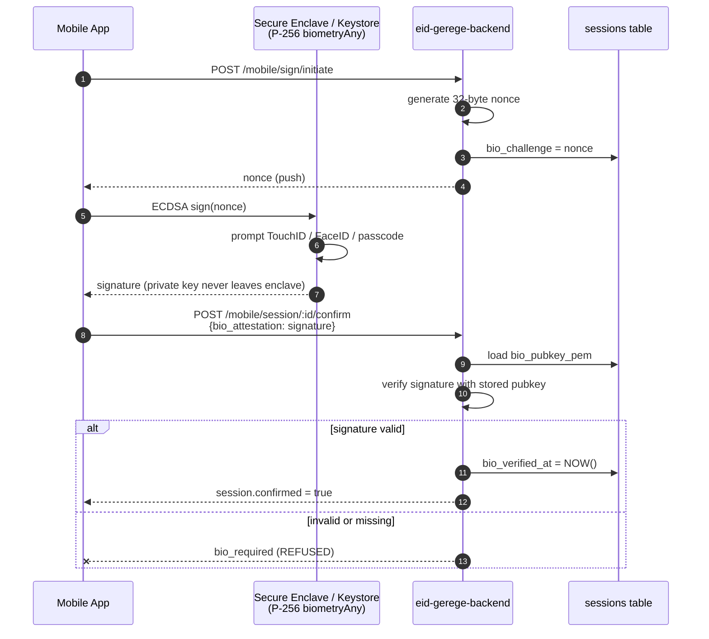

# Mobile API security roadmap

Captures the four mobile-side hardening initiatives discussed on 2026-04-19. The first two landed in production; the latter two are designed but require mobile-side build cycles to enforce end-to-end.

## ✅ 1. TSA cert fingerprint pin (DONE 2026-04-19)

`TSA_CERT_FINGERPRINT=be6e60c500aad60eda59ce3da3164305da622e5c058f69c60c7461a0221b7829` set in `eid-gerege-backend/.env`. Validator in `internal/tsa/client.go` now enforces fingerprint match on every TSA response. Renewal: every leaf cert rotation MUST update this env value (see `timeserver.mn/HISTORY.md` 2026-04-19 entry).



## ✅ 2. Device HMAC key rotation (BACKEND DONE 2026-04-19)

**Backend:** `POST /mobile/device/rotate-key` — caller authenticates with the OUTGOING key (DeviceAuth middleware), body carries the INCOMING key (`{new_client_key_id: <hex 32 bytes>}`), atomic UPDATE on `devices` row + `key_rotated_at = NOW()`. Migration `014_device_key_rotation.sql` adds the `key_rotated_at` column.

**Mobile (TODO):**
- iOS / Android: at app launch, check `device.created_at` (or stored `key_rotated_at`) age. If > 60 days, generate a fresh 32-byte HMAC secret in Secure Enclave / Keystore.
- POST `/mobile/device/rotate-key` signed with the OUTGOING key. On 200 OK, atomically swap local key store. On 4xx/5xx, keep the old key — no half-rotated state.
- Audit row `DEVICE_KEY_ROTATED` written server-side per rotation.

Cadence: 60 days is the target. Aggressive (e.g. 7 days) creates server load + audit churn; loose (180+ days) defeats the point. 60 days matches typical mobile session bank rotation policies.



## ☐ 3. TLS certificate pinning (DESIGN — mobile-only)

**Why:** Defend against compromised public CAs and government-level MitM. iOS / Android default trust stores accept any cert chained to a system root — pinning narrows the trust radius to a specific issuer or leaf SPKI we control.

**Decision matrix:**

| Pin target | Stable | Supports LE? | Friction |
|---|---|---|---|
| Leaf cert SPKI | 90 days | ✓ | High — every LE renewal needs mobile force-update |
| LE intermediate (R10/R11) SPKI | ~yearly | ✓ | Medium — rotates rarely but unpredictably |
| ISRG Root X1/X2 SPKI | ~years | ✓ | Low — rotation is a planned multi-year event |
| Gerege Root CA SPKI (custom) | We control | ✗ direct, ✓ via private CA | Lowest — but requires Gerege-issued cert on `ca.gerege.mn` |

**Recommended approach:** Pin both ISRG Root X1 AND ISRG Root X2 SPKI hashes. Accept either. When Let's Encrypt eventually rotates roots (announced years in advance), ship a force-upgrade build adding the new root.

**iOS sketch (Swift, URLSession delegate):**
```swift
final class CertPinningSessionDelegate: NSObject, URLSessionDelegate {
    static let pinnedSPKIHashes: Set<String> = [
        // ISRG Root X1 SPKI SHA-256 (base64)
        "C5+lpZ7tcVwmwQIMcRtPbsQtWLABXhQzejna0wHFr8M=",
        // ISRG Root X2 SPKI SHA-256 (base64)
        "diGVwiVYbubAI3RW4hB9xU8e/CH2GnkuvVFZE8zmgzI=",
    ]

    func urlSession(_ session: URLSession,
                    didReceive challenge: URLAuthenticationChallenge,
                    completionHandler: @escaping (URLSession.AuthChallengeDisposition, URLCredential?) -> Void) {
        guard let trust = challenge.protectionSpace.serverTrust,
              SecTrustEvaluateWithError(trust, nil) else {
            completionHandler(.cancelAuthenticationChallenge, nil); return
        }
        let chain = (0..<SecTrustGetCertificateCount(trust))
            .compactMap { SecTrustGetCertificateAtIndex(trust, $0) }
        for cert in chain {
            let pubKey = SecCertificateCopyKey(cert).flatMap { SecKeyCopyExternalRepresentation($0, nil) as Data? }
            guard let key = pubKey else { continue }
            let hash = SHA256.hash(data: key)
            let b64 = Data(hash).base64EncodedString()
            if Self.pinnedSPKIHashes.contains(b64) {
                completionHandler(.useCredential, URLCredential(trust: trust)); return
            }
        }
        completionHandler(.cancelAuthenticationChallenge, nil)
    }
}
```

**Android sketch (Kotlin, OkHttp):** use `CertificatePinner.Builder().add("ca.gerege.mn", "sha256/<base64>")`.

**Watch out:** ALWAYS ship a "kill switch" mechanism (remote config flag, e.g. via Firebase Remote Config) that disables pinning if the production cert chain unexpectedly changes — without one, a single misissued cert can brick the entire installed base.



## ☐ 4. Step-up auth on sign (DESIGN — protocol change)

**Why:** Today, a stolen device HMAC key (e.g., extracted from Keychain on a compromised phone) is enough to confirm a sign session. We want PROOF of user presence on the device for every signing operation, not just every-N-day re-login.

**Proposal — biometric-bound signing key (P-256 in Secure Enclave):**

1. At device registration, alongside the HMAC secret, generate a separate P-256 key pair in Secure Enclave with `SecAccessControlCreateWithFlags(.biometryAny, .privateKeyUsage)`. Public key uploaded to backend → stored on `devices` row as `bio_pubkey_pem`.
2. On `/mobile/sign/initiate` server-side, generate a random 32-byte challenge nonce, store on the session row as `bio_challenge`, push to mobile.
3. Mobile prompts TouchID / FaceID / device passcode (forced by Secure Enclave key access flag). On success, ECDSA-sign the nonce with the bio-bound key.
4. Mobile sends the signature to `/mobile/session/:id/confirm` in a new field `bio_attestation`.
5. Backend verifies signature against the stored `bio_pubkey_pem`. If valid, sign session proceeds. If missing/invalid, session is REFUSED with `bio_required` reason.

**Backwards compat:** mobile clients without bio-key support continue to work for AUTH sessions. SIGN sessions REQUIRE bio attestation — so old mobile clients must be force-upgraded before this gate flips on.

**Audit fields added to `sessions`:**
- `bio_challenge BYTEA` — generated server-side, kept until confirm
- `bio_attestation BYTEA` — signature received from mobile
- `bio_verified_at TIMESTAMPTZ` — when backend validated the signature

**Why ECDSA in Secure Enclave (not just a flag in HMAC payload):**
- HMAC flag is forgeable by anyone who has the HMAC key. Secure Enclave private key is non-exportable — it CANNOT leave the device. Even a fully rooted phone cannot extract it.
- Apple's & Android's security model GUARANTEES biometric prompt before private key use (when `biometryAny` flag is set on key creation). Backend can trust that an ECDSA signature implies the user authenticated on the device.

**Why this matters for legal-grade signatures:**
- Mongolia's e-ID law treats sign sessions as digital signatures on documents. Signatures must be tied to "human intent." Bio attestation is the strongest form of proof of intent we can deliver from a software-only mobile app.
- Without it, the legal posture is "the device-owner's HMAC key was used" — weaker than "the human present at the device authorized the sign."


