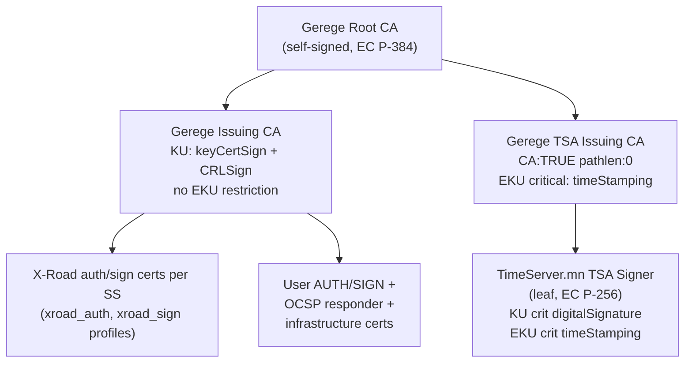
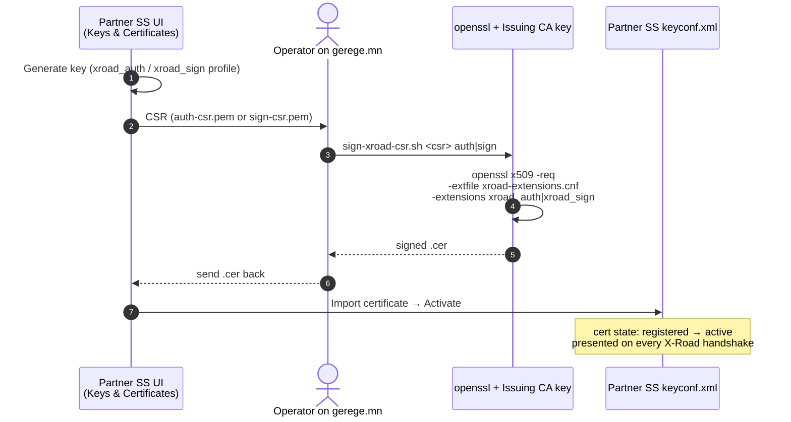
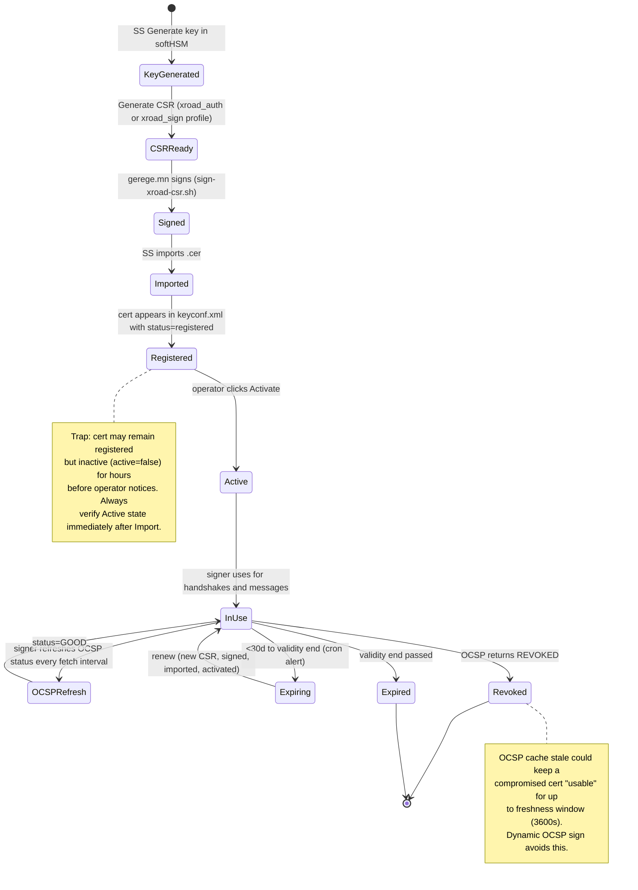

# PKI architecture

The Mongolia X-Road instance is rooted in a single trust anchor (`Gerege Root CA`) operated by Gerege Systems LLC on `gerege.mn`. No external trust roots are needed by SSes — the CS distributes only Gerege-issued CA certs in `shared-params.xml`.

## Hierarchy

### Per-SS certificate issuance flow

## Per-cert profile in `xroad-extensions.cnf`

| Section          | Used for                          | KU                               | EKU                              | basicConstraints     |
|------------------|-----------------------------------|----------------------------------|----------------------------------|----------------------|
| `xroad_auth`     | SS authentication cert            | digitalSignature, keyEncipherment| clientAuth, serverAuth           | CA:FALSE             |
| `xroad_sign`     | SS message-signing cert           | nonRepudiation                   | emailProtection                  | CA:FALSE             |
| `xroad_tsa`      | TSA leaf                          | digitalSignature (critical)      | timeStamping (critical)          | CA:FALSE             |
| `tsa_issuing_ca` | Gerege TSA Issuing CA             | keyCertSign, CRLSign (critical)  | timeStamping (critical)          | CA:TRUE, pathlen:0   |

All certs include CRL distribution + AIA pointing to `https://crl.gerege.mn/issuing-ca.crl` and `https://ocsp.gerege.mn/ocsp`.

## Certificate lifecycle state

## Key storage

| Key                                  | Where it lives                                                                                  |
|--------------------------------------|--------------------------------------------------------------------------------------------------|
| Gerege Root CA private key           | gerege.mn `/opt/gerege-mn-eid/eid-gerege-backend/config/pki/root-ca.key`                         |
| Gerege Issuing CA private key        | gerege.mn `/opt/gerege-mn-eid/eid-gerege-backend/config/pki/issuing-ca.key`                      |
| Gerege TSA Issuing CA private key    | gerege.mn `/opt/xroad-ca/tsa-issuing/tsa-issuing.key`                                            |
| OCSP responder private key           | gerege.mn `/opt/gerege-mn-eid/eid-gerege-backend/config/pki/ocsp-responder.key`                  |
| TimeServer.mn TSA Signer private key | timeserver.mn `/opt/tsa-certs/leaf-key.pem`                                                      |
| Per-SS auth + sign keys              | The owning SS's `keyconf.xml` (managed by xroad-signer; never leaves the SS)                    |
| User AUTH + SIGN keys                | Inside the user's Gerege ID app on their phone (HSM-backed where available)                      |

PKI hardening status (SoftHSM2 backbone, autobackup cron, leading-zero serial fix) is tracked in the operator's local memory. The EC-HSM code refactor in gerege-ocsp/backend remains as future work.
