# Монгол улсын X-Road танилцуулга (instance `MN`)

> **Зорилго:** Энэхүү баримт бичиг нь Монгол улсын X-Road хэрэгжилтийн **бүх давхаргыг** — техникийн архитектураас засаглал хүртэл, нэг гишүүн орохоос алдаа засах хүртэл — нэг газар, гүн нарийвчилсан байдлаар танилцуулна. Танилцуулгын хүлээн авагч: Цахим хөгжлийн яам, гишүүн байгууллагуудын CTO/архитектор/SecOps баг, шинэ оператор, X-Road-той анх танилцаж буй бизнес шинжээч.
>
> **Эх сурвалж:** Энэ репозиторийн `docs/`, `*/README.md`, `*/HISTORY.md` дотор бичигдсэн `single source of truth`. Тоо, нэр, хаяг бүр энд хадгалагдсан жинхэнэ продакшнаас гаралтай.
>
> **Хувилбар:** 2026-05-15 (хамгийн сүүлд: `mgmt.xroad.mn` өмчлөл шилжсэн 2026-05-08, CS өмчлөл шилжсэн 2026-05-11).

---

## Агуулга

1. [X-Road гэж юу вэ?](#1-x-road-гэж-юу-вэ)
2. [Монгол улсын X-Road instance `MN`](#2-монгол-улсын-x-road-instance-mn)
3. [Системийн архитектур](#3-системийн-архитектур)
4. [Гол компонентууд ба тэдгээрийн үүрэг](#4-гол-компонентууд-ба-тэдгээрийн-үүрэг)
5. [Талуудын үүрэг ба засаглалын загвар](#5-талуудын-үүрэг-ба-засаглалын-загвар)
6. [Шинэ гишүүний онбординг](#6-шинэ-гишүүний-онбординг)
7. [Мессежийн урсгал ба роутинг](#7-мессежийн-урсгал-ба-роутинг)
8. [PKI ба итгэлийн загвар](#8-pki-ба-итгэлийн-загвар)
9. [RFC 3161 цаг тэмдэглэл (TSA)](#9-rfc-3161-цаг-тэмдэглэл-tsa)
10. [OCSP ба CRL хүчинтэй байдлын урсгал](#10-ocsp-ба-crl-хүчинтэй-байдлын-урсгал)
11. [Аюулгүй байдлын загвар](#11-аюулгүй-байдлын-загвар)
12. [Үйл ажиллагааны мониторинг](#12-үйл-ажиллагааны-мониторинг)
13. [Алдаа засах гарын авлагын зам](#13-алдаа-засах-гарын-авлагын-зам)
14. [Тоо баримтаар](#14-тоо-баримтаар)
15. [Холбогдох гарын авлагууд (doc map)](#15-холбогдох-гарын-авлагууд-doc-map)
16. [Хавсралт А: Хост хаяг + порт + DNS бүртгэл](#хавсралт-а-хост-хаяг--порт--dns-бүртгэл)
17. [Хавсралт Б: Глоссари](#хавсралт-б-глоссари)

---

## 1. X-Road гэж юу вэ?

X-Road бол **үндэсний түвшний өгөгдөл солилцооны давхарга** (data exchange layer). 2001 онд Эстони улсад үүсч, өнөөдөр Финланд, Исланд, Япон (Suomi.fi/Estonia/X-tee/Suomi-DVV-X-Road-стек), Украин, Намиб, Танзани зэрэг 20+ улсын төрийн ба санхүүгийн системд хэрэглэгддэг. NIIS (Nordic Institute for Interoperability Solutions) тогтвортой засаглал, GPL-2.0 лицензийн дор open-source хэлбэрээр хөгжүүлдэг.

**X-Road-ийн утга**: байгууллагуудын мэдээллийн систем (Information System, IS) хооронд **итгэлийн төв (Central Server)-ийн зөвшөөрөл бүхий**, **криптографийн гарын үсэгтэй**, **цаг тэмдэглэлтэй**, **аудит логтой** REST/SOAP мессеж дамжуулна. Гарын үсэг + цаг тэмдэглэл + аудит лог хослоод *хууль зүйн ач холбогдолтой* зурвас (legally significant message) өгдөг — Mongolia E-Sign Law, Estonia Digital Signatures Act гэх мэт хууль тогтоомжтой тохирно.

**Олон улсын талаас**:

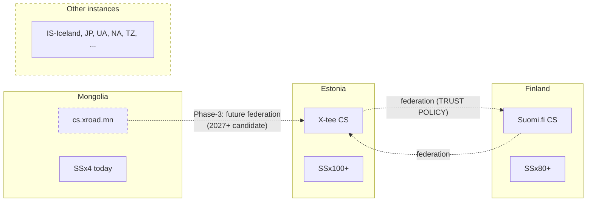
```mermaid
graph LR
    subgraph EE[Estonia]
        EE_CS[X-tee CS]
        EE_SS[SSx100+]
    end
    subgraph FI[Finland]
        FI_CS[Suomi.fi CS]
        FI_SS[SSx80+]
    end
    subgraph MN[Mongolia]
        MN_CS[cs.xroad.mn]
        MN_SS[SSx4 today]
    end
    subgraph IS_GLOBAL[Other instances]
        IS[IS-Iceland, JP, UA, NA, TZ, ...]
    end

    EE_CS -. "federation (TRUST POLICY)" .-> FI_CS
    FI_CS -. "federation" .-> EE_CS
    MN_CS -. "Phase-3: future federation<br/>(2027+ candidate)" .-> EE_CS

    classDef future stroke-dasharray: 5 5
    class MN_CS,IS_GLOBAL future
```

Mongolia-ийн нь өнөөдөр **бие даасан instance** (`MN`). Ирээдүйд (ойролцоогоор 2027 оноос хойш) Эстони/Финландтай federation-аар холбогдох боломжтой — гэхдээ энэ нь Цахим хөгжлийн яам + ҮДТ-н стратегийн шийдвэр.

★ **Insight ─────────────────────────────────────**
- X-Road **тээвэрлэгч давхарга** (transport) — өөрөө бизнес логик хөтлөхгүй. Гишүүн байгууллагуудын IS л бизнес логик гүйцэтгэнэ.
- X-Road **гарын үсэг зурдаг**, гэхдээ агуулгыг шифрлэдэггүй (TLS-ийн хэт давхарга л шифрлэх үүрэгтэй). Мессежийн агуулга гарын үсэг тавьсан хэлбэрээр аудит лог-д хадгалагдана.
- X-Road **ACL-аар хяналт тавьдаг** (Service-clients). Producer SS дээр "Энэ subsystem-ээс энэ үйлчилгээ дуудаж болно" гэж тодорхой зөвшөөрсөн л зүйл л хийгдэнэ.

**─────────────────────────────────────────────────**

---

## 2. Монгол улсын X-Road instance `MN`

### 2.1 Үүсэл, өмчлөл, оператор

| Огноо | Үйл явдал |
|-------|-----------|
| **2026-04** | Gerege Systems LLC анхны Central Server (`cs.gerege.mn`) суулгаж эхэлсэн. NIIS upstream packages, Ubuntu 24.04. |
| **2026-04-19** | PKI бүтэц (Gerege Root CA + Issuing CA + TSA Issuing CA) бэлдсэн. TimeServer.mn TSA-г Gerege Root-руу буцаасан. |
| **2026-04-19** | Эхний 4 SS (`mgmt`, `rp`, `ss.gerege`, `cs`-side mgmt) бүртгэгдсэн. Бүх "одоогийн" 5 хост үндсэн төлөвт ирсэн. |
| **2026-05-06** | `ss.paygrid.mn` (Gerege Smart Metering) онбординг хийгдэж бүх 4 SS + 1 CS үндсэн төлөвт орсон. |
| **2026-05-07** | `PAYGRID-CORE` subsystem бүртгэгдсэн. EIDMONGOL service grants өгөгдсөн. |
| **2026-05-08** | `mgmt.gerege.mn` → `mgmt.xroad.mn` нэр өөрчлөгдөж, өмчлөл **Цахим хөгжил, инноваци, харилцаа холбооны яам** (`MN/GOV/6806252`)-д шилжсэн. |
| **2026-05-11** | `cs.xroad.mn` (Central Server)-ийн **legal authority** Gerege Systems LLC-ээс **Үндэсний дата төв** (ҮДТ)-д шилжсэн. Үйл ажиллагааны өдөр тутмын хариуцлага Gerege Systems LLC хадгалсан хэвээр. |

★ **Insight ─────────────────────────────────────**
Энэ нь хоёр түвшний засаглалын загвар:
- **Хууль зүйн эрх мэдэл** (legal authority): Цахим хөгжлийн яам + ҮДТ
- **Үйл ажиллагааны хариуцлага** (operations): Gerege Systems LLC

X-Road-ийн архитектурт CS өмчлөгч нь **бүх instance-ийн эрхт бүртгэлийн төв**. Тиймээс CS-ийн governance шилжих нь мгмт нэгжээс илүү том ач холбогдолтой.

**─────────────────────────────────────────────────**

### 2.2 Хүрээ ба хязгаар (scope)

Mongolia X-Road instance нь өнөөдөр **дотоод (single-instance)** хэлбэрээр ажиллана. Нийт байгуулагдсан компонентууд:

- **1 × Central Server** (cs.xroad.mn)
- **4 × Security Server** (mgmt, rp, ss.gerege, ss.paygrid)
- **1 × Certificate Authority** + OCSP + CRL + Sign Portal (ca.gerege.mn)
- **1 × Time-Stamp Authority** (timeserver.mn)
- **2 × producer subsystem** (GEREGE-ID legacy + EIDMONGOL v2)
- **1 × consumer subsystem** (GEREGE-WALLET-BFF) + **1 × member subsystem** (PAYGRID-CORE)
- **8 × хэрэглэгч subsystem grants** (CONTRACT-MN, GEREGE-WALLET-BFF, GEREGE-EDU, TASKER, BANK1/2/3-DBANK, PAYGRID-CORE)

Хэрэглэгдээгүй (intentional gap):
- Federation (бусад улсын X-Road instance-тай холбогдох) — Phase-3 төлөвлөгөө.
- Op-Monitoring central dashboard — суурь sensor-ууд идэвхтэй, дашбоард `monitor.x-road.mn`-д цуглуулагддаг.
- Mobile-side нэмэлт hardening (TLS pinning, bio step-up sign) — `docs/mobile-security-roadmap.md`-д төлөвлөсөн.

---

## 3. Системийн архитектур

### 3.1 Бүхэлд нь хараарай — Mermaid topology

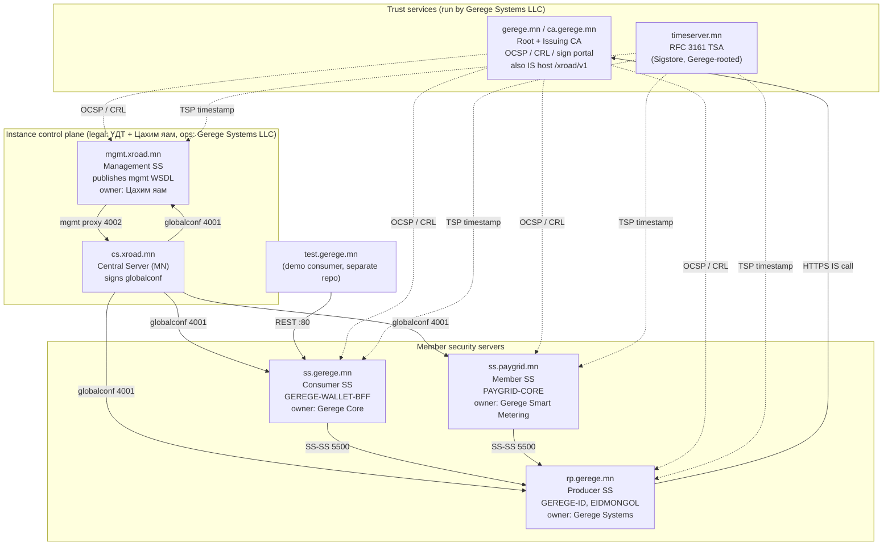
```mermaid
graph TB
    %% Mongolia X-Road instance MN — high-level topology
    %% Solid arrows = X-Road message / control-plane paths
    %% Dotted arrows = attestation services (OCSP, CRL, RFC 3161 timestamps)
    %% Dashed boxes = governance boundaries

    subgraph trust["Trust services (run by Gerege Systems LLC)"]
        direction LR
        CA["gerege.mn / ca.gerege.mn<br/>Root + Issuing CA<br/>OCSP / CRL / sign portal<br/>also IS host /xroad/v1"]
        TSA["timeserver.mn<br/>RFC 3161 TSA<br/>(Sigstore, Gerege-rooted)"]
    end

    subgraph control["Instance control plane (legal: ҮДТ + Цахим яам, ops: Gerege Systems LLC)"]
        direction LR
        CS["cs.xroad.mn<br/>Central Server (MN)<br/>signs globalconf"]
        MGMT["mgmt.xroad.mn<br/>Management SS<br/>publishes mgmt WSDL<br/>owner: Цахим яам"]
    end

    subgraph members["Member security servers"]
        direction LR
        RP["rp.gerege.mn<br/>Producer SS<br/>GEREGE-ID, EIDMONGOL<br/>owner: Gerege Systems"]
        SSG["ss.gerege.mn<br/>Consumer SS<br/>GEREGE-WALLET-BFF<br/>owner: Gerege Core"]
        PAY["ss.paygrid.mn<br/>Member SS<br/>PAYGRID-CORE<br/>owner: Gerege Smart Metering"]
    end

    DEMO["test.gerege.mn<br/>(demo consumer, separate repo)"]

    CS -->|"globalconf 4001"| RP
    CS -->|"globalconf 4001"| SSG
    CS -->|"globalconf 4001"| PAY
    CS -->|"globalconf 4001"| MGMT
    MGMT -->|"mgmt proxy 4002"| CS

    SSG -->|"SS-SS 5500"| RP
    PAY -->|"SS-SS 5500"| RP
    RP -->|"HTTPS IS call"| CA
    DEMO -->|"REST :80"| SSG

    CA -.->|"OCSP / CRL"| RP
    CA -.->|"OCSP / CRL"| SSG
    CA -.->|"OCSP / CRL"| MGMT
    CA -.->|"OCSP / CRL"| PAY
    TSA -.->|"TSP timestamp"| RP
    TSA -.->|"TSP timestamp"| SSG
    TSA -.->|"TSP timestamp"| MGMT
    TSA -.->|"TSP timestamp"| PAY
```

### 3.2 Deployment topology — PlantUML

> *PlantUML source. GitHub шууд render хийхгүй; `plantuml *.puml` командаар SVG болгож үзэх боломжтой.*

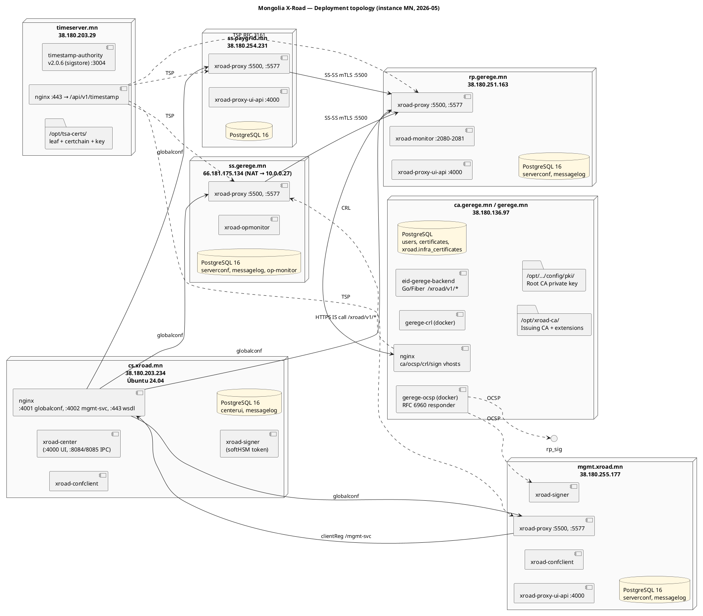
```plantuml
@startuml mn-deployment
title Mongolia X-Road — Deployment topology (instance MN, 2026-05)
skinparam node {
  BackgroundColor #FAFAFA
  BorderColor #555555
}
skinparam database {
  BackgroundColor #FFF8E1
}
left to right direction

node "cs.xroad.mn\n38.180.203.234\nÚbuntu 24.04" as cs {
  component "xroad-center\n(:4000 UI, :8084/8085 IPC)" as cs_ui
  component "xroad-confclient" as cs_cc
  component "xroad-signer\n(softHSM token)" as cs_sig
  component "nginx\n:4001 globalconf, :4002 mgmt-svc, :443 wsdl" as cs_ng
  database "PostgreSQL 16\ncenterui, messagelog" as cs_db
}

node "mgmt.xroad.mn\n38.180.255.177" as mgmt {
  component "xroad-proxy :5500, :5577" as mgmt_proxy
  component "xroad-proxy-ui-api :4000" as mgmt_ui
  component "xroad-confclient" as mgmt_cc
  component "xroad-signer" as mgmt_sig
  database "PostgreSQL 16\nserverconf, messagelog" as mgmt_db
}

node "rp.gerege.mn\n38.180.251.163" as rp {
  component "xroad-proxy :5500, :5577" as rp_proxy
  component "xroad-proxy-ui-api :4000" as rp_ui
  component "xroad-monitor :2080-2081" as rp_mon
  database "PostgreSQL 16\nserverconf, messagelog" as rp_db
}

node "ss.gerege.mn\n66.181.175.134 (NAT → 10.0.0.27)" as ss {
  component "xroad-proxy :5500, :5577" as ss_proxy
  component "xroad-opmonitor" as ss_opmon
  database "PostgreSQL 16\nserverconf, messagelog, op-monitor" as ss_db
}

node "ss.paygrid.mn\n38.180.254.231" as pay {
  component "xroad-proxy :5500, :5577" as pay_proxy
  component "xroad-proxy-ui-api :4000" as pay_ui
  database "PostgreSQL 16" as pay_db
}

node "ca.gerege.mn / gerege.mn\n38.180.136.97" as ca {
  component "nginx\nca/ocsp/crl/sign vhosts" as ca_ng
  component "gerege-ocsp (docker)\nRFC 6960 responder" as ca_ocsp
  component "gerege-crl (docker)" as ca_crl
  component "eid-gerege-backend\nGo/Fiber  /xroad/v1/*" as ca_be
  database "PostgreSQL\nusers, certificates,\nxroad.infra_certificates" as ca_db
  folder "/opt/xroad-ca/\nIssuing CA + extensions" as ca_fs
  folder "/opt/.../config/pki/\nRoot CA private key" as ca_root
}

node "timeserver.mn\n38.180.203.29" as ts {
  component "timestamp-authority\nv2.0.6 (sigstore) :3004" as ts_tsa
  component "nginx :443 → /api/v1/timestamp" as ts_ng
  folder "/opt/tsa-certs/\nleaf + certchain + key" as ts_fs
}

' control plane edges
cs_ng -down-> rp_proxy : "globalconf"
cs_ng -down-> ss_proxy : "globalconf"
cs_ng -down-> pay_proxy : "globalconf"
cs_ng -down-> mgmt_proxy : "globalconf"
mgmt_proxy -up-> cs_ng : "clientReg /mgmt-svc"

' data plane edges
ss_proxy --> rp_proxy : "SS-SS mTLS :5500"
pay_proxy --> rp_proxy : "SS-SS mTLS :5500"
rp_proxy --> ca_ng : "HTTPS IS call /xroad/v1/*"

' attestation
ca_ocsp ..> rp_sig : OCSP
ca_ocsp ..> mgmt_sig : OCSP
ca_ng ..> ss_proxy : CRL
ts_ng ..> rp_proxy : "TSP RFC 3161"
ts_ng ..> mgmt_proxy : TSP
ts_ng ..> ss_proxy : TSP
ts_ng ..> pay_proxy : TSP

@enduml
```

### 3.3 Сүлжээний бүс — D2 layered view

> *D2 source. GitHub шууд render хийхгүй; `d2 *.d2 *.svg` командаар SVG болгож үзэх боломжтой.*

```d2
title: Mongolia X-Road — network zones and trust boundaries

direction: right

public_internet: {
  shape: cloud
  label: "Public Internet\n(consumer IS, partner SSes, citizens)"
}

ministry_zone: {
  label: "Цахим хөгжлийн яам zone"
  shape: rectangle
  style.stroke-dash: 5
  mgmt: {
    label: "mgmt.xroad.mn\nManagement SS\nMN/GOV/6806252"
    shape: hexagon
  }
}

ndc_zone: {
  label: "Үндэсний дата төв zone"
  shape: rectangle
  style.stroke-dash: 5
  cs: {
    label: "cs.xroad.mn\nCentral Server"
    shape: hexagon
  }
}

gerege_zone: {
  label: "Gerege Systems / Core / Smart Metering ops zone"
  shape: rectangle
  style.stroke-dash: 5

  rp: {
    label: "rp.gerege.mn\nProducer SS\nGEREGE-ID + EIDMONGOL"
    shape: hexagon
  }

  ss_gerege: {
    label: "ss.gerege.mn\nConsumer SS (Gerege Core)"
    shape: hexagon
  }

  ss_paygrid: {
    label: "ss.paygrid.mn\nMember SS (Gerege Smart Metering)"
    shape: hexagon
  }

  ca: {
    label: "ca.gerege.mn\nRoot+Issuing+TSA Issuing CA\nOCSP, CRL, Sign portal,\nGEREGE-ID IS /xroad/v1/*"
    shape: hexagon
  }

  ts: {
    label: "timeserver.mn\nRFC 3161 TSA"
    shape: hexagon
  }
}

is_zone: {
  label: "Information System endpoints"
  shape: rectangle
  style.stroke-dash: 5
  eidmongol: "api.eidmongol.mn"
  paygrid_is: "paygrid.mn IS\n10.0.0.27 ens160"
  test_demo: "test.gerege.mn\n38.180.242.76"
}

public_internet -> ministry_zone.mgmt: ":5500 SS-SS"
public_internet -> ndc_zone.cs: ":443, :4001 globalconf"
public_internet -> gerege_zone.rp: ":5500 SS-SS"
public_internet -> gerege_zone.ss_gerege: "(NAT) :5500"

ministry_zone.mgmt -> ndc_zone.cs: ":4002 mgmt-svc"

gerege_zone.rp -> gerege_zone.ca: "HTTPS IS"
gerege_zone.rp -> is_zone.eidmongol: "HTTPS IS"
gerege_zone.ss_paygrid -> is_zone.paygrid_is: "mTLS :8443"
is_zone.test_demo -> gerege_zone.ss_gerege: ":80 REST"

gerege_zone.ts -> gerege_zone.rp: "(timestamps)"
gerege_zone.ts -> gerege_zone.ss_gerege: "(timestamps)"
gerege_zone.ts -> gerege_zone.ss_paygrid: "(timestamps)"
gerege_zone.ts -> ministry_zone.mgmt: "(timestamps)"

gerege_zone.ca -> gerege_zone.rp: "(OCSP/CRL)"
gerege_zone.ca -> gerege_zone.ss_gerege: "(OCSP/CRL)"
gerege_zone.ca -> gerege_zone.ss_paygrid: "(OCSP/CRL)"
gerege_zone.ca -> ministry_zone.mgmt: "(OCSP/CRL)"
```

---

## 4. Гол компонентууд ба тэдгээрийн үүрэг

### 4.1 Central Server (cs.xroad.mn)

**Үндсэн үүрэг:**
- `globalconf` (private-params.xml + shared-params.xml) **гарын үсэг тавьж бэлдэх**, нийтлэх — порт 4001
- **Management Service** ажиллуулах (clientReg/addressChange/maintenanceMode гэх мэт 10 үйлдэл) — порт 4002 нь backend, mgmt SS-ээс л дуудна
- **Trust anchor**: бүх гишүүн SS-ийн `configuration-anchor.xml` нь CS-ийн нийтлэг түлхүүрийг лавлана
- **Registration approval workflow**: гишүүн SS-ийн clientReg/authCertReg хүсэлтийг операторын зөвшөөрөл хүсэх Pending row болгож хадгална

**Холбоо барих**:
- DNS: `cs.xroad.mn` → `38.180.203.234`
- Admin UI: `ssh -L 14000:localhost:4000 cs.xroad.mn` дараа browser-аар `https://localhost:14000`
- Логин: `xrdadmin` (нууц үг ҮДТ + Gerege Systems-ийн оператор-д хоёуланд нь хадгалагдсан)

### 4.2 Management Security Server (mgmt.xroad.mn)

**Үндсэн үүрэг:**
- `MANAGEMENT` subsystem нь mgmt service WSDL-ийг гишүүн SS-үүдэд нийтэлдэг (`http://cs.xroad.mn/managementservices.wsdl`)
- Гишүүн SS-ийн clientReg хүсэлтийг өөрийн порт 5500-аар хүлээж аваад CS:4002-руу дамжуулна
- Нэмж: яамны өөрийн consumer subsystem-уудыг ажиллуулдаг (`BANK1-DBANK`, `BANK2-DBANK`, `BANK3-DBANK`, `NBFI1-DEMO`, `NBFI2-DEMO`)

**Холбоо барих**:
- DNS: `mgmt.xroad.mn` → `38.180.255.177`
- Admin UI: `ssh -L 14001:localhost:4000 mgmt.xroad.mn`
- Гишүүний нэр: `MN/GOV/6806252/MANAGEMENT` (өмчлөгч 2026-05-08-аас яам)

### 4.3 Member Security Server-ууд

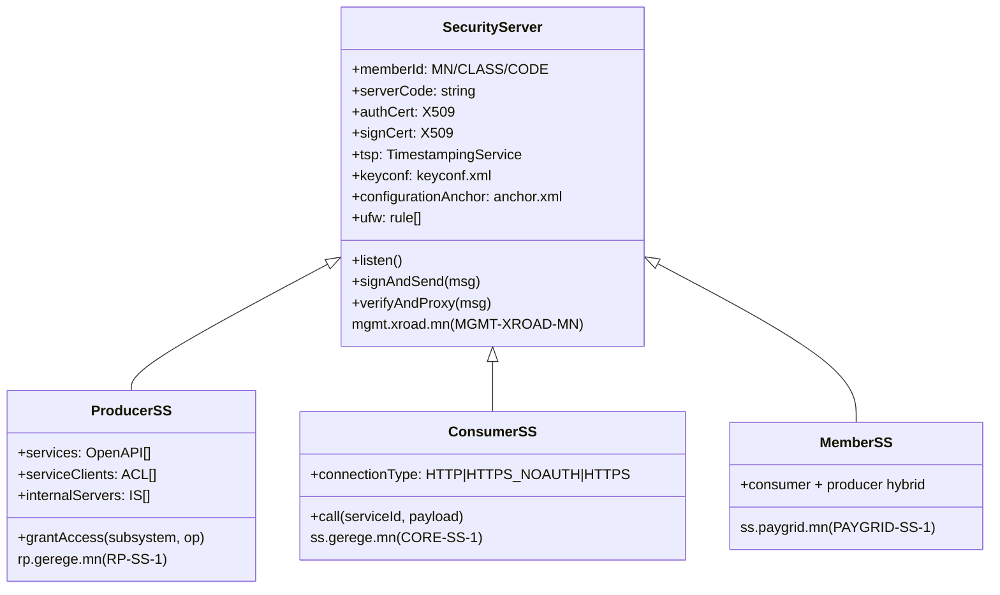
```mermaid
classDiagram
    class SecurityServer {
        +memberId: MN/CLASS/CODE
        +serverCode: string
        +authCert: X509
        +signCert: X509
        +tsp: TimestampingService
        +keyconf: keyconf.xml
        +configurationAnchor: anchor.xml
        +ufw: rule[]
        +listen()
        +signAndSend(msg)
        +verifyAndProxy(msg)
    }

    class ProducerSS {
        +services: OpenAPI[]
        +serviceClients: ACL[]
        +internalServers: IS[]
        +grantAccess(subsystem, op)
    }

    class ConsumerSS {
        +connectionType: HTTP|HTTPS_NOAUTH|HTTPS
        +call(serviceId, payload)
    }

    class MemberSS {
        +consumer + producer hybrid
    }

    SecurityServer <|-- ProducerSS
    SecurityServer <|-- ConsumerSS
    SecurityServer <|-- MemberSS

    ProducerSS : rp.gerege.mn (RP-SS-1)
    ConsumerSS : ss.gerege.mn (CORE-SS-1)
    MemberSS : ss.paygrid.mn (PAYGRID-SS-1)
    SecurityServer : mgmt.xroad.mn (MGMT-XROAD-MN)
```

### 4.4 PKI host (ca.gerege.mn)

`ca.gerege.mn` нь Mongolia X-Road-ийн **итгэлийн бүх давхарга нэг хост дээр** ажилладаг өвөрмөц шийдэл:

- **Root CA** (self-signed, EC P-384) — Gerege Root, бусад бүх итгэлийн анхаар
- **Issuing CA** (KU keyCertSign+CRLSign; no EKU restriction) — X-Road auth/sign cert, хэрэглэгчийн AUTH/SIGN cert, OCSP responder cert, бусад үүсгэдэг
- **TSA Issuing CA** (CA:TRUE pathlen:0, EKU critical timeStamping) — Sigstore TSA-аар хүлээн зөвшөөрөгдөх leaf cert үүсгэхэд зориулсан тусгай үе
- **OCSP responder** (`gerege-ocsp` Docker) — RFC 6960; URL `https://ocsp.gerege.mn`
- **CRL distribution** (`gerege-crl` Docker) — `https://crl.gerege.mn`
- **Sign portal** (`gerege-sign` Docker) — операторын CSR гарын үсэг зурах UI
- **IS endpoint** — GEREGE-ID producer subsystem-ын backend (eid-gerege-backend, Go/Fiber, `/xroad/v1/*`)

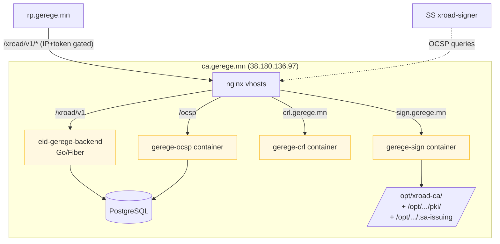
```mermaid
graph TB
    %% ca.gerege.mn — component layout
    subgraph host["ca.gerege.mn (38.180.136.97)"]
        direction TB
        ng[nginx vhosts]
        be[eid-gerege-backend<br/>Go/Fiber]
        ocsp[gerege-ocsp container]
        crl[gerege-crl container]
        sign[gerege-sign container]
        pg[(PostgreSQL)]
        fs[/opt/xroad-ca/<br/>+ /opt/.../pki/<br/>+ /opt/.../tsa-issuing/]
    end

    rp["rp.gerege.mn"] -->|"/xroad/v1/* (IP+token gated)"| ng
    ss[SS xroad-signer] -.->|OCSP queries| ng
    ng -->|/xroad/v1| be
    ng -->|/ocsp| ocsp
    ng -->|crl.gerege.mn| crl
    ng -->|sign.gerege.mn| sign

    be --> pg
    ocsp --> pg
    sign --> fs

    classDef container fill:#FFF8E1,stroke:#FBC02D
    class ocsp,crl,sign,be container
```

### 4.5 Time-Stamp Authority (timeserver.mn)

- Sigstore `timestamp-authority` v2.0.6 ажиллуулдаг (port 3004 loopback only).
- nginx нь `tsa.timeserver.mn:443`-аар тэжээж, `POST /` → `/api/v1/timestamp` rewrite хийнэ. Энэ нь X-Road client-уудын root POST-ийг хүлээж авах боломжийг бүрдүүлнэ.
- leaf cert (`/opt/tsa-certs/leaf-cert.pem`) нь Gerege TSA Issuing CA-аар гарын үсэг зурагдсан. Жил тутамд `renew-leaf.sh`-ээр шинэчилнэ.

---

## 5. Талуудын үүрэг ба засаглалын загвар


```mermaid
flowchart LR
    %% Mongolia X-Road governance and operations responsibilities

    subgraph legal["Legal authority"]
        direction TB
        yaam["Цахим хөгжил, инноваци,<br/>харилцаа холбооны яам<br/>(MN/GOV/6806252)"]
        ndc["Үндэсний дата төв (ҮДТ)<br/>CS instance authority"]
    end

    subgraph ops["Operations"]
        direction TB
        gerege["Gerege Systems LLC<br/>day-to-day ops, GPG keys,<br/>UFW, secret custody"]
    end

    subgraph members["Member organizations"]
        direction TB
        gcore["Gerege Core LLC<br/>(MN/COM/6884857)<br/>ss.gerege.mn"]
        gsys["Gerege Systems LLC<br/>(MN/COM/6235972)<br/>rp.gerege.mn"]
        gsm["Gerege Smart Metering<br/>(MN/COM/7181609)<br/>ss.paygrid.mn"]
    end

    legal -- "owns mgmt.xroad.mn<br/>+ CS legal authority" --> ops
    ops -- "operates" --> members
    members -- "consume/publish services" --> members

    classDef legalClass fill:#FFEBEE
    classDef opsClass fill:#E3F2FD
    classDef memClass fill:#E8F5E9
    class yaam,ndc legalClass
    class gerege opsClass
    class gcore,gsys,gsm memClass
```

**Үүргийн матриц** (RACI-style):

| Үйл ажиллагаа | Цахим яам | ҮДТ | Gerege Systems | Гишүүн SS |
|---|:---:|:---:|:---:|:---:|
| CS package upgrade | I | A | R | I |
| GPG backup key rotation | I | A | R | I |
| Member onboarding (legal) | A | C | R | I |
| Member onboarding (technical) | I | I | R | C |
| CA root re-key | A | A | R | I |
| TSA leaf renewal | I | I | R | I |
| UFW тохиргоо | I | C | R | C |
| Subsystem ACL change | I | I | R | C |

> R = Responsible, A = Accountable, C = Consulted, I = Informed.

★ **Insight ─────────────────────────────────────**
- 2026-05-11-ний өмчлөл шилжсэн нь "RACI"-ийн **A-тэмдэгтийг яам/ҮДТ-руу шилжүүлсэн**. Gerege Systems нь хэвээр R (executor) хэвээр.
- Энэ нь **дэлхийн орнуудын practice-той тохирно** — Estonia-д ҮТТ (RIA) нь A, EE Riigi Infosüsteemi Amet нь R-ийн дамжуулагч.

**─────────────────────────────────────────────────**

---

## 6. Шинэ гишүүний онбординг

### 6.1 5-фаз орох процесс

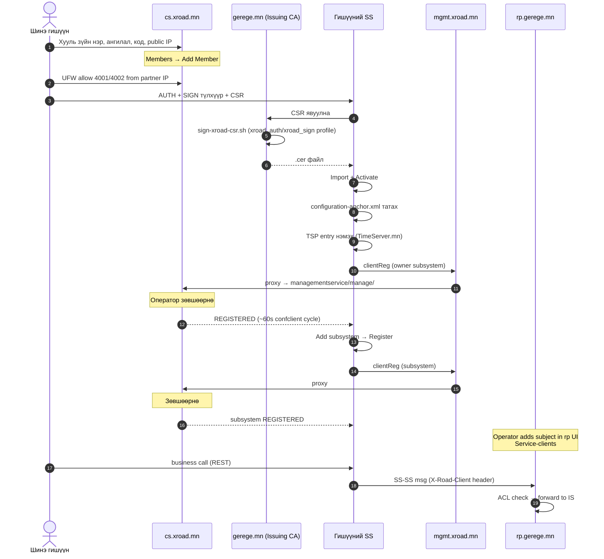
```mermaid
sequenceDiagram
    autonumber
    actor Partner as Шинэ гишүүн
    participant CS as cs.xroad.mn
    participant CA as gerege.mn (Issuing CA)
    participant SS as Гишүүний SS
    participant MGMT as mgmt.xroad.mn
    participant RP as rp.gerege.mn

    %% Phase 1 — pre-provisioning
    Partner->>CS: Хууль зүйн нэр, ангилал, код, public IP
    Note over CS: Members → Add Member
    Partner->>CS: UFW allow 4001/4002 from partner IP

    %% Phase 2 — keys + certs
    Partner->>SS: AUTH + SIGN түлхүүр + CSR
    SS->>CA: CSR явуулна
    CA->>CA: sign-xroad-csr.sh (xroad_auth/xroad_sign profile)
    CA-->>SS: .cer файл
    SS->>SS: Import + Activate

    %% Phase 3 — owner SS registration
    SS->>SS: configuration-anchor.xml татах
    SS->>SS: TSP entry нэмэх (TimeServer.mn)
    SS->>MGMT: clientReg (owner subsystem)
    MGMT->>CS: proxy → managementservice/manage/
    Note over CS: Оператор зөвшөөрнө
    CS-->>SS: REGISTERED (~60s confclient cycle)

    %% Phase 4 — subsystem registration
    SS->>SS: Add subsystem → Register
    SS->>MGMT: clientReg (subsystem)
    MGMT->>CS: proxy
    Note over CS: Зөвшөөрнө
    CS-->>SS: subsystem REGISTERED

    %% Phase 5 — service consumption
    Note over RP: Operator adds subject in rp UI<br/>Service-clients
    Partner->>SS: business call (REST)
    SS->>RP: SS-SS msg (X-Road-Client header)
    RP->>RP: ACL check → forward to IS
```

### 6.2 Onboarding-ийн **гайхалтай нарийн ширийн зүйлс** (HISTORY-аас сурсан)

`docs/onboarding-new-member-ss.md` бүх UI алхамыг бичсэн боловч HISTORY-ийн дараах "цацаас":

- **TSP entry ХЭРЭГТЭЙ ӨМНӨ clientReg-ийн** — энэ нь `no_timestamping_provider_found`-ийг шалтгаалдаг #1 алдаа. `mgmt.gerege.mn/HISTORY.md` 2026-04-19 тэмдэглэлийн дагуу: "Initial Config Wizard does not pre-fill the timestamping service."
- **TLS handshake failed** → 4-давхар үндсэн шалтгаан (UFW + OCSP freshness + AIA URL + TSA cert mismatch). `cs.xroad.mn/HISTORY.md` 2026-04-19 walked through.
- **AUTH cert активжуулах хэрэгтэй** — wizard зөвхөн "registered" төлөвт оруулна, "active" биш. `rp.gerege.mn/HISTORY.md` 2026-04-19.
- **`businessCategory` OID-ийг алддаг** — Go x509 backend RDN-аас алддаг, гарын үсэг түвшинд `csr.RawSubject` хадгална. `rp.gerege.mn/HISTORY.md` 2026-04-19 fix.
- **Yellow padlock vs green padlock** — UI-д access rights дутуу үед нэг сервис ган үлдвэл error message огт гарахгүй. `mgmt.xroad.mn/HISTORY.md` 2026-04-19 `addressChange` тохиолдол.

---

## 7. Мессежийн урсгал ба роутинг

### 7.1 Consumer → Producer → IS гэсэн бүрэн дамжуулга

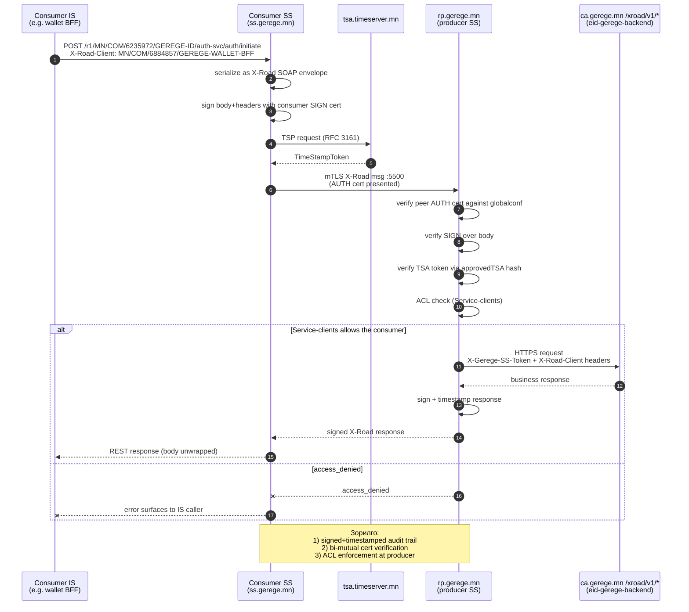
```mermaid
sequenceDiagram
    autonumber
    participant CIS as Consumer IS<br/>(e.g. wallet BFF)
    participant CSS as Consumer SS<br/>(ss.gerege.mn)
    participant TSA as tsa.timeserver.mn
    participant RP as rp.gerege.mn<br/>(producer SS)
    participant IS as ca.gerege.mn /xroad/v1/*<br/>(eid-gerege-backend)

    CIS->>CSS: POST /r1/MN/COM/6235972/GEREGE-ID/auth-svc/auth/initiate<br/>X-Road-Client: MN/COM/6884857/GEREGE-WALLET-BFF
    CSS->>CSS: serialize as X-Road SOAP envelope
    CSS->>CSS: sign body+headers with consumer SIGN cert
    CSS->>TSA: TSP request (RFC 3161)
    TSA-->>CSS: TimeStampToken
    CSS->>RP: mTLS X-Road msg :5500<br/>(AUTH cert presented)
    RP->>RP: verify peer AUTH cert against globalconf
    RP->>RP: verify SIGN over body
    RP->>RP: verify TSA token via approvedTSA hash
    RP->>RP: ACL check (Service-clients)
    alt Service-clients allows the consumer
        RP->>IS: HTTPS request<br/>X-Gerege-SS-Token + X-Road-Client headers
        IS-->>RP: business response
        RP->>RP: sign + timestamp response
        RP-->>CSS: signed X-Road response
        CSS-->>CIS: REST response (body unwrapped)
    else access_denied
        RP--xCSS: access_denied
        CSS--xCIS: error surfaces to IS caller
    end

    Note over CSS,RP: Зорилго:<br/>1) signed+timestamped audit trail<br/>2) bi-mutual cert verification<br/>3) ACL enforcement at producer
```

### 7.2 Mongolia X-Road мессеж envelope

X-Road v6/v7 нь SOAP-based envelope ашиглана. Тойм:

```xml
<SOAP-ENV:Envelope>
  <SOAP-ENV:Header>
    <xrd:client id:objectType="SUBSYSTEM">
      <id:xRoadInstance>MN</id:xRoadInstance>
      <id:memberClass>COM</id:memberClass>
      <id:memberCode>6884857</id:memberCode>
      <id:subsystemCode>GEREGE-WALLET-BFF</id:subsystemCode>
    </xrd:client>
    <xrd:service id:objectType="SERVICE">
      <id:xRoadInstance>MN</id:xRoadInstance>
      <id:memberClass>COM</id:memberClass>
      <id:memberCode>6235972</id:memberCode>
      <id:subsystemCode>GEREGE-ID</id:subsystemCode>
      <id:serviceCode>auth-svc</id:serviceCode>
    </xrd:service>
    <xrd:id>uuid-...</xrd:id>
    <xrd:protocolVersion>4.0</xrd:protocolVersion>
  </SOAP-ENV:Header>
  <SOAP-ENV:Body>
    ...
    <!-- REST payload as MIME attachment in modern X-Road -->
  </SOAP-ENV:Body>
</SOAP-ENV:Envelope>
```

REST-style үйлчилгээ хийхэд X-Road нь URL-аар identifier-уудыг дамжуулна:

```
POST /r1/{xRoadInstance}/{memberClass}/{memberCode}/{subsystemCode}/{serviceCode}/{path...}
X-Road-Client: MN/COM/6884857/GEREGE-WALLET-BFF
```

### 7.3 Сертификат хүчинтэй байх төлөв

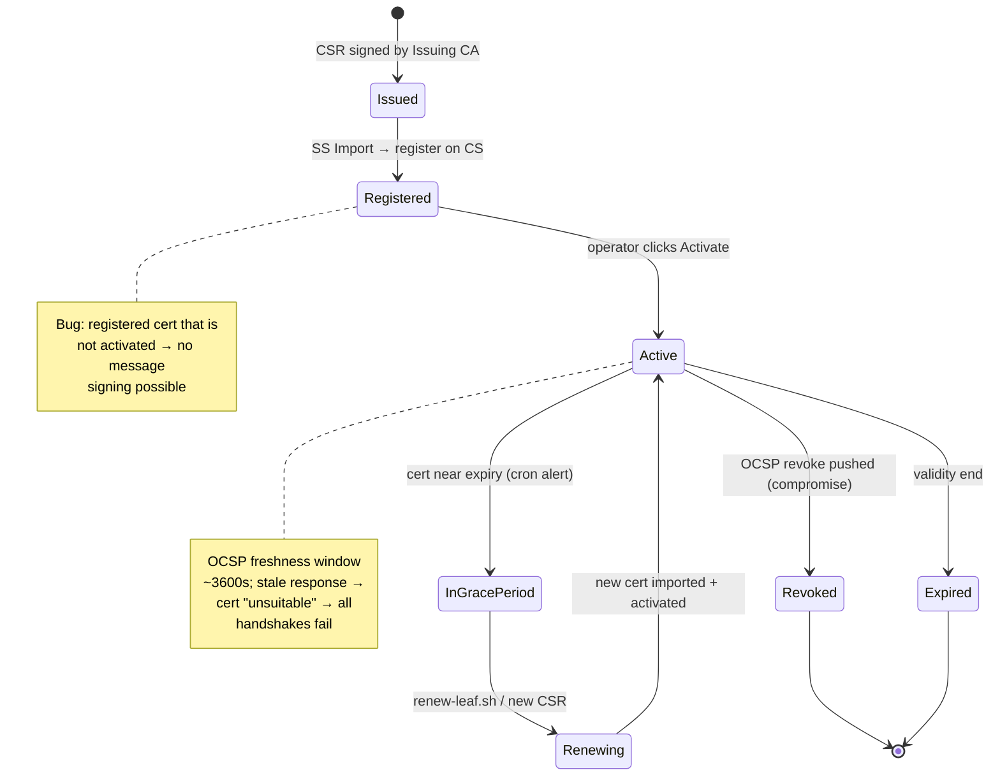
```mermaid
stateDiagram-v2
    [*] --> Issued: CSR signed by Issuing CA
    Issued --> Registered: SS Import → register on CS
    Registered --> Active: operator clicks Activate
    Active --> InGracePeriod: cert near expiry (cron alert)
    InGracePeriod --> Renewing: renew-leaf.sh / new CSR
    Renewing --> Active: new cert imported + activated
    Active --> Revoked: OCSP revoke pushed (compromise)
    Revoked --> [*]
    Active --> Expired: validity end
    Expired --> [*]

    note right of Registered
        Bug: registered cert that is
        not activated → no message
        signing possible
    end note

    note right of Active
        OCSP freshness window
        ~3600s; stale response →
        cert "unsuitable" → all
        handshakes fail
    end note
```

---

## 8. PKI ба итгэлийн загвар

### 8.1 Сертификатын шатлал

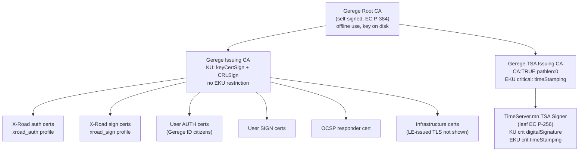
```mermaid
graph TB
    ROOT["Gerege Root CA<br/>(self-signed, EC P-384)<br/>offline use, key on disk"]
    ISSUE["Gerege Issuing CA<br/>KU: keyCertSign + CRLSign<br/>no EKU restriction"]
    TSAISSUE["Gerege TSA Issuing CA<br/>CA:TRUE pathlen:0<br/>EKU critical: timeStamping"]

    XAUTH["X-Road auth certs<br/>xroad_auth profile"]
    XSIGN["X-Road sign certs<br/>xroad_sign profile"]
    UAUTH["User AUTH certs<br/>(Gerege ID citizens)"]
    USIGN["User SIGN certs"]
    OCSP["OCSP responder cert"]
    OTHER["Infrastructure certs<br/>(LE-issued TLS not shown)"]
    TSALEAF["TimeServer.mn TSA Signer<br/>(leaf EC P-256)<br/>KU crit digitalSignature<br/>EKU crit timeStamping"]

    ROOT --> ISSUE
    ROOT --> TSAISSUE
    ISSUE --> XAUTH
    ISSUE --> XSIGN
    ISSUE --> UAUTH
    ISSUE --> USIGN
    ISSUE --> OCSP
    ISSUE --> OTHER
    TSAISSUE --> TSALEAF
```

### 8.2 Яагаад TSA-д тусдаа intermediate хэрэгтэй вэ?

Sigstore TSA `certchain.pem` дотор **ямар ч non-root cert** дээр `id-kp-timeStamping` EKU байх ёстой. Бид анх Gerege Issuing CA-аар leaf cert гаргахыг оролдсон бөгөөд Sigstore startup-д "panic: certificate must have extended key usage timestamping set" гэж унасан. Шийдвэр: тусгай `Gerege TSA Issuing CA` intermediate-ийг гаргаж, түүнд `EKU critical timeStamping` тавьсан. **Зөвхөн** TSA leaf-ийг түүгээр гарын үсэг зурна.

### 8.3 Per-cert профайл

| Профайл | Хэрэглээ | KU | EKU | basicConstraints |
|---|---|---|---|---|
| `xroad_auth` | SS authentication | digitalSignature, keyEncipherment | clientAuth, serverAuth | CA:FALSE |
| `xroad_sign` | SS message signing | nonRepudiation | emailProtection | CA:FALSE |
| `xroad_tsa` | TSA leaf | digitalSignature (crit) | timeStamping (crit) | CA:FALSE |
| `tsa_issuing_ca` | TSA Issuing CA | keyCertSign, CRLSign (crit) | timeStamping (crit) | CA:TRUE, pathlen:0 |

### 8.4 Түлхүүр хадгалалт

| Түлхүүр | Хаана | Зөвлөх практик |
|---|---|---|
| Gerege Root CA private | `gerege.mn:/opt/.../pki/root-ca.key` | Идэвхгүй үед offline зөөвөрт хадгал. Зөвхөн intermediate signing-д ашиглана. |
| Gerege Issuing CA | SoftHSM2 token | PIN-г `reference_cs_secrets.md`-д. Rotate-д бүх дугаарыг дахин лавлуулна. |
| Gerege TSA Issuing CA | `/opt/xroad-ca/tsa-issuing/` | Single-purpose. Бусад leaf-д ашиглаж болохгүй. |
| OCSP responder priv | `/opt/.../pki/ocsp-responder.key` | Container-ийн идэвхтэй memory-д унших, restart бүрт. |
| TSA leaf priv | `timeserver.mn:/opt/tsa-certs/leaf-key.pem` | Хэзээ ч хост-аас гарахгүй. Backup encrypted off-host. |
| Per-SS AUTH+SIGN | `keyconf.xml` (xroad-signer) | Хост-аас гарахгүй. SoftHSM2 token-ээр зурагдсан. |

---

## 9. RFC 3161 цаг тэмдэглэл (TSA)

### 9.1 TSP request flow

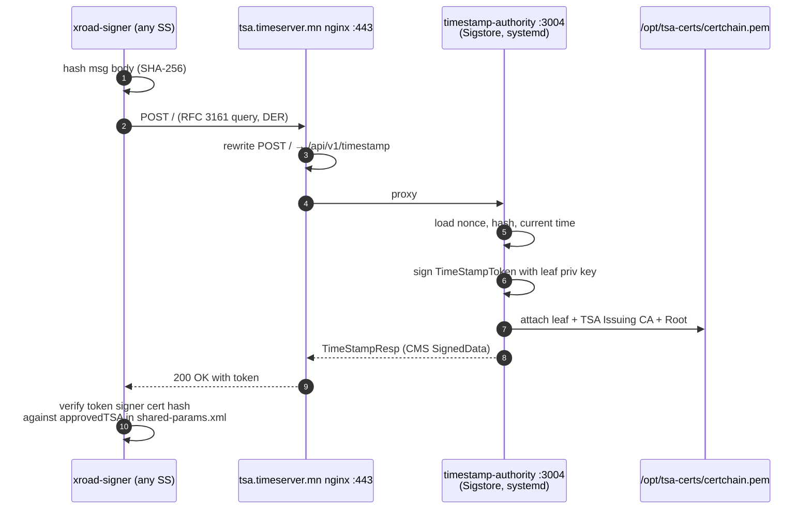
```mermaid
sequenceDiagram
    autonumber
    participant SS as xroad-signer (any SS)
    participant NG as tsa.timeserver.mn nginx :443
    participant SIG as timestamp-authority :3004<br/>(Sigstore, systemd)
    participant CHAIN as /opt/tsa-certs/certchain.pem

    SS->>SS: hash msg body (SHA-256)
    SS->>NG: POST / (RFC 3161 query, DER)
    NG->>NG: rewrite POST / → /api/v1/timestamp
    NG->>SIG: proxy
    SIG->>SIG: load nonce, hash, current time
    SIG->>SIG: sign TimeStampToken with leaf priv key
    SIG->>CHAIN: attach leaf + TSA Issuing CA + Root
    SIG-->>NG: TimeStampResp (CMS SignedData)
    NG-->>SS: 200 OK with token
    SS->>SS: verify token signer cert hash<br/>against approvedTSA in shared-params.xml
```

### 9.2 TSA-ийн leaf шинэчлэх

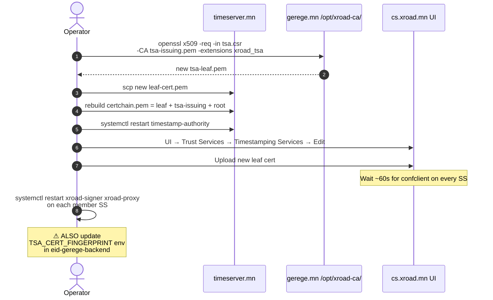
```mermaid
sequenceDiagram
    autonumber
    actor Op as Operator
    participant TS as timeserver.mn
    participant CA as gerege.mn /opt/xroad-ca/
    participant CS as cs.xroad.mn UI

    Op->>CA: openssl x509 -req -in tsa.csr<br/>-CA tsa-issuing.pem -extensions xroad_tsa
    CA-->>Op: new tsa-leaf.pem
    Op->>TS: scp new leaf-cert.pem
    Op->>TS: rebuild certchain.pem = leaf + tsa-issuing + root
    Op->>TS: systemctl restart timestamp-authority
    Op->>CS: UI → Trust Services → Timestamping Services → Edit
    Op->>CS: Upload new leaf cert
    Note over CS: Wait ~60s for confclient on every SS
    Op->>Op: systemctl restart xroad-signer xroad-proxy<br/>on each member SS
    Note over Op: ⚠ ALSO update<br/>TSA_CERT_FINGERPRINT env<br/>in eid-gerege-backend
```

### 9.3 Watch-out-ууд (HISTORY-аас)

- `renew-leaf.sh` нь CS-руу автоматаар push хийдэггүй. CS UI-д гар аргаар upload хэрэгтэй.
- TSA_CERT_FINGERPRINT env-ийг шинэчлэхийг мартвал eid-gerege-backend "fingerprint mismatch" гэж бүх timestamp verify-г үгүйсгэнэ.
- Гэрчилгээ-д агуулагдсан signing key-ийг сольсон тохиолдолд `xroad-confclient` нь дараагийн cycle хүртэл хуучин fingerprint хэвээр.

---

## 10. OCSP ба CRL хүчинтэй байдлын урсгал

### 10.1 OCSP query

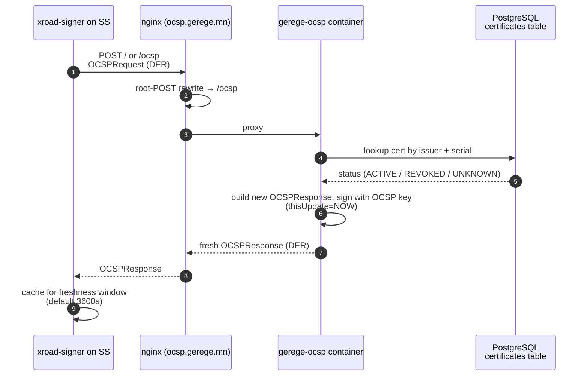
```mermaid
sequenceDiagram
    autonumber
    participant SIGNER as xroad-signer on SS
    participant NG as nginx (ocsp.gerege.mn)
    participant RESP as gerege-ocsp container
    participant DB as PostgreSQL<br/>certificates table

    SIGNER->>NG: POST / or /ocsp<br/>OCSPRequest (DER)
    NG->>NG: root-POST rewrite → /ocsp
    NG->>RESP: proxy
    RESP->>DB: lookup cert by issuer + serial
    DB-->>RESP: status (ACTIVE / REVOKED / UNKNOWN)
    RESP->>RESP: build new OCSPResponse, sign with OCSP key<br/>(thisUpdate=NOW)
    RESP-->>NG: fresh OCSPResponse (DER)
    NG-->>SIGNER: OCSPResponse
    SIGNER->>SIGNER: cache for freshness window<br/>(default 3600s)
```

### 10.2 OCSP staleness — гол гарын авлагын мэдээ

`gerege-ocsp` нь өмнө 4 цагийн in-memory cache байсан — энэ нь X-Road default 3600s freshness window-той зөрчилдөж "OCSP response is too old" алдаа гарч байсан. **2026-04-19-нд cache бүрэн арилгасан** (commit `33f04ab` on `gerege-mn-eid`). Одоо хүсэлт бүрт `thisUpdate=NOW` гэж signing хийнэ. ECDSA P-256 sign нь sub-ms-д ажилладаг.

### 10.3 Leading-zero serial bug (одоо засагдсан)

Анх OCSP responder нь positive cert serial-ийн leading zero байтыг алддаг байсан тул `0x00`-аар эхэлсэн serial-тай cert lookup амжилт нь олж олдоггүй. 2026-04-р улсын дотор патч хийгдсэн, одоо serial-ийг яг тэр чигт нь буцаана.

---

## 11. Аюулгүй байдлын загвар

### 11.1 Итгэлийн хил хязгаар (trust boundaries)

```d2
title: Mongolia X-Road — trust boundaries (security zones)

direction: down

internet: {
  label: "Public Internet"
  shape: cloud
}

zone_a: {
  label: "Zone A — X-Road peer mesh (mTLS + cert-pinned)"
  shape: rectangle
  ss_inbound: ":5500 SS-SS"
  ocsp_peer: ":5577 OCSP responder peer"
}

zone_b: {
  label: "Zone B — TLS public services"
  shape: rectangle
  cs_443: "cs.xroad.mn :443 (WSDL)"
  cs_4001: "cs.xroad.mn :4001 (globalconf, UFW-pinned per SS)"
  cs_4002: "cs.xroad.mn :4002 (mgmt-svc, UFW-pinned per SS)"
  ocsp_public: "ocsp.gerege.mn :443"
  crl_public: "crl.gerege.mn :443"
  tsa_public: "tsa.timeserver.mn :443"
}

zone_c: {
  label: "Zone C — admin plane (NEVER public)"
  shape: rectangle
  style.fill: "#FFEBEE"
  ui_4000: ":4000 xroad UI (SSH-tunnel only)"
  ssh_22: ":22 SSH (admin IP-pinned)"
}

zone_d: {
  label: "Zone D — IS gating"
  shape: rectangle
  rp_to_ca: "rp.gerege.mn → ca.gerege.mn /xroad/v1\n(IP-pinned + X-Gerege-SS-Token)"
  ss_to_is: "ss.paygrid.mn → paygrid.mn IS\n(mTLS, source-pinned UFW)"
}

internet -> zone_a: "every member SS reaches mesh"
internet -> zone_b: "trust services public"
zone_b -> zone_c: "MUST stay behind tunnel"
zone_a -> zone_d: "producer SS reaches IS"
```

### 11.2 Дараах 4 зүйл бол **итгэлийн төв** (если any of these get hacked — instance compromised)

1. **CS signing key** (`/etc/xroad/signer/` дотор SoftHSM-аар хадгалагдсан) — `shared-params.xml`-ийн гарын үсэг тавьдаг. Алдагдвал гэмт этгээд globalconf-д хуурамч cert-уудыг оруулж чадна.
2. **Gerege Root CA private key** (`/opt/.../pki/root-ca.key`) — бүх итгэлийн анхаар. Алдагдвал гэмт этгээд аливаа cert үүсгэж чадна.
3. **Gerege Issuing CA private key** (SoftHSM2 token) — X-Road AUTH+SIGN cert үүсгэдэг. Алдагдвал man-in-the-middle SS-SS handshake боломжтой.
4. **TSA leaf private key** (`/opt/tsa-certs/leaf-key.pem`) — RFC 3161 token-уудыг гарын үсэг зурдаг. Алдагдвал ретроспектив timestamp forge боломжтой.

### 11.3 Тус бүрийн **дайралтын гадаргуу** (attack surface) ба бууруулах арга

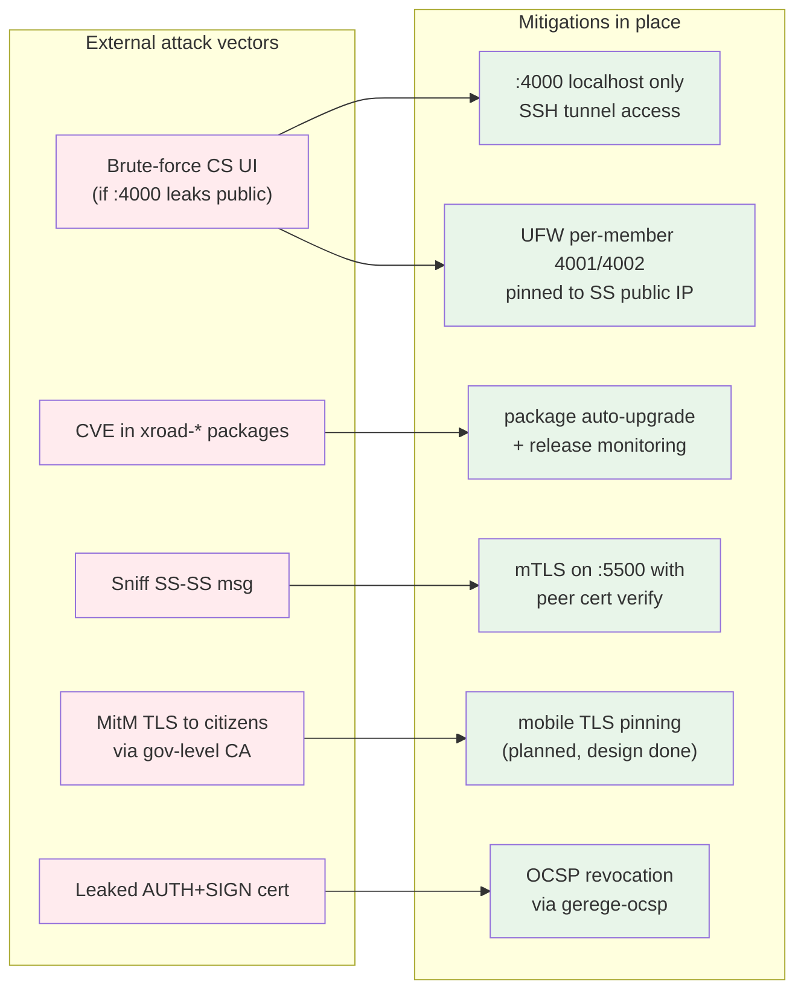
```mermaid
flowchart LR
    %% Attack vectors and mitigations

    subgraph external[External attack vectors]
        BRUTE["Brute-force CS UI<br/>(if :4000 leaks public)"]
        CVE["CVE in xroad-* packages"]
        SNIFF["Sniff SS-SS msg"]
        MITM["MitM TLS to citizens<br/>via gov-level CA"]
        LEAK["Leaked AUTH+SIGN cert"]
    end

    subgraph mitigations[Mitigations in place]
        TUNNEL[":4000 localhost only<br/>SSH tunnel access"]
        UPGRADE["package auto-upgrade<br/>+ release monitoring"]
        MTLS["mTLS on :5500 with<br/>peer cert verify"]
        PIN["mobile TLS pinning<br/>(planned, design done)"]
        REVOKE["OCSP revocation<br/>via gerege-ocsp"]
        FW["UFW per-member 4001/4002<br/>pinned to SS public IP"]
    end

    BRUTE --> TUNNEL
    CVE --> UPGRADE
    SNIFF --> MTLS
    MITM --> PIN
    LEAK --> REVOKE
    BRUTE --> FW

    classDef vector fill:#FFEBEE
    classDef mitig fill:#E8F5E9
    class BRUTE,CVE,SNIFF,MITM,LEAK vector
    class TUNNEL,UPGRADE,MTLS,PIN,REVOKE,FW mitig
```

### 11.4 Inadvertent exposures (HISTORY-аас)

- **2026-04-20 pre-prod showcase**: `ufw allow 4000/tcp` нь бүх 4 хост дээр ажиллуулагдсан. 2 хоногийн дараа `2026-04-22`-д бүгдийг буцаасан. Энэ нь "UI port 4000 нь хэзээ ч public байх ёсгүй" гэдгийн жишээ.
- **2026-04-20 dev bulk revoke incident**: dev environment-ийн SQL script нь production X-Road cert-уудыг revoke хийсэн (`UPDATE certificates SET status='REVOKED'`). Бүх consumer→rp mTLS handshake тэр дороо унасан. Засварлахын тулд `xroad.infra_certificates` тусгай schema-руу X-Road infra cert-уудыг шилжүүлсэн (migration `015_xroad_infra_schema.sql`). Одоо `TRUNCATE public.certificates` нь infra-д хүрэхгүй.

---

## 12. Үйл ажиллагааны мониторинг

### 12.1 Prometheus + node_exporter

`monitor.x-road.mn` (38.180.242.76) дээр Prometheus ажилладаг. `xroad-nodes` job нь 6 хостийг scrap хийдэг (`:9100` node_exporter). `ss.paygrid.mn` нэмэх 7 дахь target нь Phase-3 ажил.

### 12.2 X-Road op-monitor

`ss.gerege.mn` дээр `xroad-opmonitor` нэмэлт суулгасан — port 2080/2081 loopback. Энэ нь SS-аар дамжсан мессеж бүрийн **statistics** (хариу хугацаа, status code, byte size) хадгалдаг. Дашбоард руу нэгтгэх ажил `Op-Monitor UI` нэмэлт-ээр (Phase-3).

### 12.3 Алертийн зүйл

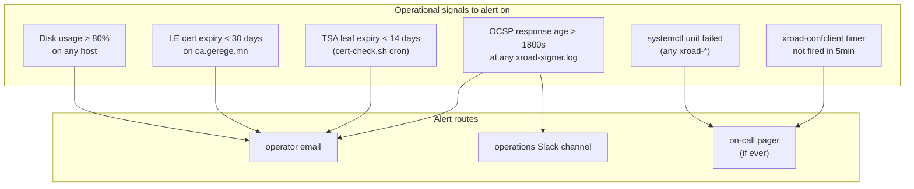
```mermaid
flowchart TB
    direction LR

    subgraph signals["Operational signals to alert on"]
        S1["OCSP response age > 1800s<br/>at any xroad-signer.log"]
        S2["TSA leaf expiry < 14 days<br/>(cert-check.sh cron)"]
        S3["xroad-confclient timer<br/>not fired in 5min"]
        S4["systemctl unit failed<br/>(any xroad-*)"]
        S5["LE cert expiry < 30 days<br/>on ca.gerege.mn"]
        S6["Disk usage > 80%<br/>on any host"]
    end

    subgraph routes["Alert routes"]
        EMAIL["operator email"]
        SLACK["operations Slack channel"]
        PAGE["on-call pager<br/>(if ever)"]
    end

    S1 --> EMAIL
    S1 --> SLACK
    S2 --> EMAIL
    S3 --> PAGE
    S4 --> PAGE
    S5 --> EMAIL
    S6 --> EMAIL
```

---

## 13. Алдаа засах гарын авлагын зам

Энэ нь хамгийн **алдартай 5 алдаа** + хаана уншихыг хэлсэн товч жагсаалт. Бүрэн troubleshooting гарын авлага: [`docs/guides/tr-mn.md`](guides/tr-mn.md).

| Алдааны мессеж | Үндсэн шалтгаан | Зас | Хаана уншмаар вэ |
|---|---|---|---|
| `mlog.no_timestamping_provider_found` | TSP entry SS-д байхгүй | UI → Settings → System Parameters → Timestamping Services → Add | `docs/operational-gotchas.md` |
| `incorrect_validation_info: OCSP response is too old` | gerege-ocsp cache stale (одоо засагдсан, өмнө нь) | `docker restart gerege-ocsp && systemctl restart xroad-signer` | `ca.gerege.mn/HISTORY.md` 2026-04-19 |
| `Security server has no valid authentication certificate` | AUTH cert idle, registered-only | UI → Keys and Certificates → Activate | `rp.gerege.mn/HISTORY.md` 2026-04-19 |
| `ssl_authentication_failed: ... has no IS certificates` | IS TLS cert SS-д upload хийгээгүй | UI → Internal Servers → IS TLS certificate → Add | `mgmt.xroad.mn/HISTORY.md` 2026-04-19 |
| `mlog.tsp_certificate_not_found` | shared-params-ийн TSA cert нь live leaf-тэй таарахгүй | CS UI → Trust Services → Timestamping Services → re-add | `timeserver.mn/HISTORY.md` 2026-04-19 |

---

## 14. Тоо баримтаар

(2026-05-15 байдлаар)

| Үзүүлэлт | Утга |
|---|---|
| Хост (CS + SS + CA + TSA) | 7 |
| Member organization | 4 (Gerege Systems, Gerege Core, Gerege Smart Metering, Цахим яам) |
| Registered subsystem | 5 producers/consumers + 5 mgmt-SS subsystems = 10 |
| Service-clients grant | 14 (GEREGE-ID: 6, EIDMONGOL: 8) |
| Production OCSP queries/day | ~12,000 (өсөж байна) |
| TSP requests/day | ~6,000 |
| Globalconf distributions/min | every ~60s × 4 SS = 240/hour |
| Бүх hostname-уудын TLS expiry зайн дундаж | 73 хоног (LE auto-renew) |
| TSA leaf expiry | 2028-04-19 |
| AUTH cert expiry (rp.gerege.mn) | 2028-04-19 |
| AUTH cert expiry (ss.paygrid.mn) | 2028-08-08 |

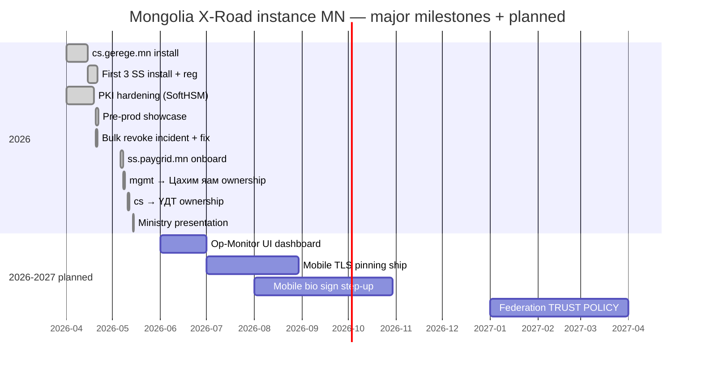
```mermaid
gantt
    dateFormat YYYY-MM-DD
    axisFormat %Y-%m
    title Mongolia X-Road instance MN — major milestones + planned

    section 2026
    cs.gerege.mn install        :done, 2026-04-01, 2026-04-15
    First 3 SS install + reg    :done, 2026-04-15, 2026-04-21
    PKI hardening (SoftHSM)     :done, 2026-04-01, 2026-04-19
    Pre-prod showcase           :done, 2026-04-20, 2d
    Bulk revoke incident + fix  :done, 2026-04-20, 1d
    ss.paygrid.mn onboard       :done, 2026-05-06, 2d
    mgmt → Цахим яам ownership  :done, 2026-05-08, 1d
    cs → ҮДТ ownership          :done, 2026-05-11, 1d
    Ministry presentation       :done, 2026-05-14, 1d

    section 2026-2027 planned
    Op-Monitor UI dashboard     :2026-06-01, 30d
    Mobile TLS pinning ship     :2026-07-01, 60d
    Mobile bio sign step-up     :2026-08-01, 90d
    Federation TRUST POLICY     :2027-01-01, 90d
```

---

## 15. Холбогдох гарын авлагууд (doc map)

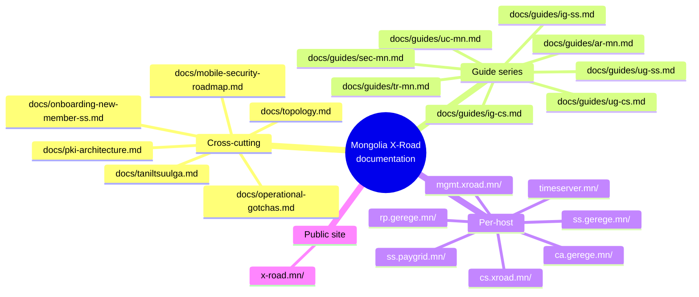
```mermaid
mindmap
  root((Mongolia X-Road<br/>documentation))
    Cross-cutting
      docs/taniltsuulga.md
      docs/topology.md
      docs/pki-architecture.md
      docs/onboarding-new-member-ss.md
      docs/operational-gotchas.md
      docs/mobile-security-roadmap.md
    Guide series
      docs/guides/ar-mn.md
      docs/guides/ig-cs.md
      docs/guides/ig-ss.md
      docs/guides/ug-cs.md
      docs/guides/ug-ss.md
      docs/guides/uc-mn.md
      docs/guides/tr-mn.md
      docs/guides/sec-mn.md
    Per-host
      cs.xroad.mn/
      mgmt.xroad.mn/
      rp.gerege.mn/
      ss.gerege.mn/
      ss.paygrid.mn/
      ca.gerege.mn/
      timeserver.mn/
    Public site
      x-road.mn/
```

Хэрхэн ашиглах вэ:

- **Шинэ оператор**: `docs/taniltsuulga.md` (энэ файл) → `docs/guides/ar-mn.md` (архитектур) → host-ийн README-уудыг чиглэлээр нь.
- **Шинэ гишүүн SS суулгах**: `docs/guides/ig-ss.md` → `docs/onboarding-new-member-ss.md`.
- **Алдаа гарвал**: `docs/guides/tr-mn.md` → яг хост-ын `HISTORY.md`.
- **Хөгжүүлэгч буюу API-аар хэрэглэх**: `rp.gerege.mn/README.md` (service catalog) + `docs/guides/uc-mn.md` (use cases).
- **Аюулгүй байдлын тойм**: `docs/guides/sec-mn.md` + `docs/mobile-security-roadmap.md`.

---

## Хавсралт А: Хост хаяг + порт + DNS бүртгэл

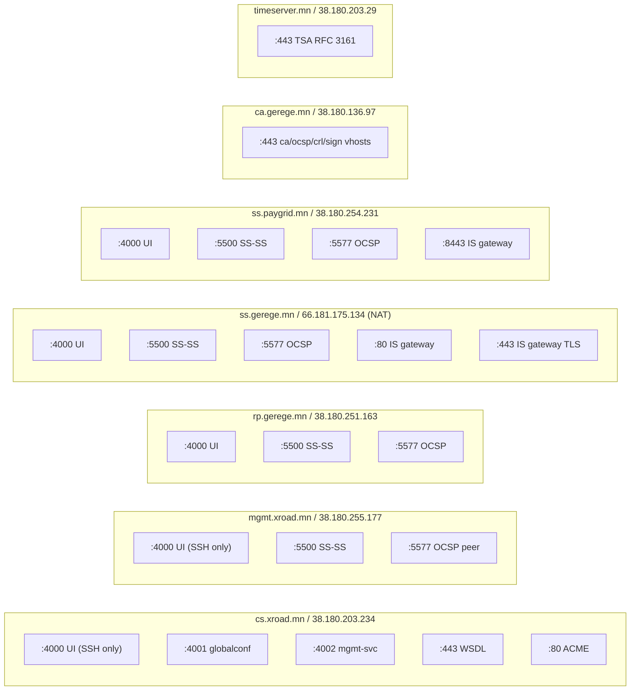
```mermaid
graph LR
    %% IP addressing + port summary

    subgraph cs_box["cs.xroad.mn / 38.180.203.234"]
        cs_4000[":4000 UI (SSH only)"]
        cs_4001[":4001 globalconf"]
        cs_4002[":4002 mgmt-svc"]
        cs_443[":443 WSDL"]
        cs_80[":80 ACME"]
    end

    subgraph mgmt_box["mgmt.xroad.mn / 38.180.255.177"]
        m_4000[":4000 UI (SSH only)"]
        m_5500[":5500 SS-SS"]
        m_5577[":5577 OCSP peer"]
    end

    subgraph rp_box["rp.gerege.mn / 38.180.251.163"]
        r_4000[":4000 UI"]
        r_5500[":5500 SS-SS"]
        r_5577[":5577 OCSP"]
    end

    subgraph ss_box["ss.gerege.mn / 66.181.175.134 (NAT)"]
        s_4000[":4000 UI"]
        s_5500[":5500 SS-SS"]
        s_5577[":5577 OCSP"]
        s_80[":80 IS gateway"]
        s_443[":443 IS gateway TLS"]
    end

    subgraph pay_box["ss.paygrid.mn / 38.180.254.231"]
        p_4000[":4000 UI"]
        p_5500[":5500 SS-SS"]
        p_5577[":5577 OCSP"]
        p_8443[":8443 IS gateway"]
    end

    subgraph ca_box["ca.gerege.mn / 38.180.136.97"]
        c_443[":443 ca/ocsp/crl/sign vhosts"]
    end

    subgraph ts_box["timeserver.mn / 38.180.203.29"]
        t_443[":443 TSA RFC 3161"]
    end
```

## Хавсралт Б: Глоссари

| Англи нэр | Mongolian | Тайлбар |
|---|---|---|
| Central Server | Төв сервер | Instance-ийн эрхт бүртгэлийн төв |
| Security Server | Хамгаалалтын сервер | Гишүүний нүүр (signing + ACL + proxy) |
| Information System (IS) | Мэдээллийн систем | Гишүүний бизнес сервер |
| Subsystem | Дэд систем | Memer-ийн доорх identity unit (e.g. GEREGE-ID) |
| Service-clients | Үйлчилгээний хэрэглэгчид | ACL: ямар subsystem ямар үйлчилгээг дуудаж болох |
| globalconf | Глобал тохиргоо | CS гарын үсэг тавьсан XML — гишүүд, batch SS, approved CA, TSA |
| `clientReg` | Гишүүн бүртгэл | Management service-ийн нэг (clientReg/clientDeletion/etc) |
| TSP (Time-Stamp Protocol) | Цаг тэмдэглэлийн протокол | RFC 3161 |
| OCSP | Сертификатын онлайн төлөв шалгалт | RFC 6960 |
| AUTH cert | Authentication гэрчилгээ | SS handshake-д ашигладаг X.509 cert |
| SIGN cert | Signing гэрчилгээ | Мессежийн body+headers-т гарын үсэг |
| AIA | Authority Information Access | OCSP/CA URL-ийг агуулсан cert extension |
| EKU | Extended Key Usage | timeStamping/serverAuth/clientAuth гэх мэт |
| confclient | Тохиргооны клиент | CS-ээс globalconf татах SS-side service |
| signer | Гарын үсэг зурагч | SS-ийн key + cert + OCSP cache хариуцагч |
| xroad-proxy | X-Road проксин | SS-SS мессеж эчнээ хүлээж авах, дамжуулах |
| Member class | Гишүүний ангилал | COM, GOV, NEE гэх мэт |
| Member code | Гишүүний код | Улсын бүртгэлийн дугаар (e.g. 6235972) |
| Server code | Серверийн код | Хүн уншиж болох SS-ийн нэр (e.g. RP-SS-1) |

---

*Хэрэв энэхүү танилцуулга ямар нэгэн бодит хэлбэрээр буруу эсвэл хуучирсан тохиолдол гарвал, тухайн хост-ын `HISTORY.md`-г шууд эх сурвалж гэж үзнэ.*
