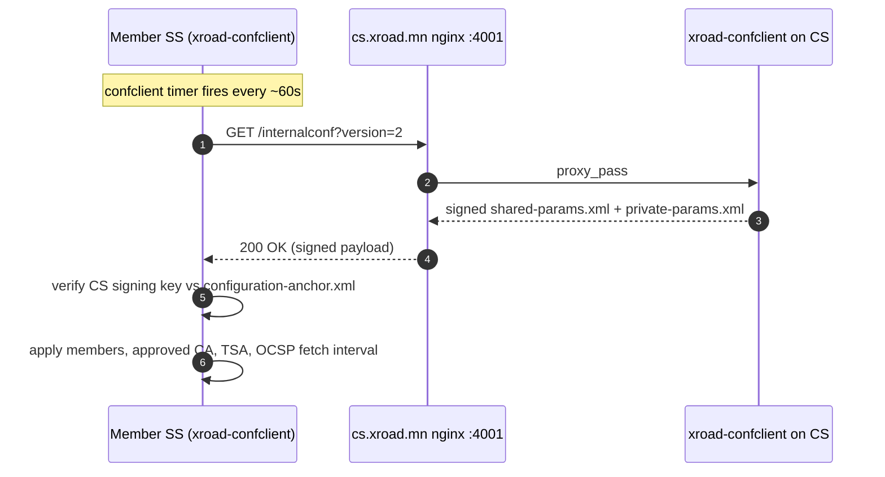
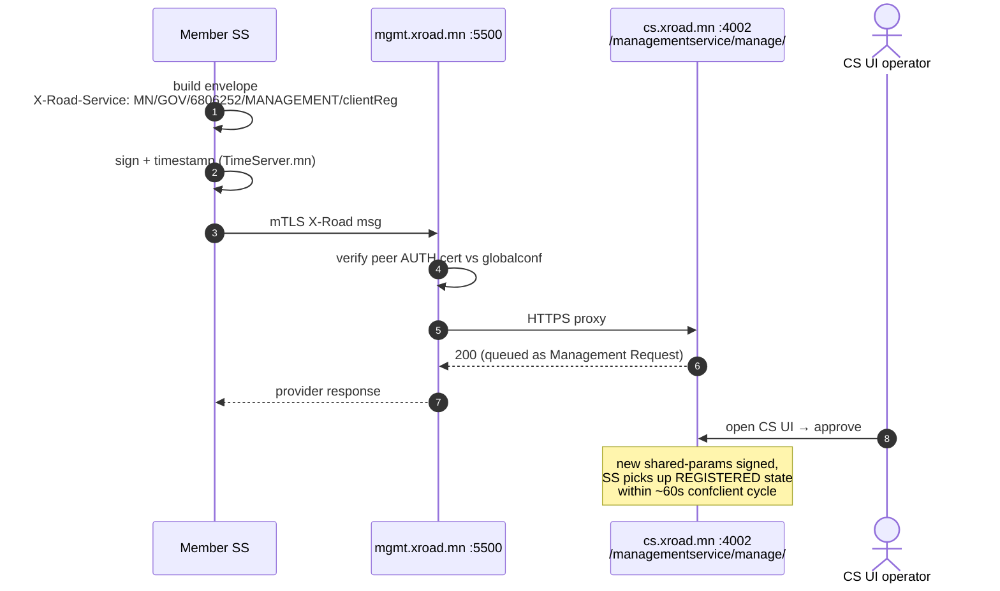
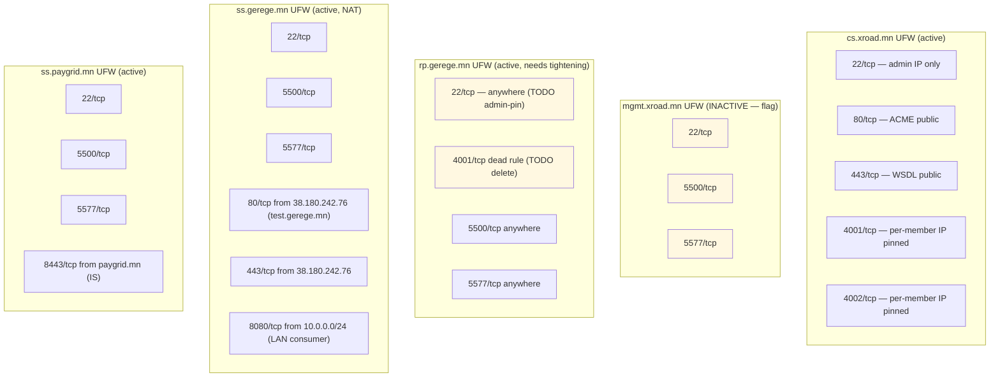

# Topology — Mongolia X-Road (instance MN)

Frozen as of 2026-05-11 (`cs.xroad.mn` ownership transferred to
Үндэсний дата төв; `ss.paygrid.mn` install + first subsystem
`PAYGRID-CORE` registered on 2026-05-07).

## Hosts and X-Road identifiers

| Host                | IP             | xRoadInstance | memberClass | memberCode | subsystemCode | serverCode  | Role                |
|---------------------|----------------|---------------|-------------|-----------:|---------------|-------------|---------------------|
| `cs.xroad.mn`       | 38.180.203.234 | MN            | —           |          — | —             | —             | Central Server      |
| `mgmt.xroad.mn`     | 38.180.255.177 | MN            | GOV         |    6806252 | MANAGEMENT    | MGMT-XROAD-MN | Management SS       |
| `rp.gerege.mn`      | 38.180.251.163 | MN            | COM         |    6235972 | GEREGE-ID     | RP-SS-1       | Producer SS         |
| `ss.gerege.mn`      | 66.181.175.134 | MN            | COM         |    6884857 | TEST-DEMO     | CORE-SS-1     | Consumer SS         |
| `ss.paygrid.mn`     | 38.180.254.231 | MN            | COM         |    7181609 | PAYGRID-CORE  | PAYGRID-SS-1  | Member SS (paygrid) |

(`memberCode` 6235972 = Gerege Systems LLC; 6884857 = Gerege Core LLC;
7181609 = Gerege Smart Metering, brand domain `paygrid.mn`;
6806252 = Цахим хөгжил инновац харилцаа холбооны яам / Ministry of
Digital Development, took ownership of MGMT-XROAD-MN on 2026-05-08.
PAYGRID-SS-1 owner + PAYGRID-CORE subsystem REGISTERED on CS
2026-05-06 / 2026-05-07. The Central Server itself has no member
identity; its legal owner transferred from Gerege Systems LLC to
**Үндэсний дата төв** (National Data Center) on 2026-05-11 — see
`cs.xroad.mn/HISTORY.md` 2026-05-11 entry. Day-to-day operator
remains Gerege Systems LLC.)

## Listening ports (after host firewalls)

| Host                | Port     | Service                                    | Reachable from                                                |
|---------------------|---------:|--------------------------------------------|---------------------------------------------------------------|
| cs.xroad.mn         |       80 | Let's Encrypt + landing                    | public                                                        |
| cs.xroad.mn         |      443 | nginx (managementservices.wsdl, public)    | public                                                        |
| cs.xroad.mn         |     4000 | xroad-center UI                            | localhost (use SSH tunnel `-L 14000:localhost:4000`)          |
| cs.xroad.mn         |     4001 | nginx → confclient (globalconf download)   | every member SS                                               |
| cs.xroad.mn         |     4002 | nginx → mgmt service backend               | every member SS that calls mgmt                               |
| mgmt.xroad.mn       |     5500 | xroad-proxy server-proxy (incoming X-Road) | public                                                        |
| mgmt.xroad.mn       |     5577 | xroad-proxy OCSP responder                 | public                                                        |
| mgmt.xroad.mn       |     4000 | xroad-proxy-ui-api (admin UI)              | localhost (`-L 14005:localhost:4000`)                         |
| rp.gerege.mn        |     5500 | xroad-proxy server-proxy                   | public (consumer SSes connect here)                           |
| rp.gerege.mn        |     5577 | xroad-proxy OCSP                           | public                                                        |
| rp.gerege.mn        |     4000 | xroad admin UI                             | localhost (`-L 14003:localhost:4000`)                         |
| ss.gerege.mn        |     5500 | xroad-proxy server-proxy                   | public                                                        |
| ss.gerege.mn        |     5577 | xroad-proxy OCSP                           | public                                                        |
| ss.gerege.mn        |       80 | xroad-proxy IS gateway (consumer REST)     | UFW-allowlisted IS hosts only (test.gerege.mn 38.180.242.76)  |
| ss.gerege.mn        |      443 | xroad-proxy IS gateway with TLS            | (same)                                                        |
| ss.gerege.mn        |     4000 | xroad admin UI                             | localhost (`-L 14004:localhost:4000`)                         |
| ss.paygrid.mn       |     5500 | xroad-proxy server-proxy                   | public                                                        |
| ss.paygrid.mn       |     5577 | xroad-proxy OCSP                           | public                                                        |
| ss.paygrid.mn       |     8080 | xroad-proxy IS gateway (consumer REST)     | UFW-blocked until paygrid IS host is decided                  |
| ss.paygrid.mn       |     8443 | xroad-proxy IS gateway with TLS            | (same)                                                        |
| ss.paygrid.mn       |     4000 | xroad admin UI                             | localhost (`-L 14006:localhost:4000`)                         |
| gerege.mn           |      443 | nginx (gerege.mn, ca, ocsp, crl, sign)     | public                                                        |
| gerege.mn           |     8080 | eid-gerege-backend (behind ca.gerege.mn)   | nginx only                                                    |
| timeserver.mn       |      443 | nginx → Sigstore TSA (RFC 3161)            | public                                                        |
| timeserver.mn       |     3004 | timestamp-authority (Sigstore)             | localhost only                                                |

## Flows on this topology

### Globalconf distribution (every ~60s, per member SS)

### Management service call (clientReg / addressChange / authCertDeletion / …)

## UFW rules summary by host

⚠ Two posture issues to fix:
1. **mgmt.xroad.mn UFW нь INACTIVE** — relies on service binding (`*:5500`, `*:5577`) being public-facing by design. Daughter-of-design: enable UFW with explicit allow rules to match other SS pattern.
2. **rp.gerege.mn UFW дотор 4001/tcp dead rule** — `4001/tcp` нь CS port, SS дээр сонсогддоггүй. Removed нь зөв.

## TSA cert chain in `shared-params.xml`

The CS distributes `shared-params.xml` with a single `<approvedTSA>` whose `<cert>` is the LEAF cert (TimeServer.mn TSA Signer, EC P-256). Any TSP response signed by this leaf is accepted; the chain validation up to Gerege Root is not currently performed by `TimestampVerifier` (it matches by signer cert hash against the configured cert).
