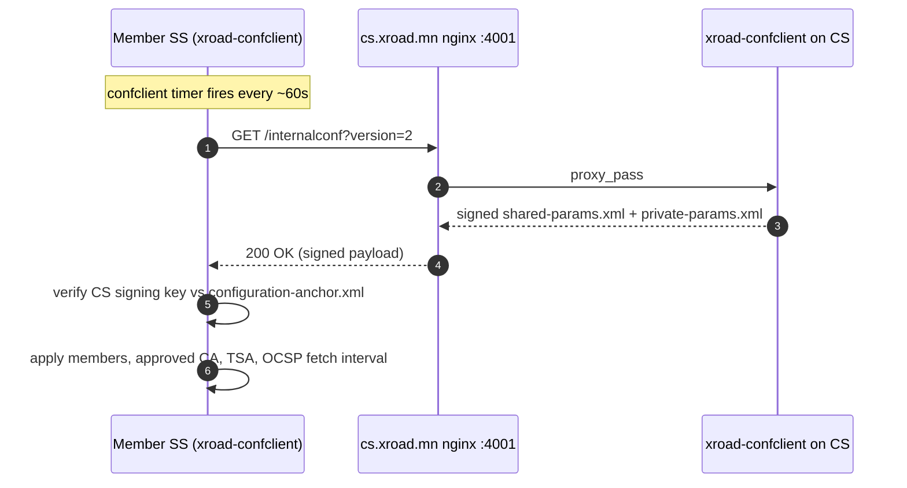
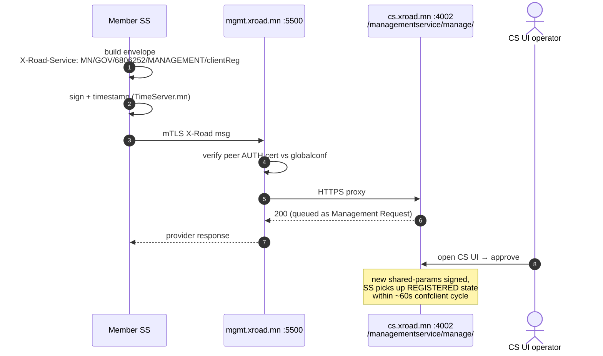
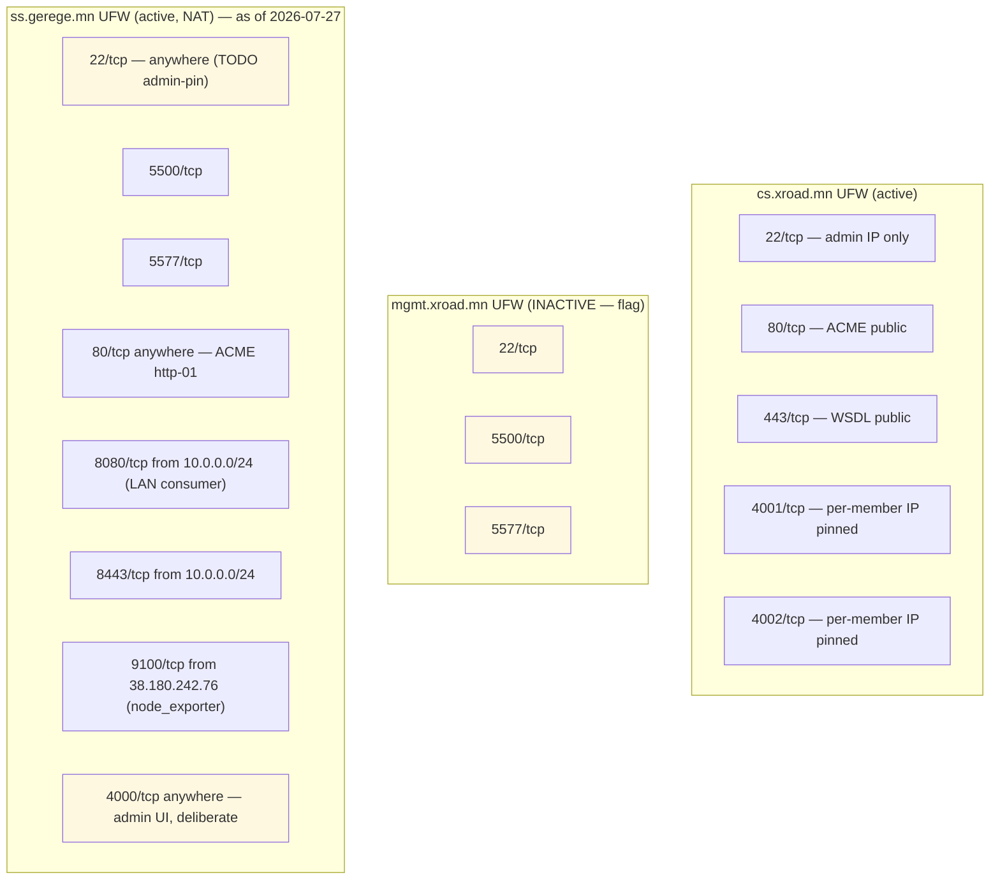

# Topology — Mongolia X-Road (instance MN)

Read from `cs.xroad.mn` on **2026-07-27**.

> The MN instance was **re-provisioned from scratch on 2026-07-22** — cs was
> reinstalled in place and its registry now contains only the hosts below.
> `rp.gerege.mn` (`RP-SS-1`) and `ss.paygrid.mn` (`PAYGRID-SS-1`) no longer
> exist in the instance and were removed from this repo on 2026-07-27, along
> with members `6884857` (Gerege Core LLC), `7181609` (Gerege Smart Metering)
> and `6806252` (Цахим хөгжлийн яам). Background:
> `ss.gerege.mn/HISTORY.md`, entry "The whole MN instance was re-provisioned".

## Hosts and X-Road identifiers

| Host                | IP             | xRoadInstance | memberClass | memberCode | subsystemCode | serverCode  | Role                |
|---------------------|----------------|---------------|-------------|-----------:|---------------|-------------|---------------------|
| `cs.xroad.mn`       | 38.180.203.234 | MN            | —           |          — | —             | —             | Central Server (7.8.2) |
| `mgmt.xroad.mn`     | 38.180.137.229 | MN            | GOV         |    5323304 | MANAGEMENT    | mgmt          | Management SS       |
| `ss.gerege.mn`      | 66.181.175.134 | MN            | COM         |    6235972 | EIDMONGOLIA, GEREGE-WALLET-BFF | GEREGE-SS-1 | Member SS (REGISTERED 2026-07-27) |

Members on cs: `MN/GOV/9900001` "X-Road Operator PoC placeholder" (subsystems
`MANAGEMENT`, `TEST`, `CONSUMER`), `MN/GOV/5323304` "Үндэсний дата төв" — owner of
`MN:GOV:5323304:mgmt` — and `MN/COM/6235972` "Gerege Systems LLC", added
2026-07-27 together with the `COM` member class, owner of
`MN:COM:6235972:GEREGE-SS-1`. Those two are the instance's only security servers.
The Central Server has no member identity of its own.

`GEREGE-SS-1`'s AUTH and SIGN certificates were issued by the **staging** CA
(serials 1005/1006, expire 2028-07-26), not the production eID Mongolia CA —
re-issue before the server carries real traffic.

Approved trust services in this instance: CA **eID Mongolia Organization
Issuing CA** (`C=MN, O=Gerege Systems LLC`, valid to 2046-07-22, OCSP
`https://rp-api.eidmongolia.mn/ocsp`) and **MN X-Road Staging Test CA** (OCSP
`http://cs.xroad.mn:8888`, an `openssl ocsp` process serving `/root/testca` on
cs); TSA **eID Mongolia TSA** at `http://tsa.timeserver.mn:8318/`. The former
Gerege Root → Gerege Issuing CA chain and the `https://tsa.timeserver.mn/` TSA
endpoint are **not** part of this instance.

## Listening ports (after host firewalls)

| Host                | Port     | Service                                    | Reachable from                                                |
|---------------------|---------:|--------------------------------------------|---------------------------------------------------------------|
| cs.xroad.mn         |       80 | Let's Encrypt + landing                    | public                                                        |
| cs.xroad.mn         |      443 | nginx (managementservices.wsdl, public)    | public                                                        |
| cs.xroad.mn         |     4000 | xroad-center UI                            | localhost (use SSH tunnel `-L 14000:localhost:4000`)          |
| cs.xroad.mn         |     4001 | nginx → confclient (globalconf download)   | every member SS                                               |
| cs.xroad.mn         |     4002 | nginx → mgmt service backend               | every member SS that calls mgmt                               |
| mgmt.xroad.mn       |     5500 | xroad-proxy server-proxy (incoming X-Road) | public                                                        |
| mgmt.xroad.mn       |     5577 | xroad-proxy OCSP responder                 | public                                                        |
| mgmt.xroad.mn       |     4000 | xroad-proxy-ui-api (admin UI)              | **public** (operator decision)                                |
| mgmt.xroad.mn       | 8080/8443| xroad-proxy IS gateway                     | see host                                                      |
| ss.gerege.mn        |     5500 | xroad-proxy server-proxy                   | public                                                        |
| ss.gerege.mn        |     5577 | xroad-proxy OCSP                           | public                                                        |
| ss.gerege.mn        |     8080 | xroad-proxy IS gateway (consumer REST)     | `10.0.0.0/24` only — moved off `:80` on 2026-07-27             |
| ss.gerege.mn        |     8443 | xroad-proxy IS gateway with TLS            | `10.0.0.0/24` only — moved off `:443` on 2026-07-27            |
| ss.gerege.mn        |       80 | (free) — reserved for ACME http-01         | public, certbot standalone only                               |
| ss.gerege.mn        |     4000 | xroad admin UI                             | **public** (operator decision; router forwards 4000)          |
| ca.gerege.mn        |      443 | eID Mongolia CA / OCSP / `rp-api` vhosts   | public (38.180.82.252)                                        |
| timeserver.mn       |     8318 | eID Mongolia TSA (RFC 3161)                | public — **not** `:443`                                       |
| cs.xroad.mn         |     8888 | `openssl ocsp` for MN X-Road Staging Test CA | public                                                      |
| timeserver.mn       |     3004 | timestamp-authority (Sigstore)             | localhost only                                                |

## Flows on this topology

### Globalconf distribution (every ~60s, per member SS)

### Management service call (clientReg / addressChange / authCertDeletion / …)

## UFW rules summary by host

⚠ Posture issues to fix:
1. **mgmt.xroad.mn UFW нь INACTIVE** — relies on service binding (`*:5500`, `*:5577`) being public-facing by design. Enable UFW with explicit allow rules to match the other SS pattern.
2. **ss.gerege.mn `22/tcp` нь anywhere** — admin IP-д pin хийх (cs шиг).
3. **`4000/tcp` public** — операторын зориудын шийдвэр, form-login only, mTLS/IP allow-list/WAF байхгүй. Showcase дуусмагц router forward + UFW rule хоёуланг авах.

## TSA cert chain in `shared-params.xml`

The CS distributes `shared-params.xml` with a single `<approvedTSA>` whose `<cert>` is the LEAF cert (TimeServer.mn TSA Signer, EC P-256). Any TSP response signed by this leaf is accepted; the chain validation up to Gerege Root is not currently performed by `TimestampVerifier` (it matches by signer cert hash against the configured cert).
