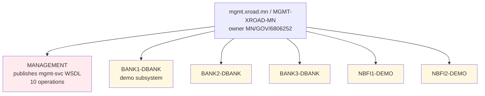
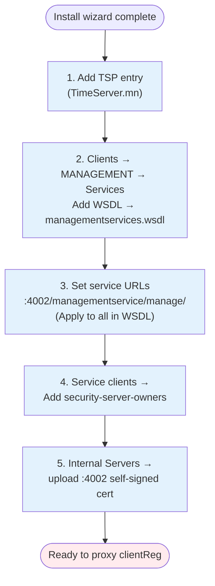

# mgmt.xroad.mn — Management Security Server

**Public IP:** 38.180.255.177
**SSH aliases:** `mgmt.xroad.mn`, `mgmt.gerege.mn` (legacy alias, both still SSH-resolve to the same host)
**Owner:** Цахим хөгжил инновац харилцаа холбооны яам / Ministry of Digital Development (`MN/GOV/6806252`) — owner moved here from Gerege Systems LLC on 2026-05-08; reflected in cs `shared-params.xml` securityServer block `MGMT-XROAD-MN`.
**Member-server code:** `MGMT-XROAD-MN` (was `MGMT-SS-1` until 2026-05-08)
**X-Road version:** 7.8.0
**Role:** The "owner SS" of the Mongolia X-Road instance. Runs the `MANAGEMENT` subsystem that publishes the management-service WSDL with all 10 operations (`addressChange`, `authCertDeletion`, `clientDeletion`, `clientDisable`, `clientEnable`, `clientReg`, `clientRename`, `maintenanceModeDisable`, `maintenanceModeEnable`, `ownerChange`).

Also hosts the `BANK1-DBANK`, `BANK2-DBANK`, `BANK3-DBANK`, `NBFI1-DEMO`, `NBFI2-DEMO` subsystems registered to Gerege Core LLC for the DBank / NBFI demo flows (see `securityServer/MGMT-XROAD-MN` clients in cs `shared-params.xml`).

## How a member SS reaches us

Every member SS that wants to register a subsystem (e.g. `clientReg`) on the central server sends a signed X-Road message with `X-Road-Service: MN/GOV/6806252/MANAGEMENT/{operation}`. mgmt SS receives it via its own `5500/tcp` server-proxy port, signs at its end, and proxies the request to the management-service backend hosted on cs.xroad.mn (`https://cs.xroad.mn:4002/managementservice/manage/`).

```mermaid
sequenceDiagram
    autonumber
    participant SS as Member SS<br/>(rp / ss.gerege / paygrid)
    participant MGMT as mgmt.xroad.mn :5500
    participant TSA as tsa.timeserver.mn
    participant CSAPI as cs.xroad.mn :4002<br/>/managementservice/manage/
    participant DB as CS centerui DB
    actor OP as CS UI operator

    SS->>SS: build clientReg envelope (X-Road msg)
    SS->>SS: sign with SS SIGN cert
    SS->>TSA: TSP query (timestamp the signed msg)
    TSA-->>SS: TimeStampToken
    SS->>MGMT: POST signed + stamped msg
    MGMT->>MGMT: verify peer AUTH cert against globalconf
    MGMT->>MGMT: re-sign at the MANAGEMENT WSDL boundary
    MGMT->>CSAPI: HTTPS (mTLS) /clientReg
    CSAPI->>DB: INSERT into management_requests (status=pending)
    CSAPI-->>MGMT: 200 queued
    MGMT-->>SS: provider response
    OP->>CSAPI: open CS UI → Management Requests → Approve
    Note over CSAPI: row → approved;<br/>shared-params re-signed,<br/>SS picks up REGISTERED in ~60s
```

## Hosted subsystems on this SS



## Setup sequence (one-time per fresh mgmt SS install)



⚠ Бүх 5 алхамыг ӨМНӨ нь хийх МАШ ЧУХАЛ. Хэдийгээр install wizard үүсгэдэг боловч **юу ч pre-fill хийдэггүй**. `mgmt.gerege.mn/HISTORY.md` 2026-04-19-ний бүх 5 алхам нь яг энэ нөхцлөөс үүссэн.

## Required configuration on this SS — order matters

1. **TSP entry.** Settings → System Parameters → Timestamping Services → Add → TimeServer.mn (URL `https://tsa.timeserver.mn/`). Without this, `clientReg` from any member SS fails with `mlog.no_timestamping_provider_found` — the failure surfaces back at the member, not here, which is confusing.
2. **MANAGEMENT subsystem WSDL.** Clients → MANAGEMENT → Services → Add WSDL → `http://cs.xroad.mn/managementservices.wsdl`. After enable, all 10 services become callable.
3. **Set service URLs to** `https://cs.xroad.mn:4002/managementservice/manage/` for each operation (use "Apply to all in WSDL").
4. **Grant `security-server-owners` access** on every service (Service clients → Add subjects → security-server-owners). Default deny means without this any `clientReg` returns `service_failed.access_denied`.
5. **IS TLS certificate.** Internal Servers → Information System TLS certificate → Add → upload the cert nginx serves on `cs.xroad.mn:4002` (self-signed by X-Road CS install). Without this, the proxy step fails with `ssl_authentication_failed: has no IS certificates`.

## What lives in this folder

- `xroad/configuration-anchor.xml` — the public anchor downloaded from cs.xroad.mn at install time. Distributing this file is what tells `xroad-confclient` where to fetch globalconf. The embedded `downloadURL` reads `cs.xroad.mn`; as of 2026-05-08 every member SS (rp.gerege.mn, ss.gerege.mn, ss.paygrid.mn) has been refreshed onto this same anchor, with each host's pre-rename copy preserved as `/etc/xroad/configuration-anchor.xml.bak.20260508`. The legacy `cs.gerege.mn` DNS name still resolves to the same host as a safety net, but no live anchor or service URL relies on it any more.
- `xroad/conf.d-local.ini` — sanitized `/etc/xroad/conf.d/local.ini`. Currently no credential overrides; backup encryption is disabled (proxy.ini default).
- `xroad/etc-xroad-listing.txt` — annotated layout snapshot of `/etc/xroad/` on this host.

## Reminder

Anything that affects the "control plane" of the entire MN instance (member registration, address change, maintenance mode) flows through this SS. Don't disable it casually — every other SS depends on it being reachable to manage their own clients.
