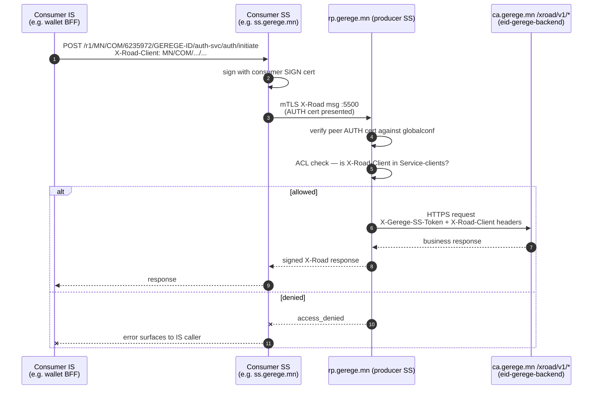

# rp.gerege.mn — Producer Security Server (GEREGE-ID + e-ID Mongolia v2)

**Public IP:** 38.180.251.163
**Owner:** Gerege Systems LLC (`MN/COM/6235972`)
**Member-server code:** `RP-SS-1`
**X-Road version:** 7.8.0 (Ubuntu 24.04)
**Role:** X-Road producer SS that publishes the **two** Gerege identity stacks as REST/OpenAPI3 — the legacy Gerege ID services and the newer e-ID Mongolia v2 services. Both subsystems are owned by Gerege Systems LLC and ride on the same SS.

## Subsystems on this SS

| Subsystem code | Status     | Purpose                                                                |
|----------------|------------|------------------------------------------------------------------------|
| (owner)        | REGISTERED | Gerege Systems LLC owner client (no services published)                |
| `GEREGE-ID`    | REGISTERED | Legacy Gerege ID identity services. IS = `https://ca.gerege.mn/xroad/v1/...`. |
| `GEREGE-WEB`   | REGISTERED | Sender-identity subsystem for the Gerege Web frontend; **no services published** — used purely as a `<service>` ↔ `<client>` identity when the web app initiates X-Road calls into GEREGE-ID. |
| `EIDMONGOL`    | REGISTERED | e-ID Mongolia v2 services. IS = `https://api.eidmongol.mn/`. CS display name "e-ID Mongolia v2". |

## Published REST services (OpenAPI3)

Both subsystems publish OpenAPI3 service descriptions and they share the
service codes `auth-svc` / `sign-svc`. The codes are scoped to the
publishing subsystem — `MN/COM/6235972/GEREGE-ID/auth-svc` and
`MN/COM/6235972/EIDMONGOL/auth-svc` are **distinct** services with
distinct ACLs, distinct IS backends, and distinct OpenAPI YAMLs.

### `GEREGE-ID` (legacy stack — backed by gerege.mn)

| Service code | OpenAPI URL                                    | Operations                                                            |
|--------------|------------------------------------------------|-----------------------------------------------------------------------|
| `auth-svc`   | `https://ca.gerege.mn/xroad/openapi/auth.yaml` | `POST /auth/initiate`, `GET /auth/session/{id}`                       |
| `sign-svc`   | `https://ca.gerege.mn/xroad/openapi/sign.yaml` | `POST /sign/initiate`, `GET /sign/session/{id}`                       |
| `cert-svc`   | `https://ca.gerege.mn/xroad/openapi/cert.yaml` | `POST /certificate/validate`, `GET /certificate/lookup/{national_id}` |

### `EIDMONGOL` (e-ID Mongolia v2 — backed by api.eidmongol.mn)

| Service code | OpenAPI URL                                                       | Operations                       |
|--------------|-------------------------------------------------------------------|----------------------------------|
| `auth-svc`   | `https://api.eidmongol.mn/.well-known/openapi/eid-rp/auth.yaml`   | (per OpenAPI spec at the URL)    |
| `sign-svc`   | `https://api.eidmongol.mn/.well-known/openapi/eid-rp/sign.yaml`   | (per OpenAPI spec at the URL)    |

`EIDMONGOL` deliberately publishes only `auth-svc` + `sign-svc` —
**no `cert-svc`**. National-ID lookup in v2 is part of the auth
callback rather than a separate API, which removes the harvest
surface that the v1 `cert-svc/lookup` endpoint exposed.

## Information Systems

| Subsystem  | IS endpoint                                  | TLS trust pattern                                                                 |
|------------|----------------------------------------------|------------------------------------------------------------------------------------|
| GEREGE-ID  | `https://ca.gerege.mn/xroad/v1/...`          | LE cert for `ca.gerege.mn` uploaded under Internal Servers → IS TLS certificate.  |
| EIDMONGOL  | `https://api.eidmongol.mn/`                  | LE cert for `api.eidmongol.mn` uploaded the same way.                              |

Both subsystems use HTTPS to the IS, so producer-side connection
type is implicit — the IS TLS cert must be installed on rp BEFORE
the first call or every request fails with
`Could not establish TLS connection to IS`.

## Access control

Granted via Services tab → expand the publishing subsystem → expand
each operation → Add subjects. X-Road defaults to deny — any new
partner subsystem must be added explicitly. There is no backend DB
write needed (see HISTORY 2026-04-19 X-Road Gateway refactor).

### `GEREGE-ID` service-clients

| Subject                          | auth-svc | sign-svc | cert-svc | Granted on |
|----------------------------------|:--------:|:--------:|:--------:|------------|
| `MN/COM/6235972/GEREGE-WEB`      |    ✓     |    ✓     |    ✓     | 2026-04-19 |
| `MN/COM/6884857/TEST-DEMO`       |    ✓     |    ✓     |    ✓     | 2026-04-19 |
| `MN/COM/6884857/CONTRACT-MN`     |    ✓     |    ✓     |    —     | 2026-04-29 |
| `MN/COM/6884857/GEREGE-WALLET-BFF` |  ✓     |    ✓     |    —     | 2026-04-29 |
| `MN/COM/6658679/GEREGE-EDU`      |    ✓     |    ✓     |    ✓     | 2026-05-01 |
| `MN/COM/6975291/TASKER`          |    ✓     |    ✓     |    ✓     | 2026-04-19 |

### `EIDMONGOL` service-clients

| Subject                          | auth-svc | sign-svc | Granted on |
|----------------------------------|:--------:|:--------:|------------|
| `MN/COM/6884857/CONTRACT-MN`     |    ✓     |    ✓     | 2026-05-04 |
| `MN/COM/6884857/GEREGE-WALLET-BFF` |  ✓     |    ✓     | 2026-05-04 |
| `MN/COM/6658679/GEREGE-EDU`      |    ✓     |    ✓     | 2026-05-04 |
| `MN/COM/6975291/TASKER`          |    ✓     |    ✓     | 2026-05-04 |
| `MN/COM/6884857/BANK1-DBANK`     |    ✓     |    ✓     | 2026-05-06 |
| `MN/COM/6884857/BANK2-DBANK`     |    ✓     |    ✓     | 2026-05-06 |
| `MN/COM/6884857/BANK3-DBANK`     |    ✓     |    ✓     | 2026-05-06 |
| `MN/COM/7181609/PAYGRID-CORE`    |    ✓     |    ✓     | 2026-05-07 |

## Producer service call flow

## Required prerequisites — these lessons were earned the hard way

1. **TSP entry** in Settings → System Parameters → Timestamping Services → TimeServer.mn. Without it, even the SS-internal log-timestamper backs off and refuses incoming requests with `no_timestamping_provider_found`.
2. **AUTH cert + SIGN cert** issued by the Gerege CA (xroad_auth + xroad_sign profiles in `gerege.mn/xroad-ca/xroad-extensions.cnf`). Both must be in `registered` state on CS, both must be `active` in `keyconf.xml`. The SIGN cert may need to be activated manually after issuance.
3. **OCSP responder must be reachable AND fresh.** `incorrect_validation_info: OCSP response is too old` means the `gerege-ocsp` container hasn't refreshed its responses against the configured 3600s freshness window — restart the container and `xroad-signer` here.
4. **CS-side UFW** must `allow from 38.180.251.163 to any port 4001 proto tcp` and the same for `4002` so this SS can fetch globalconf and submit `clientReg`.

## What lives in this folder

- `xroad/configuration-anchor.xml` — the same anchor distributed by CS to every member SS.
- `xroad/conf.d-local.ini` — sanitized.
- `xroad/etc-listing.txt` — listing of `/etc/xroad/conf.d` and `/etc/nginx/sites-enabled` so future operators know what to grep for.
