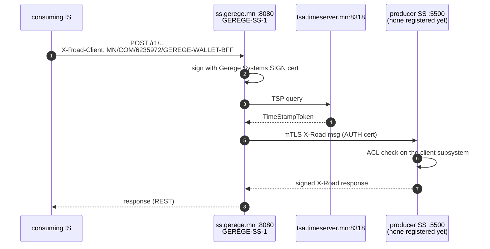
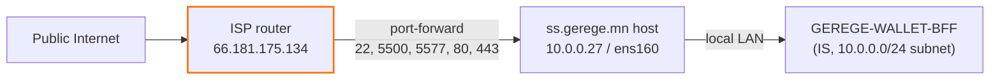
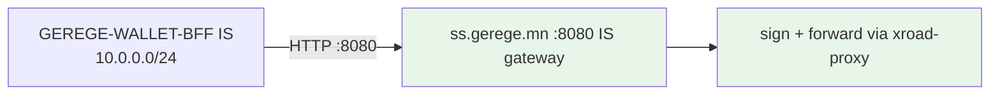

# ss.gerege.mn — `GEREGE-SS-1`, Gerege Systems LLC

**Public IP:** 66.181.175.134 (host is `10.0.0.27` behind the ISP router)
**Owner:** Gerege Systems LLC (`MN/COM/6235972`)
**Member-server code:** `GEREGE-SS-1`
**X-Road version:** 7.8.0, `ee` variant + opmonitor (apt-pinned; cs itself runs 7.8.2)
**Registered on cs:** 2026-07-27 (`MN:COM:6235972:GEREGE-SS-1`, address `ss.gerege.mn`)

Wiped and rebuilt on **2026-07-27**. Before that it was a Gerege Core LLC (`MN/COM/6884857`) server with code `CORE-SS-1`; that identity, and the whole pre-2026-07-22 MN registry, no longer exist — the instance was re-provisioned from scratch on 2026-07-22. Full account in [`HISTORY.md`](HISTORY.md).

## Subsystems on this SS

| Subsystem code      | Status     | Purpose                                                                          |
|---------------------|------------|----------------------------------------------------------------------------------|
| (owner)             | REGISTERED | Gerege Systems LLC owner client                                                   |
| `EIDMONGOLIA`       | REGISTERED | e-ID Mongolia services. **No service descriptions yet** — the OpenAPI documents are unreachable, see `HISTORY.md`. |
| `GEREGE-WALLET-BFF` | REGISTERED | Backend-for-frontend for the Gerege Wallet app.                                   |

## Keys and certificates

| Key                    | Usage          | Certificate                                        | State |
|------------------------|----------------|----------------------------------------------------|-------|
| `gerege-ss-auth-key-1` | AUTHENTICATION | `C=MN, CN=GEREGE-SS-1`, serial 1005                | active, REGISTERED, OCSP good |
| `gerege-ss-sign-key-1` | SIGNING        | `C=MN, O=COM, CN=6235972`, serial 1006             | active, REGISTERED, OCSP good |

Both were issued by **MN X-Road Staging Test CA** (the `openssl ca` layout in `/root/testca` on cs.xroad.mn, OCSP `http://cs.xroad.mn:8888`) — *not* by the production **eID Mongolia Organization Issuing CA**. **Watch out:** these are staging certificates; re-issue from the production CA before this server carries anything real. Certificate type is decided by keyUsage — `digitalSignature` → authentication, `nonRepudiation` → signing; the CA's `openssl.cnf` already carries matching `[auth_ext]` / `[sign_ext]` profiles.

Timestamping: **eID Mongolia TSA** at `http://tsa.timeserver.mn:8318/`.

## How a consumer call would work

There is nothing to call yet. The pre-2026-07-22 producer (`rp.gerege.mn`, publishing `GEREGE-ID` / `EIDMONGOL`) does not exist in this instance, and this server publishes no service descriptions of its own, so the flow below is the shape a call *will* take once a producer is registered — it is not a description of live traffic.

1. Internal IS sends, to the consumer gateway on **`:8080`** (see the port section below — it was `:80` before 2026-07-27):
   ```
   POST /r1/MN/<class>/<code>/<subsystem>/<service>/<path>
   Host: ss.gerege.mn:8080
   X-Road-Client: MN/COM/6235972/GEREGE-WALLET-BFF
   Content-Type: application/json
   ```
2. This SS signs the message with the Gerege Systems LLC SIGN cert, timestamps it against the eID Mongolia TSA, and opens an mTLS X-Road connection to the producer's `:5500` using its AUTH cert.
3. The producer validates this server's AUTH cert against globalconf, checks its Service-clients ACL for the subsystem in `X-Road-Client`, then proxies to its own information system.



## NAT topology



⚠ **NAT trap (HISTORY 2026-05-14):** UFW зөв нэмэгдсэн ч router-д port-forward rule байхгүй бол public-аас холбогдохгүй. `mgmt.xroad.mn/HISTORY.md` 2026-05-14 показ-д port 4000-ийг нээх оролдлогын дүн — UFW нэмэгдсэн ч router-д forward rule байхгүй учир timeout.

## Internal Servers connection type



Энэ нь "Internal Servers → Connection type = HTTP" хувилбар. IS нь plain HTTP-аар хандана, client cert хэрэггүй. `HISTORY.md` 2026-04-19 тохиолдол — HTTPS default-аас HTTP болгож тохируулсан. **Анхаар:** 2026-07-27-ны rebuild-ийн дараа connection type-ууд дахин тохируулагдаагүй — subsystem бүрд шалгах.

## Inbound port for IS clients

Since 2026-07-27 the consumer REST gateway is on the X-Road standard **`8080/tcp`** (plus `8443/tcp` with TLS), set in `conf.d/local.ini`. It was `80`/`443` before — the `xroad-securityserver-ee` variant's own default — and occupying `:80` was what blocked ACME/HTTP-01 renewal of this host's Let's Encrypt certificate.

UFW admits `8080`/`8443` from `10.0.0.0/24` only. `80/tcp` is now open to the world purely so `certbot --standalone` can answer HTTP-01. When onboarding a consumer IS outside the LAN, add an explicit rule for its address — and remember the NAT trap above: the ISP router forwards only `22, 5500, 5577, 80, 443, 4000`, so a LAN-external IS also needs a router forward for `8080`.

**Any IS still calling `ss.gerege.mn:80/r1/...` must be repointed to `:8080`.**

## Required configuration order

The order that actually worked on 2026-07-27 (each step blocks the next):
1. Upload the configuration anchor from cs → confirm `diagnostics/globalconf` is `OK`.
2. Initialize: owner member class/code + server code + software token PIN. The owner member must already exist on cs, otherwise you get the `init_unregistered_member` warning — wait for globalconf to carry it rather than passing `ignore_warnings`.
3. Log in to the software token.
4. Add the TSP entry (`eID Mongolia TSA`). Without it every `clientReg` fails with `mlog.no_timestamping_provider_found`.
5. Generate AUTH + SIGN keys and CSRs, sign at an **approved** CA, import, activate.
6. Register the AUTH certificate → approve the request on cs → the owner client flips to `REGISTERED`.
7. Add each subsystem → Register → approve on cs.
8. Subsystem → Internal Servers → Connection type.

**Watch out (cost me a failed step):** after changing `client-https-port` in `local.ini`, restart **`xroad-proxy-ui-api`** as well as `xroad-proxy`. The UI API sends management requests through the local client proxy and caches that port at startup; with only `xroad-proxy` restarted, subsystem registration fails with `management_request_sending_failed: Connect to localhost:443 ... Connection refused`.

## What lives in this folder

- `xroad/configuration-anchor.xml`
- `xroad/conf.d-local.ini` — sanitized

## Renewal notes

**OCSP freshness.** If the AUTH cert's OCSP "good" cache lapses (default 3600 s window in `shared-params.xml`), every outgoing X-Road call fails with `Security server has no authentication certificate`. Restarting `xroad-signer` re-queries the responder and is the standard fix. This host's certificates are answered by the staging CA responder on `cs.xroad.mn:8888` — a bare `openssl ocsp` process, not a managed service, and it only reads `index.txt` at startup, so it must be restarted after any new certificate is issued.

**Staging certificates expire 2028-07-26** — but re-issue from the production eID Mongolia CA long before that, see the keys table above.

**Let's Encrypt.** `certbot` renews via `--standalone` on `:80`; the cert is valid to 2026-10-25 and `certbot.timer` is active. Don't take `:80` back for X-Road, or renewal breaks again.
