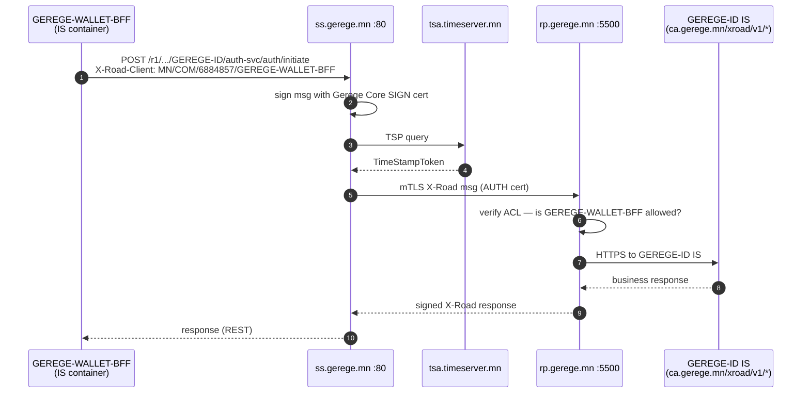
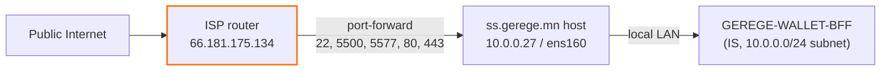
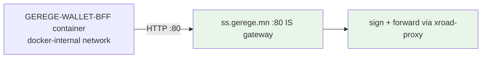

# ss.gerege.mn — Consumer Security Server (Gerege Core LLC)

**Public IP:** 66.181.175.134
**Owner:** Gerege Core LLC (`MN/COM/6884857`)
**Member-server code:** `CORE-SS-1`
**X-Road version:** 7.8.0
**Role:** Consumer-side Security Server. Its information systems call X-Road producer services (GEREGE-ID + EIDMONGOL on rp.gerege.mn).

## Subsystems on this SS

| Subsystem code      | Status     | Purpose                                                                          |
|---------------------|------------|----------------------------------------------------------------------------------|
| (owner)             | REGISTERED | Gerege Core LLC owner client                                                     |
| `GEREGE-WALLET-BFF` | REGISTERED | Backend-for-frontend for the Gerege Wallet app; consumes GEREGE-ID + EIDMONGOL.  |

Historical note: `TEST-DEMO` lived on this SS until 2026-05-04 when it was deleted in favour of routing the test.gerege.mn flow through GEREGE-WALLET-BFF. The TEST-DEMO subsystem record still exists at the member level on cs (Gerege Core LLC / TEST-DEMO) but is not bound to any security server and is preserved only for demo backwards-compat. Other Gerege Core subsystems registered on cs (`CONTRACT-MN`, `BANK1-DBANK`, `BANK2-DBANK`, `BANK3-DBANK`, `NBFI1-DEMO`, `NBFI2-DEMO`) are hosted elsewhere — `CONTRACT-MN` on `CONTRACT-MN-SS` (10.0.0.30) and the bank/NBFI demos on `MGMT-XROAD-MN`.

## How the consumer call works

1. Internal IS (the wallet BFF) sends:
   ```
   POST /r1/MN/COM/6235972/GEREGE-ID/auth-svc/auth/initiate
   Host: ss.gerege.mn
   X-Road-Client: MN/COM/6884857/GEREGE-WALLET-BFF
   Content-Type: application/json
   { ...request body... }
   ```
2. ss.gerege.mn signs the message with the Gerege Core LLC SIGN cert, opens an mTLS X-Road connection to rp.gerege.mn:5500 using its AUTH cert, and forwards.
3. rp.gerege.mn validates the SS-side AUTH cert against globalconf, authorizes per Service-clients ACL, then proxies to the IS at `https://ca.gerege.mn/xroad/v1/...` which is the gerege backend.



## NAT topology



⚠ **NAT trap (HISTORY 2026-05-14):** UFW зөв нэмэгдсэн ч router-д port-forward rule байхгүй бол public-аас холбогдохгүй. `mgmt.xroad.mn/HISTORY.md` 2026-05-14 показ-д port 4000-ийг нээх оролдлогын дүн — UFW нэмэгдсэн ч router-д forward rule байхгүй учир timeout.

## Internal Servers connection type



Энэ нь "Internal Servers → Connection type = HTTP" хувилбар. IS docker network дотроос plain HTTP-аар хандана, client cert хэрэггүй. `ss.gerege.mn/HISTORY.md` 2026-04-19 тохиолдол — HTTPS default-аас HTTP болгож тохируулсан.

## Inbound HTTP port for IS clients

The SS exposes the consumer REST gateway on **`80/tcp`** (custom from the X-Road default of 8080) and 443/tcp. Currently UFW allows port 80 from:

- `38.180.242.76` (`x-road.mn` host running test.gerege.mn).

When onboarding a new consumer IS, add a firewall rule for its public IP.

## Required configuration order

Same playbook as rp.gerege.mn:
1. Add TSP entry → TimeServer.mn.
2. Generate AUTH + SIGN keys + CSRs, sign at the Gerege CA, import + activate.
3. Register the SS with cs.xroad.mn (mgmt-service flow).
4. Add subsystem (e.g. `GEREGE-WALLET-BFF`) → Register.
5. Subsystem → Internal Servers → Connection type. For `GEREGE-WALLET-BFF` it is HTTP because the wallet BFF calls the SS over HTTP from its docker network (port 80).

## What lives in this folder

- `xroad/configuration-anchor.xml`
- `xroad/conf.d-local.ini` — sanitized

## Renewal note

If the AUTH cert OCSP "good" cache lapses (default 3600s window in shared-params), every outgoing call to rp.gerege.mn fails with `Security server has no authentication certificate`. Restarting `xroad-signer` after `gerege-ocsp` container restart on gerege.mn is the standard fix.
