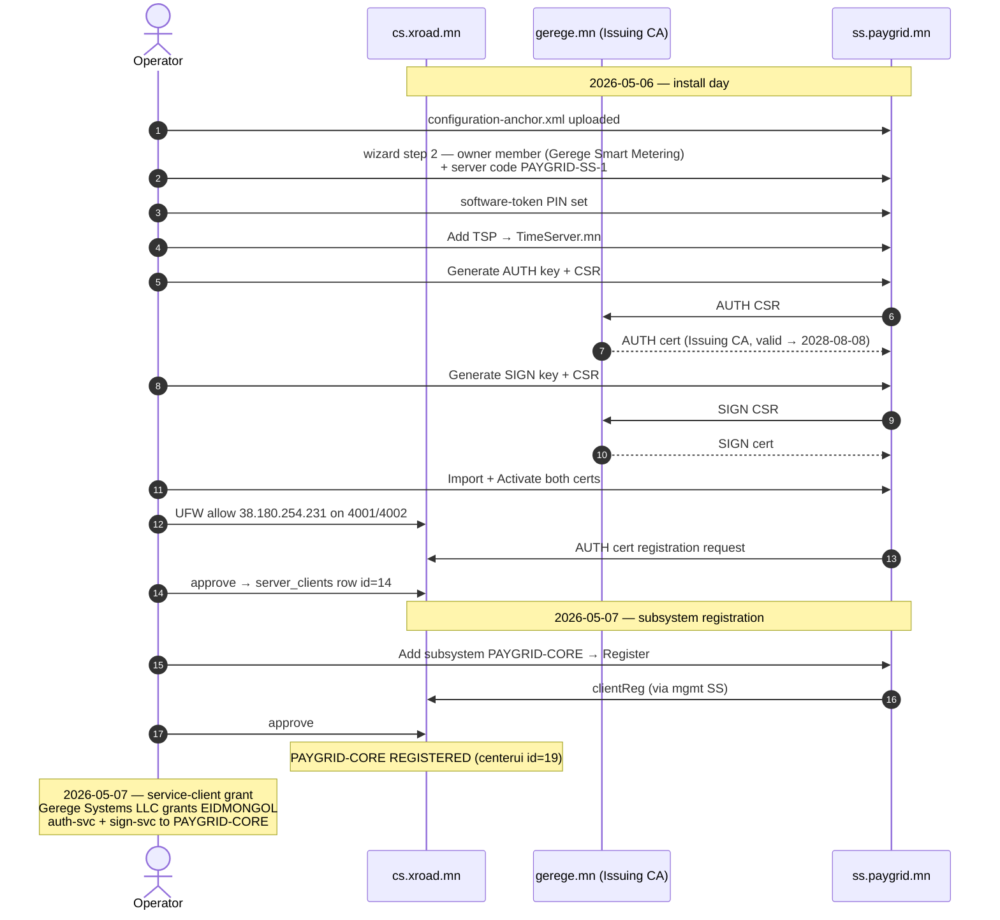

# ss.paygrid.mn — Member Security Server (paygrid.mn)

**Public IP:** `38.180.254.231`
**Owner:** Gerege Smart Metering — `MN/COM/7181609` *(brand domain `paygrid.mn`; legal entity is Gerege Smart Metering, registered on CS as `id=18` on 2026-05-06)*
**Member-server code:** `PAYGRID-SS-1`
**X-Road version:** 7.8.0 (`xroad-securityserver`, generic profile, on Ubuntu 24.04 LTS)
**Role:** Member Security Server for the `paygrid.mn` (Gerege Smart Metering) ecosystem on the Mongolian X-Road instance `MN`. Initial direction: **consumer + producer hybrid** — paygrid IS calls partner producers (e.g. GEREGE-ID on rp.gerege.mn) and may publish its own metering services later. Final role split is part of the Phase-2 onboarding decision.

## Why a separate SS for paygrid

Gerege Smart Metering runs its own information system stack and is a separate legal entity from Gerege Systems LLC and Gerege Core LLC, even though they sit under the broader Гэрэгэ corporate umbrella. Putting paygrid into its own SS gives:

- A distinct member identity (`MN/COM/7181609`) on every signed X-Road message — no commingling with `MN/COM/6235972` (Gerege Systems) or `MN/COM/6884857` (Gerege Core).
- Independent AUTH + SIGN cert lifecycle and key custody under Gerege Smart Metering's control (different software-token PIN, different P12 lineage).
- A clean firewall + ACL boundary: paygrid's IS hosts can only reach this SS, not the gerege-side SSes.
- Future-proofs the member for tri-party governance: when CS ownership shifts to Цахим хөгжлийн яам, the member registration on CS stays valid because the SS identity (`MN/COM/7181609`) is portable.

## Subsystems on this SS

| Subsystem code  | Status     | Purpose                                                                |
|-----------------|------------|------------------------------------------------------------------------|
| (owner)         | REGISTERED | Gerege Smart Metering owner client (no services published yet)         |
| `PAYGRID-CORE`  | REGISTERED | PayGrid Core System — primary paygrid.mn subsystem. Display name set in NIIS UI; CS row id=19 (centerui.security_server_clients), bound to PAYGRID-SS-1 via server_clients id=14. |

## Listening ports (post-firewall plan)

| Port    | Service                                    | Reachable from                                              |
|--------:|--------------------------------------------|-------------------------------------------------------------|
| 22      | sshd                                       | admin source-IPs                                            |
| 4000    | xroad-proxy-ui-api (admin UI)              | localhost only — use SSH tunnel `-L 14006:localhost:4000`   |
| 5500    | xroad-proxy server-proxy (SS-SS message)   | public — every peer SS must reach this                      |
| 5577    | xroad-proxy OCSP responder                 | public                                                      |
| 8080    | IS gateway — consumer REST                 | UFW-allowlisted IS hosts only (TBD which paygrid IS host)   |
| 8443    | IS gateway — consumer REST + TLS           | (same)                                                      |

UFW rules will mirror the ss.gerege.mn pattern but pinned to paygrid's IS host(s) and Gerege admin source-IPs. **Do NOT** open port 4000 to public — even briefly. The 2026-04-20 pre-prod showcase exposure on cs/mgmt/rp/ss was rolled back the same week (commits 8fc52a0, 1e327e7) and is not repeated here.

## Onboarding sequence — what was done 2026-05-06

The full playbook ran in one session — see `HISTORY.md` for the
detailed log. Summary of the steps and where each one ended up:

| Step | Status | Notes |
|---|---|---|
| Configuration anchor → uploaded from `cs.gerege.mn` | ✅ done | `/etc/xroad/configuration-anchor.xml` present; globalconf `MN/` populated. |
| Owner Member registered (`MN/COM/7181609` Gerege Smart Metering) | ✅ done | wizard step 2; CS already had the member pre-registered (id=18). |
| Server Code `PAYGRID-SS-1` | ✅ done | wizard step 2. |
| Software-token PIN | ✅ set | stored in operator memory; not in repo. |
| TSP entry → `https://tsa.timeserver.mn/` (TimeServer.mn TSA Signer) | ✅ added | `serverconf.tsp` row id=4. |
| AUTH key + CSR + cert (signed by Gerege Issuing CA, valid 2026-05-06 → 2028-08-08) | ✅ active | `xroad_auth` profile; CN=`ss.paygrid.mn`, serialNumber=7181609. |
| SIGN key + CSR + cert (signed by Gerege Issuing CA) | ✅ active | `xroad_sign` profile; subject CN=`Gerege Smart Metering`, memberId `MN/COM/7181609`. |
| AUTH cert registered with CS | ✅ approved | CS `centerui.security_servers` row id=7. |
| CS-side UFW for `38.180.254.231` on `4001/4002` | ✅ open | rule added 2026-05-06 to mirror existing per-SS pattern. |
| Subsystems → `PAYGRID-CORE` registered | ✅ done | 2026-05-07; serverconf id=6, CS centerui id=19, server_clients id=14 (bound to PAYGRID-SS-1). |

### Phase 3 — what still needs operator decisions

1. **Service-client grant on `EIDMONGOL`** ✅ done 2026-05-07 — Gerege
   Systems LLC granted `MN/COM/7181609/PAYGRID-CORE` access to
   `auth-svc` + `sign-svc` on `MN/COM/6235972/EIDMONGOL` (e-ID
   Mongolia v2, IS = `api.eidmongol.mn`). **NOT GEREGE-ID** — paygrid
   uses the v2 stack, matches the pattern of the other 7 v2
   consumers (CONTRACT-MN, GEREGE-WALLET-BFF, GEREGE-EDU, TASKER,
   BANK1/2/3-DBANK). `cert-svc` deliberately omitted in v2.
2. **What services will paygrid publish?** If smart-metering APIs, host
   the OpenAPI3 description on a public TLS endpoint (mirror the
   `https://ca.gerege.mn/xroad/openapi/...` pattern), wire UI →
   Services → Add REST → OpenAPI 3 Description on the PAYGRID-CORE
   subsystem.
3. ~~Internal Servers connection type~~ ✅ done 2026-05-07 — kept at
   the NIIS-default `HTTPS` (mTLS). IS host = `paygrid.mn`
   (`38.180.254.229`); ECDSA P-256 client cert generated at
   `paygrid.mn:/etc/paygrid/xroad-is-tls/`, leaf uploaded to SS
   under PAYGRID-CORE → Internal Servers → Information system TLS
   certificates. UFW `8443/tcp` source-pinned to the IS host only.
   See HISTORY for the cert fingerprint + curl test command.
4. **Add to monitor.x-road.mn** — install `prometheus-node-exporter`,
   add UFW rule allowing `38.180.242.76` to `:9100`, append target to
   `/opt/xroad-monitor/prometheus.yml` `xroad-nodes` job. Same pattern
   as the existing 6 hosts; no autossh tunnel needed (direct public
   IP, no NAT).

## What lives in this folder

- `README.md` — this file.
- `HISTORY.md` — install + operational log; every incident, fix, and gotcha.
- `xroad/configuration-anchor.xml` — copy of `/etc/xroad/configuration-anchor.xml` (CS-issued, identical to ss.gerege.mn / rp.gerege.mn copies). The anchor's `<downloadURL>` was refreshed from `cs.gerege.mn` to `cs.xroad.mn` on 2026-05-08; the pre-rename anchor is preserved on the host as `/etc/xroad/configuration-anchor.xml.bak.20260508`. The host still resolves both DNS names so no member-side action was required during the swap.
- `xroad/conf.d-local.ini` — sanitized snapshot of `/etc/xroad/conf.d/local.ini`.
- `xroad/etc-listing.txt` — listing of `/etc/xroad/conf.d` so future operators know what to grep for.

## Watch list for the next operator

- **Direct public IP, no NAT.** Unlike ss.gerege.mn (66.181.175.134, behind NAT to 10.0.0.27), this host has its public IP `38.180.254.231` directly on `eth0`. Means UFW is the only ingress filter — a misconfig here is internet-visible immediately. Default policy: deny incoming, allow established + the explicit per-port rules above.
- **Member identity is permanent.** Once `MN/COM/<code>/<subsystem>` is REGISTERED on CS, every signed X-Road message carries this identity forever. Pick the registry number once and don't change it. NIIS does not support member-code rename without re-registering every cert.
- **OCSP freshness applies.** Same `incorrect_validation_info: OCSP response is too old` trap that hit rp/ss on 2026-04-19. If paygrid's AUTH/SIGN cert ever becomes "unsuitable", restart `gerege-ocsp` on the CA host then `xroad-signer` here.
- **Monitoring.** This SS should be added to `monitor.x-road.mn` as the 7th scrape target — prometheus.yml `xroad-nodes` job + node_exporter on `:9100` (UFW source-pinned to `38.180.242.76`). Same pattern as the existing 6 hosts; no autossh tunnel needed because this SS has a direct public IP.
