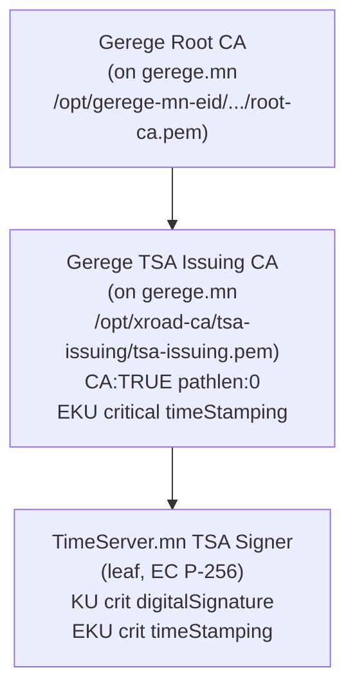
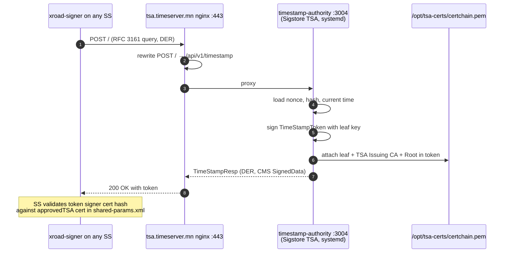
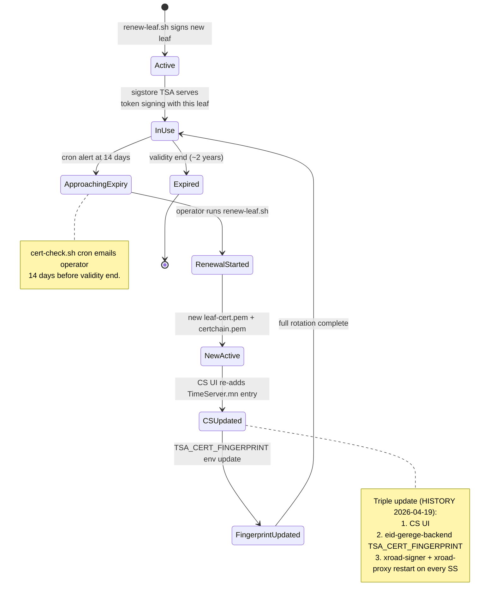

# timeserver.mn — RFC 3161 Timestamp Authority

**Public IP:** 38.180.203.29
**Public URL:** `https://tsa.timeserver.mn/`
**Role:** Provides RFC 3161 time-stamps to every X-Road SS in the Mongolia X-Road instance, and to any other internal service that needs trusted timestamps.

## Stack

- **Sigstore Timestamp Authority** v2 — single Go binary `timestamp-server` running under systemd as `timestamp-authority.service`, bound to `127.0.0.1:3004`.
- **nginx** (`tsa.timeserver.mn`) terminates TLS (Let's Encrypt) on `443/tcp` and rewrites POST `/` → `/api/v1/timestamp` for compatibility with X-Road clients that POST RFC 3161 queries to the bare host root.

## Cert chain (after 2026-04-19 rebuild)

The original install used a self-signed `TimeServer.mn Root CA` chain. That has been replaced with a chain that ultimately roots in the Gerege Root CA so X-Road OCSP/CRL validation makes sense end-to-end:



The leaf cert + the chain (`certchain.pem`) live in `/opt/tsa-certs/` on this server. The TSA leaf private key (`leaf-key.pem`) NEVER leaves this server.

## What lives in this folder

```
timeserver.mn/
├── README.md
├── nginx/
│   ├── tsa.timeserver.mn.conf  TLS terminator + RFC 3161 root POST rewrite
│   └── timeserver.mn.conf      brand site
├── systemd/
│   └── timestamp-authority.service
└── tsa-certs/
    ├── leaf-cert.pem      ← what CS shared-params identifies as the approved TSA cert
    ├── certchain.pem      ← leaf + Gerege TSA Issuing CA + Gerege Root, served back to clients in TSP responses
    ├── gen-certs.sh       ← original Sigstore-shipped cert generator (kept for reference)
    ├── renew-leaf.sh      ← rotate the leaf without rotating the whole chain
    ├── healthcheck.sh
    ├── cert-check.sh      ← cron: warn N days before leaf expiry
    └── ntpsync.yaml       ← NTP monitoring config consumed by timestamp-authority
```

## TSP request flow (RFC 3161)



## Leaf cert lifecycle



## CS-side coupling

The CS UI → Trust Services → Timestamping Services entry must hold the LEAF cert (`leaf-cert.pem`) in DER/PEM form. Whenever the leaf is rotated:

1. Re-run leaf signing on gerege.mn:
   ```bash
   sudo openssl x509 -req -in /tmp/tsa-gerege.csr \
     -CA /opt/xroad-ca/tsa-issuing/tsa-issuing.pem \
     -CAkey /opt/xroad-ca/tsa-issuing/tsa-issuing.key \
     -set_serial 0x$(openssl rand -hex 16) -days 825 -sha256 \
     -extfile /opt/xroad-ca/xroad-extensions.cnf -extensions xroad_tsa \
     -out /tmp/tsa-leaf.pem
   ```
2. Drop the new leaf into `/opt/tsa-certs/leaf-cert.pem` here, rebuild `certchain.pem = leaf + tsa-issuing + root`.
3. `systemctl restart timestamp-authority`.
4. CS UI → Trust Services → Timestamping Services → delete the old `TimeServer.mn` entry → re-add with URL `https://tsa.timeserver.mn/` and the new leaf cert.
5. Wait ~60s for `xroad-confclient` on every member SS to refresh; then `systemctl restart xroad-signer xroad-proxy` on each SS to clear OCSP/cert caches.
